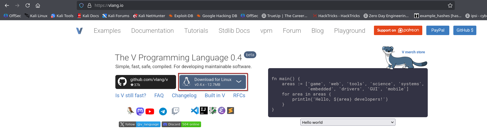
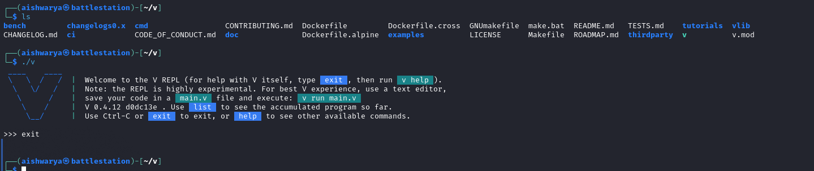
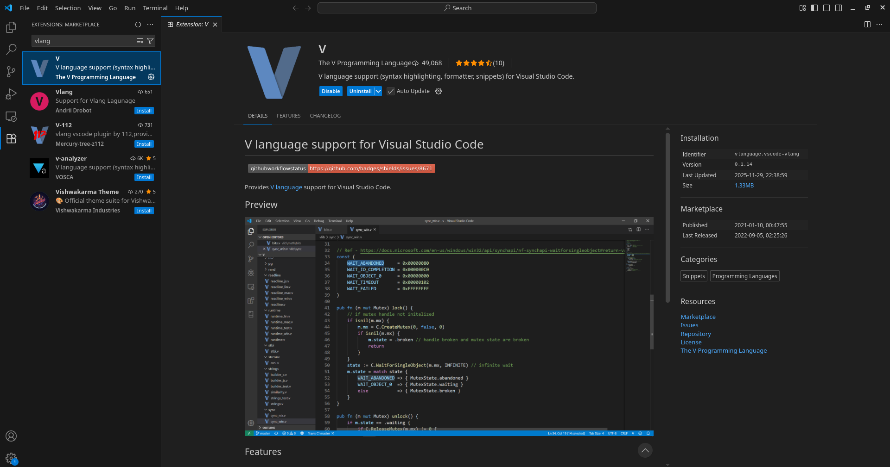
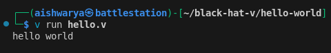
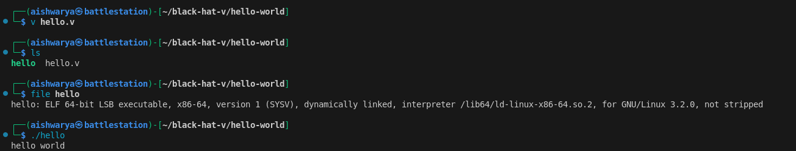
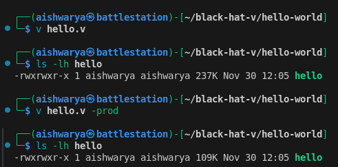
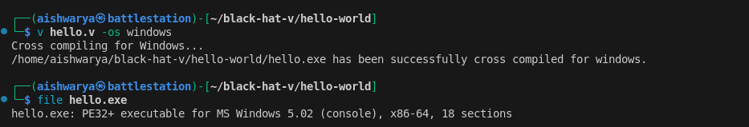
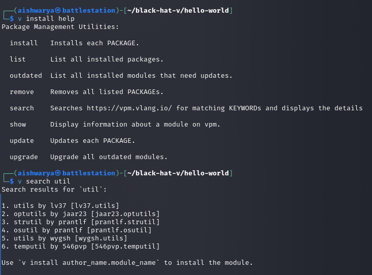

+++
title = 'Black Hat V: Introduction to something that I might or might not do'
date = 2025-11-30T11:19:42+05:30
tags = ["programming"]
+++

After brothing my first set of cybersecurity alphabet soup of certifications (yup, now I've hunt down OSCP for my HR peeps) I felt need to re-strategise my academic approach. Following is the first of many advents I have planned for myself. Throughout this and following posts (marked as Black Hat V), I'd try to reconstruct the exercises of [Black Hat Go (by Tom Steele, Chris Patten, and Dan Kottmann)](https://nostarch.com/blackhatgo) to encourage myself to learn [vlang](https://vlang.io/).

## Setting Up a Development Environment

### Downloading and Installing V

Visit [vlang.io](https://vlang.io/) and download for your OS. (I'd be using linux througout this series, if Microsoft Windows is need I'd leverage a VM).



Extract the zip archive downloaded. This would create a `v` directory with following contents. `./v` can be used to launch a REPL shell or compile/run `.v` source file.



> It is highly recommended, that you put V on your PATH. That saves you the effort to type in the full path to your v executable every time. V provides a convenience `v symlink` command to do that more easily.

On Unix systems, it creates a `/usr/local/bin/v` symlink to your executable. To do that, run:

```sh
sudo ./v symlink
```

### Choosing an IDE

I configured [Microsoft Visual Studio Code](https://code.visualstudio.com/) with extension for Vlang.



## Breaking Ice with V tool commands

### The `v run` command

Create a source file with .v extension (let's say hello.v), with following code.

```go
fn main() {
	println('hello world')
}
```

From the command line, execute `v run hello.v`, you'd see the message printed back on screen.



Similar to golang, `v run` does not produce a compiled executable. To create a binary file just remove the `run` from the command.

```sh
v hello.v
```

This should create an executable (ELF on linux, EXE on windows) with same name as the source code file.



To enable production mode optimizations while building, use `-prod` flag. This also helps to reduce the executable file size.

```sh
v hello.v -prod
```



### Cross-Compilation

To cross-compile the file, just pass the target OS using `-os` flag.

```sh
v hello.v -os windows
```



### The `v install` command

To fetch third-party packages, use the `v install` command.



### The `v fmt` command

You don't need to worry about formatting your code or setting style guidelines. v fmt takes care of that:

```sh
v fmt file.v
```

### V Playground

It is an execution environment that provides a web-based interface to play with the language. Try it [here](https://play.vlang.io/).

## The V Syntax

For a thorough study of the language you can refer to [V Documentation](https://docs.vlang.io/introduction.html). Following is a brief overview of the syntax.

### Data Types

#### Primitive Data Types

The primitive data types include
- bool
- string
- i8, i16, int, i64
- u8, u16, u32, u64
- rune (represents a single UTF-32 encoded Unicode character and is an alias for `u32`. To denote them, use **`** (backticks) )
- f32, f64
- isize, usize (platform dependent, the size of bytes it takes to reference any location in memory)
- voidptr (for interoperability with C)

> Unlike C and Go, `int` is always a **32 bit integer**.

There is an exception to the rule that all operators in V must have values of the same type on both sides. A small primitive type on one side can be automatically promoted if it fits completely into the data range of the type on the other side. These are the allowed possibilities:

```
   i8 → i16 → int → i64
                  ↘     ↘
                    f32 → f64
                  ↗     ↗
   u8 → u16 → u32 → u64 ⬎
      ↘     ↘     ↘      ptr
   i8 → i16 → int → i64 ⬏
```

An int value for example can be automatically promoted to f64 or i64 but not to u32. (u32 would mean loss of the sign for negative values). Promotion from int to f32, however, is currently done automatically (but can lead to precision loss for large values).

Literals like 123 or 4.56 are treated in a special way. They do not lead to type promotions, however they default to int and f64 respectively, when their type has to be decided.

```go
u := u16(12)
v := 13 + u    // v is of type `u16` - no promotion
x := f32(45.6)
y := x + 3.14  // y is of type `f32` - no promotion
a := 75        // a is of type `int` - default for int literal
b := 14.7      // b is of type `f64` - default for float literal
c := u + a     // c is of type `int` - automatic promotion of `u`'s value
d := b + x     // d is of type `f64` - automatic promotion of `x`'s value
```

#### Strings

In V, strings are encoded in UTF-8, and are immutable (read-only) by default.

```go
s := 'hello 🌎' // the `world` emoji takes 4 bytes, and string length is reported in bytes
assert s.len == 10

arr := s.bytes() // convert `string` to `[]u8`
assert arr.len == 10

s2 := arr.bytestr() // convert `[]u8` to `string`
assert s2 == s

name := 'Bob'
assert name.len == 3
// indexing gives a byte, u8(66) == `B`
assert name[0] == u8(66)
// slicing gives a string 'ob'
assert name[1..3] == 'ob'

// escape codes
// escape special characters like in C
windows_newline := '\r\n'
assert windows_newline.len == 2

// arbitrary bytes can be directly specified using `\x##` notation where `#` is
// a hex digit
aardvark_str := '\x61ardvark'
assert aardvark_str == 'aardvark'
assert '\xc0'[0] == u8(0xc0)

// or using octal escape `\###` notation where `#` is an octal digit
aardvark_str2 := '\141ardvark'
assert aardvark_str2 == 'aardvark'

// Unicode can be specified directly as `\u####` where # is a hex digit
// and will be converted internally to its UTF-8 representation
star_str := '\u2605' // ★
assert star_str == '★'
// UTF-8 can be specified this way too, as individual bytes.
assert star_str == '\xe2\x98\x85'
```

Note that indexing a string normally will produce a `u8` (byte), not a `rune` nor another `string`. Indexes correspond to *bytes* in the string, not Unicode code points. If you want to convert the `u8` to a `string`, use the `.ascii_str()` method on the `u8`:

```go
country := 'Netherlands'
println(country[0]) // Output: 78
println(country[0].ascii_str()) // Output: N
```

However, you can easily get the runes for a string with the `runes()` method, which will return an array of the UTF-8 characters from the string. You can then index this array. Just be aware that there may be fewer indexes available on the rune array than on the bytes in the string, if there are any non-ASCII characters.

```go
mut s := 'hello 🌎'
// there are 10 bytes in the string (as shown earlier), but only 7 runes, since the `world` emoji
// only counts as one `rune` (one Unicode character)
assert s.runes().len == 7
println(s.runes()[6])
```

Prepend `r` for raw strings. Escapes are not handled, so you will get exacly what you type:

```go
s := r'hello\nworld' // the `\n` will be preserved as two characters
println(s) // "hello\nworld"
```

Strings can be easily converted to integers:

```go
s := '42'
n := s.int() // 42

// all int literals are supported
assert '0xc3'.int() == 195
assert '0o10'.int() == 8
assert '0b1111_0000_1010'.int() == 3850
assert '-0b1111_0000_1010'.int() == -3850
```

#### String interpolation

Basic interpolation syntax is pretty simple - use `${` before a variable name and `}` after. The variable will be converted to a string and embedded into the literal:

```go
name := 'Bob'
println('Hello, ${name}!') // Hello, Bob!
```

#### Arrays

V arrays are homogeneous (all elements must have the same type). This means that code like `[1, 'a']` will not compile. The type of an array is determined by the first element:

- `[1, 2, 3]` is an array of ints (`[]int`).
- `['a', 'b']` is an array of strings (`[]string`).

The user can explicitly specify the type for the first element: `[u8(16), 32, 64, 128]`.

An element can be appended to the end of an array using the push operator <<. It can also append an entire array.

```go
mut nums := [10, 20, 30]
println(nums) // `[10, 20, 30]`

mut nums := [1, 2, 3]
nums << 4
println(nums) // "[1, 2, 3, 4]"

// append array
nums << [5, 6, 7]
println(nums) // "[1, 2, 3, 4, 5, 6, 7]"

// Declare an empty array:
users := []int{}
```

The above syntax is fine for a small number of known elements but for very large or empty arrays there is a second initialization syntax:

```go
mut a := []int{len: 10000, cap: 30000, init: 3}
```

This creates an array of 10000 `int` elements that are all initialized with 3. Memory space is reserved for 30000 elements. The parameters `len`, `cap` and `init` are optional; `len` defaults to 0 and `init` to the default initialization of the element type (`0` for numerical type, `''` for `string`, etc). The run time system makes sure that the capacity is not smaller than `len` (even if a smaller value is specified explicitly).

There are two fields that control the "size" of an array:

- `len`: **length** - the number of pre-allocated and initialized elements in the array
- `cap`: **capacity** - the amount of memory space which has been reserved for elements, but not initialized or counted as elements. The array can grow up to this size without being reallocated. Usually, V takes care of this field automatically but there are cases where the user may want to do manual optimizations.

```go
mut nums := [1, 2, 3]
println(nums.len) // "3"
println(nums.cap) // "3" or greater

arr := []int{len: 5, init: -1}
// `arr == [-1, -1, -1, -1, -1]`, arr.cap == 5
```

You can initialize the array by accessing the index variable which gives the index as shown here:

```go
count := []int{len: 4, init: index}
assert count == [0, 1, 2, 3]

mut square := []int{len: 6, init: index * index}
// square == [0, 1, 4, 9, 16, 25]
```

You can learn more about different array types [here](https://docs.vlang.io/v-types.html#array-types).

#### Multi-dimensional arrays

Arrays can have more than one dimension.

2d array example:

```go
mut a := [][]int{len: 2, init: []int{len: 3}}
a[0][1] = 2
println(a) // [[0, 2, 0], [0, 0, 0]]
```

3d array example:

```go
mut a := [][][]int{len: 2, init: [][]int{len: 3, init: []int{len: 2}}}
a[0][1][1] = 2
println(a) // [[[0, 0], [0, 2], [0, 0]], [[0, 0], [0, 0], [0, 0]]]
```

#### Fixed size arays

V also supports arrays with fixed size. Unlike ordinary arrays, their length is constant. You cannot append elements to them, nor shrink them. You can only modify their elements in place.

However, access to the elements of fixed size arrays is more efficient, they need less memory than ordinary arrays, and unlike ordinary arrays, their data is on the stack, so you may want to use them as buffers if you do not want additional heap allocations.

Most methods are defined to work on ordinary arrays, not on fixed size arrays. You can convert a fixed size array to an ordinary array with slicing:

```go
mut fnums := [3]int{} // fnums is a fixed size array with 3 elements.
fnums[0] = 1
fnums[1] = 10
fnums[2] = 100
println(fnums) // => [1, 10, 100]
println(typeof(fnums).name) // => [3]int

fnums2 := [1, 10, 100]! // short init syntax that does the same (the syntax will probably change)

anums := fnums[..] // same as `anums := fnums[0..fnums.len]`
println(anums) // => [1, 10, 100]
println(typeof(anums).name) // => []int
```

#### Maps

```go
mut m := map[string]int{} // a map with `string` keys and `int` values
m['one'] = 1
m['two'] = 2
println(m['one']) // "1"
println(m['bad_key']) // "0"
println('bad_key' in m) // Use `in` to detect whether such key exists
println(m.keys()) // ['one', 'two']
m.delete('two')
```

Maps can have keys of type string, rune, integer, float or voidptr.

The whole map can be initialized using this short syntax:

```go
numbers := {
    'one': 1
    'two': 2
}
println(numbers)
```

If a key is not found, a zero value is returned by default:

```go
sm := {
    'abc': 'xyz'
}
val := sm['bad_key']
println(val) // ''
```

It's also possible to use an `or {}` block to handle missing keys:

```go
mm := map[string]int{}
val := mm['bad_key'] or { panic('key not found') }
```

#### Map update syntax

V lets you initialise a map with an update applied on top of another map:

```go
const base_map = {
    'a': 4
    'b': 5
}

foo := {
    ...base_map
    'b': 88
    'c': 99
}

println(foo) // {'a': 4, 'b': 88, 'c': 99}
```

#### Structs

Structs can help design user-defined complex data types.

```go
struct Point {
    x int
    y int
}

mut p := Point{
    x: 10
    y: 20
}
println(p.x) // Struct fields are accessed using a dot
// Alternative literal syntax
p = Point{10, 20}
assert p.x == 10
```

> Structs are allocated on the stack. To allocate a struct on the heap and get a [reference](https://docs.vlang.io/references.html) to it, use the `&` prefix:

```go
struct Point {
    x int
    y int
}

p := &Point{10, 10}
// References have the same syntax for accessing fields
println(p.x)
```

The type of p is &Point. It's a *reference* to Point. References are similar to Go pointers and C++ references.

```go
struct Foo {
mut:
    x int
}

fa := Foo{1}
mut a := fa
a.x = 2
assert fa.x == 1
assert a.x == 2

// fb := Foo{ 1 }
// mut b := &fb  // error: `fb` is immutable, cannot have a mutable reference to it
// b.x = 2

mut fc := Foo{1}
mut c := &fc
c.x = 2
assert fc.x == 2
assert c.x == 2
println(fc) // Foo{ x: 2 }
println(c) // &Foo{ x: 2 } // Note `&` prefixed.
```

**Default field** values can be assigned during Struct definition.

```go
struct Foo {
    n   int    // n is 0 by default
    s   string // s is '' by default
    a   []int  // a is `[]int{}` by default
    pos int = -1 // custom default value
}
```

All struct fields are zeroed by default during the creation of the struct. Array and map fields are allocated. In case of reference value, see [here](https://docs.vlang.io/structs-with-reference-fields.html).

You can mark a struct field with the `[required]` attribute, to tell V that that field must be initialized when creating an instance of that struct.

```go
struct Foo {
    n int @[required]
}
```

#### Struct Access modifiers

Struct fields are **private and immutable by default** (making structs immutable as well). Their access modifiers can be changed with pub and mut. In total, there are 5 possible options:

```go
struct Foo {
    a int // private immutable (default)
mut:
    b int // private mutable
    c int // (you can list multiple fields with the same access modifier)
pub:
    d int // public immutable (readonly)
pub mut:
    e int // public, but mutable only in parent module
__global:
    // (not recommended to use, that's why the 'global' keyword starts with __)
    f int // public and mutable both inside and outside parent module
}
```

#### Methods for structs

V doesn't have classes, but you can define methods on types. A method is a function with a special **`receiver`** argument. The **receiver** appears in its own argument list **between the `fn` keyword and the method name**. Methods must be in the same module as the receiver type.

```go
struct User {
    age int
}

fn (u User) can_register() bool {
    return u.age > 16
}

user := User{
    age: 10
}
println(user.can_register()) // "false"
user2 := User{
    age: 20
}
println(user2.can_register()) // "true"
```

In this example, the `can_register` method has a receiver of type `User` named `u`. The convention is not to use receiver names like `self` or `this`, but a short, preferably one letter long, name.

#### Static type methods for structs

V supports static type methods like `User.new()`. These are defined on a struct via `fn [Type name].[function name]` and allow to organize all functions related to a struct:

```go
struct User {}

fn User.new() User {
    return User{}
}

user := User.new()
```

#### Interfaces

An interface can be considered as a blueprint that defines an expected set of actions that any concrete implementation must fulfill in order to be considered a type of that interface. Unlike Go, but like TypeScript, V's interfaces can define both fields and methods.

```go
interface Speaker {
    breed string
    speak() string
}
```

A type implements an interface by implementing its methods and fields. In the following code, both `Dog` and `Cat` struct have a `breed` attribute and a `speak()` method which allows them to adhere to requirements to be considered as a `Speaker` type.

```go
struct Dog {
    breed string
}

fn (d Dog) speak() string {
    return 'woof'
}

struct Cat {
    breed string
}

fn (c Cat) speak() string {
    return 'meow'
}

fn main() {
    dog := Dog{'Leonberger'}
    cat := Cat{'Siamese'}

    mut arr := []Speaker{}
    arr << dog
    arr << cat
    for item in arr {
        println('a ${item.breed} says: ${item.speak()}')
    }
}
```

To learn more about interfaces, you can reference [this documentation](https://docs.vlang.io/type-declarations.html#interfaces).

### Control Structures

#### If

`if` statements are pretty straightforward and similar to most other languages. Unlike other C-like languages, there are no parentheses surrounding the condition and the braces are always required.

```
a := 10
b := 20
if a < b {
    println('${a} < ${b}')
} else if a > b {
    println('${a} > ${b}')
} else {
    println('${a} == ${b}')
}
```

#### `If` expressions

Unlike C, V does not have a ternary operator, that would allow you to do: `x = c ? 1 : 2` . Instead, it has a bit more verbose, but also clearer to read, ability to use if as an expression. The direct translation in V of the ternary construct above, assuming c is a boolean condition, would be: `x = if c { 1 } else { 2 }`.

You can use multiple statements in each of the branches of an if expression, followed by a final value, that will become the value of the entire if expression, when it takes that branch:

```go
n := arguments().len
x := if n > 2 {
    dump(arguments())
    42
} else {
    println('something else')
    100
}
dump(x)
```

#### Match

A match statement is a shorter way to write a sequence of `if - else` statements. When a matching branch is found, the following statement block will be run. The else branch will be run when no other branches match.

```go
os := 'windows'
print('V is running on ')
match os {
    'darwin' { println('macOS.') }
    'linux' { println('Linux.') }
    else { println(os) }
}
```

```go
number := 2
s := match number {
    1 { 'one' }
    2 { 'two' }
    else { 'many' }
}
```

#### `in` operator

`in` allows to check whether an array or a map contains an element. To do the opposite, use `!in`.

```go
nums := [1, 2, 3]
println(1 in nums) // true
println(4 !in nums) // true
```

#### `for` loops

V has only one looping keyword: `for`, with several forms.

`for`/`in` is the most common form. You can use it with an array, map or numeric range. The `for value in arr` form is used for going through elements of an array. If an index is required, an alternative form `for index, value in arr` can be used.

```go
numbers := [1, 2, 3, 4, 5]
for num in numbers {
    println(num)
}
names := ['Sam', 'Peter']
for i, name in names {
    println('${i}) ${name}')
    // Output: 0) Sam
    //         1) Peter
}
```

Note that the value is read-only. If you need to modify the array while looping, you need to declare the element as mutable:

```go
mut numbers := [0, 1, 2]
for mut num in numbers {
    num++
}
println(numbers) // [1, 2, 3]
```

**By default, array elements are taken by value, if you need elements to be taken by reference, use `&` on the array you want to iterate over:**

```go
struct User {
    name string
}

users := [User{
    name: 'someuserwow99'
}, User{
    name: 'visgod'
}]
// note `&users`, this is how a reference to the elements of the array is received
for user in &users {
    // some operations with `user`
}
```

The same applies to maps.

When an identifier is just a single underscore, it is ignored.

```go
m := {
    'one': 1
    'two': 2
}

for key, value in m {
    println('${key} -> ${value}')
    // Output: one -> 1
    //         two -> 2
}

// iterate over keys
for key, _ in m {
    println(key)
    // Output: one
    //         two
}

// iterate over values
for _, value in m {
    println(value)
    // Output: 1
    //         2
}
```

While executing a ranged `for`, `low..high` means an exclusive range, which represents all values from `low` up to but not including `high`.

```go
// Prints '01234'
for i in 0 .. 5 {
    print(i)
}
```

A conditional `for` is of the forms

```go
mut sum := 0
mut i := 0
for i <= 100 {
    sum += i
    i++
}
println(sum) // "5050"
```

This form of the loop is similar to while loops in other languages. The loop will stop iterating once the boolean condition evaluates to false. Again, there are no parentheses surrounding the condition, and the braces are always required.

Finally, there's the traditional C style `for` loop. It's safer than the while form because with the latter it's easy to forget to update the counter and get stuck in an infinite loop.

Here `i` doesn't need to be declared with `mut` since it's always going to be mutable by definition.

```go
for i := 0; i < 10; i += 2 {
    // Don't print 6
    if i == 6 {
        continue
    }
    println(i)
}
```

V also supports [custom iterators](https://docs.vlang.io/statements-&-expressions.html#custom-iterators).

#### Defer

A `defer {}` statement, defers the execution of the block of statements until the surrounding scope of the defer ends. It is a convenient feature that allows you to group related actions (getting access to a resource and cleaning/freeing it after you are done) closely together, instead of spreading them across multiple potentially very remote lines of code.

```go
import os

fn read_log() ! {
    mut ok := false
    mut f := os.open('log.txt')!
    defer { f.close() }
    // ...
    if !ok {
        // ...
        // defer statement will be called here, the file will be closed
        return
    }
    // ...
    // defer statement will be called here too, the file will be closed
}
```

> If the function returns a value the defer block is executed after the return expression is evaluated.

### Concurrency

V's model of concurrency is similar to Go's.

`go foo()` runs `foo()` concurrently in a lightweight thread managed by the V runtime.

`spawn foo()` runs `foo()` concurrently in a different thread:

```go
import math

fn p(a f64, b f64) { // ordinary function without return value
    c := math.sqrt(a * a + b * b)
    println(c)
}

fn main() {
    spawn p(3, 4)
    // p will be run in parallel thread
    // It can also be written as follows
    // spawn fn (a f64, b f64) {
    // 	c := math.sqrt(a * a + b * b)
    // 	println(c)
    // }(3, 4)
}
```

> Threads rely on the machine's CPU (number of cores/threads). Be aware that OS threads spawned with spawn have limitations in regard to concurrency, including resource overhead and scalability issues, and might affect performance in cases of high thread count.

Sometimes it is necessary to wait until a parallel thread has finished. This can be done by assigning a handle to the started thread and calling the wait() method to this handle later:

```go
import math

fn p(a f64, b f64) { // ordinary function without return value
    c := math.sqrt(a * a + b * b)
    println(c) // prints `5`
}

fn main() {
    h := spawn p(3, 4)
    // p() runs in parallel thread
    h.wait()
    // p() has definitely finished
}
```

This approach can also be used to get a return value from a function that is run in a parallel thread. There is no need to modify the function itself to be able to call it concurrently.

```go
import math { sqrt }

fn get_hypot(a f64, b f64) f64 { //       ordinary function returning a value
    c := sqrt(a * a + b * b)
    return c
}

fn main() {
    g := spawn get_hypot(54.06, 2.08) // spawn thread and get handle to it
    h1 := get_hypot(2.32, 16.74) //   do some other calculation here
    h2 := g.wait() //                 get result from spawned thread
    println('Results: ${h1}, ${h2}') //   prints `Results: 16.9, 54.1`
}
```

If there is a large number of tasks, it might be easier to manage them using an array of `threads`.

```go
import time

fn task(id int, duration int) {
    println('task ${id} begin')
    time.sleep(duration * time.millisecond)
    println('task ${id} end')
}

fn main() {
    mut threads := []thread{}
    threads << spawn task(1, 500)
    threads << spawn task(2, 900)
    threads << spawn task(3, 100)
    threads.wait()
    println('done')
}

// Output:
// task 1 begin
// task 2 begin
// task 3 begin
// task 3 end
// task 1 end
// task 2 end
// done
```

Additionally for threads that return the same type, calling `wait()` on the thread array will return all computed values.

```go
fn expensive_computing(i int) int {
    return i * i
}

fn main() {
    mut threads := []thread int{}
    for i in 1 .. 10 {
        threads << spawn expensive_computing(i)
    }
    // Join all tasks
    r := threads.wait()
    println('All jobs finished: ${r}')
}

// Output: All jobs finished: [1, 4, 9, 16, 25, 36, 49, 64, 81]
```

### Concurrency: communicating over Channels

Channels are the preferred way to communicate between threads. They allow threads to exchange data safely without requiring explicit locking. V's channels are similar to those in Go, enabling you to push objects into a channel on one end and pop objects from the other. Channels can be buffered or unbuffered, and you can use the `select` statement to monitor multiple channels simultaneously.

Channels are declared with the type `chan` objtype. You can optionally specify a buffer length using the `cap` field:

```go
ch := chan int{} // unbuffered - "synchronous"
ch2 := chan f64{cap: 100} // buffered with a capacity of 100
```

You can define channels of various types, depending on the type of data you intend to pass via the channel (int, f64 in the example above).

Channels do not have to be declared as `mut`. **The buffer length is not part of the type but a field of the individual channel object**. Channels can be passed to threads like normal variables:

```go
import time

fn worker(ch chan int) {
    for i in 0 .. 5 {
        ch <- i // push values into the channel
    }
}

fn clock(ch chan int) {
    for i in 0 .. 5 {
        time.sleep(1 * time.second)
        println('Clock tick')
        ch <- (i + 1000) // push a value into the channel
    }
    ch.close() // close the channel when done
}

fn main() {
    ch := chan int{cap: 5}
    spawn worker(ch)
    spawn clock(ch)
    for {
        value := <-ch or { // receive/pop values from the channel
            println('Channel closed')
            break
        }
        println('Received: ${value}')
    }
}
```

Buffered channels allow you to push multiple items without blocking, as long as the buffer is not full:

```go
ch := chan string{cap: 2}
ch <- 'hello'
ch <- 'world'
// ch <- '!' // This would block because the buffer is full

println(<-ch) // "hello"
println(<-ch) // "world"
```

A channel can be closed to indicate that no further objects can be pushed. Any attempt to do so will then result in a runtime panic (with the exception of select and try_push() - see below). Attempts to pop will return immediately if the associated channel has been closed and the buffer is empty. This situation can be handled using an or {} block.

```go
ch := chan int{}
ch2 := chan f64{}
// ...
ch.close()
// ...
m := <-ch or {
    println('channel has been closed')
}

// propagate error
y := <-ch2 ?
```

#### Channel Select

The `select` command allows monitoring several channels at the same time without noticeable CPU load. It consists of a list of possible transfers and associated branches of statements - similar to the match command:

```go
import time

fn main() {
    ch := chan f64{}
    ch2 := chan f64{}
    ch3 := chan f64{}
    mut b := 0.0
    c := 1.0
    // ... setup spawn threads that will send on ch/ch2
    spawn fn (the_channel chan f64) {
        time.sleep(5 * time.millisecond)
        the_channel <- 1.0
    }(ch)
    spawn fn (the_channel chan f64) {
        time.sleep(1 * time.millisecond)
        the_channel <- 1.0
    }(ch2)
    spawn fn (the_channel chan f64) {
        _ := <-the_channel
    }(ch3)

    select {
        a := <-ch {
            // do something with `a`
            eprintln('> a: ${a}')
        }
        b = <-ch2 {
            // do something with predeclared variable `b`
            eprintln('> b: ${b}')
        }
        ch3 <- c {
            // do something if `c` was sent
            time.sleep(5 * time.millisecond)
            eprintln('> c: ${c} was send on channel ch3')
        }
        500 * time.millisecond {
            // do something if no channel has become ready within 0.5s
            eprintln('> more than 0.5s passed without a channel being ready')
        }
    }
    eprintln('> done')
}
```

The timeout branch is optional. If it is absent `select` waits for an unlimited amount of time. It is also possible to proceed immediately if no channel is ready in the moment `select` is called by adding an `else { ... }` branch. `else` and `<timeout>` are mutually exclusive.

The select command can be used as an expression of type bool that becomes false if all channels are closed:

```go
if select {
    ch <- a {
        // ...
    }
} {
    // channel was open
} else {
    // channel is closed
}
```

For special purposes there are some builtin fields and methods:

```go
ch := chan int{cap: 2}
// try to perfomr ch <- 42
println(ch.try_push(42)) // `success` if pushed, `not_ready` if full, `closed` if closed
println(ch.len) // Number of items in the buffer
println(ch.cap) // Buffer capacity
println(ch.closed) // Whether the channel is closed
```

> The `try_push/pop()` methods will return immediately with one of the results `success`, `not_ready` or `closed` - dependent on whether the object has been transferred or the reason why not. Usage of these methods and fields in production is not recommended - algorithms based on them are often subject to race conditions. Especially `.len` and `.closed` should not be used to make decisions. Use `or` branches, error propagation or `select` instead.

### Concurrency: Shared Objects

Data can be exchanged between a thread and the calling thread via a shared variable. Such variables should be created as `shared` and passed to the thread as such, too. The underlying `struct` contains a hidden *mutex* that allows locking concurrent access using `rlock` for read-only and `lock` for read/write access.

> Note: Shared variables must be structs, arrays or maps.

```go
struct Counter {
mut:
    value int
}

fn (shared counter Counter) increment() {
    lock counter {
        counter.value += 1
        println('Incremented to: ${counter.value}')
    }
}

fn main() {
    shared counter := Counter{}

    spawn counter.increment()
    spawn counter.increment()

    rlock counter {
        println('Final value: ${counter.value}')
    }
}
```

### Difference Between Channels and Shared Objects

Purpose:
- Channels: Used for message passing between threads, ensuring safe communication.
- Shared objects: Used for direct data sharing and modification between threads.

Synchronization:
- Channels: Implicit (via channel operations)
- Shared objects: Explicit (via rlock/lock blocks)

### Option/Result types and error handling

**Option** types can represent a value or `none`.
**Result** types may represent a value, or an `error` returned from a function.

Option types are declared by prepending `?` to the type name: `?Type`. Result types use `!`: `!Type`.

```go
struct User {
    id   int
    name string
}

struct Repo {
    users []User
}

fn (r Repo) find_user_by_id(id int) !User {
    for user in r.users {
        if user.id == id {
            // V automatically wraps this into a result or option type
            return user
        }
    }
    return error('User ${id} not found')
}

// A version of the function using an option
fn (r Repo) find_user_by_id2(id int) ?User {
    for user in r.users {
        if user.id == id {
            return user
        }
    }
    return none
}

fn main() {
    repo := Repo{
        users: [User{1, 'Andrew'}, User{2, 'Bob'}, User{10, 'Charles'}]
    }
    user := repo.find_user_by_id(10) or { // Option/Result types must be handled by `or` blocks
        println(err)
        return
    }
    println(user.id) // "10"
    println(user.name) // "Charles"

    user2 := repo.find_user_by_id2(10) or { return }

    // To create an Option var directly:
    my_optional_int := ?int(none)
    my_optional_string := ?string(none)
    my_optional_user := ?User(none)
}
```

The amount of work required to "upgrade" a function to an option/result function is minimal; you have to add a `?` or `!` to the return type and return `none` or an error (respectively) when something goes wrong.

This is the primary mechanism for error handling in V. They are still values, like in Go, but the advantage is that errors can't be unhandled, and handling them is a lot less verbose. Unlike other languages, V does not handle exceptions with `throw/try/catch` blocks.

`err` is defined inside an `or` block and is set to the string message passed to the `error()` function.

```go
user := repo.find_user_by_id(7) or {
    println(err) // "User 7 not found"
    return
}
```

Use `err is ...` to compare errors:

```go
import io

x := read() or {
    if err is io.Eof {
        println('end of file')
    }
    return
}
```

Only one `Option` or `Result` is allowed to be returned from a function. It is possible to return multiple values and still signal an error.

```go
fn multi_return(v int) !(int, int) {
    if v < 0 {
        return error('must be positive')
    }
    return v, v * v
}
```

### Handling options/results 

There are four ways of handling an option/result.

1. The first method is to propagate the error:

```go
import net.http

fn f(url string) !string {
    resp := http.get(url)!
    return resp.body
}
```

The body of `f` is essentially a condensed version of:

```go
resp := http.get(url) or { return err }
return resp.body
```

`http.get` returns `!http.Response`. Because `!` follows the call, the error will be propagated to the caller of `f`. When using `?` after a function call producing an option, the enclosing function must return an option as well. If error propagation is used in the `main()` function it will panic instead, since the error cannot be propagated any further.

2. The second method is to break from execution early:

```go
user := repo.find_user_by_id(7) or { return }
```

Here, you can either call `panic()` or `exit(`), which will stop the execution of the entire program, or use a control flow statement (`return`, `break`, `continue`, etc) to break from the current block.

> `break` and `continue` can only be used inside a `for` loop.

3. The third method is to provide a default value at the end of the `or` block. In case of an error, that value would be assigned instead, so it must have the same type as the content of the Option being handled.

```go
fn do_something(s string) !string {
    if s == 'foo' {
        return 'foo'
    }
    return error('invalid string')
}

a := do_something('foo') or { 'default' } // a will be 'foo'
b := do_something('bar') or { 'default' } // b will be 'default'
println(a)
println(b)
```

4. The fourth method is to use `if` unwrapping:

```go
import net.http

if resp := http.get('https://google.com') {
    println(resp.body) // resp is a http.Response, not an option
} else {
    println(err)
}
```

Above, `http.get` returns a `!http.Response`. `resp` is only in scope for the first `if` branch. `err` is only in scope for the `else` branch.

### Custom error types

V gives you the ability to define custom error types through the `IError` interface. The interface requires two methods: `msg() string` and `code() int`. Every type that implements these methods can be used as an error.

When defining a custom error type it is recommended to embed the builtin `Error` default implementation. This provides an empty default implementation for both required methods, so you only have to implement what you really need, and may provide additional utility functions in the future.

```go
struct PathError {
    Error
    path string
}

fn (err PathError) msg() string {
    return 'Failed to open path: ${err.path}'
}

fn try_open(path string) ! {
    // V automatically casts this to IError
    return PathError{
        path: path
    }
}

fn main() {
    try_open('/tmp') or { panic(err) }
}
```

### JSON

Because of the ubiquitous nature of JSON, support for it is built directly into V.

V generates code for JSON encoding and decoding. No runtime reflection is used. This results in much better performance.

#### Decoding JSON

The `json.decode` function takes two arguments: the first is the type into which the JSON value should be decoded and the second is a string containing the JSON data.

```go
import json

struct Foo {
    x int
}

struct User {
    // Adding a [required] attribute will make decoding fail, if that
    // field is not present in the input.
    // If a field is not [required], but is missing, it will be assumed
    // to have its default value, like 0 for numbers, or '' for strings,
    // and decoding will not fail.
    name string @[required]
    age  int
    // Use the `@[skip]` attribute to skip certain fields.
    // You can also use `@[json: '-']`, and `@[sql: '-']`, which will cause only
    // the `json` module to skip the field, or only the SQL orm to skip it.
    foo Foo @[skip]
    // If the field name is different in JSON, it can be specified
    last_name string @[json: lastName]
}

data := '{ "name": "Frodo", "lastName": "Baggins", "age": 25, "nullable": null }'
user := json.decode(User, data) or {
    eprintln('Failed to decode json, error: ${err}')
    return
}
println(user.name)
println(user.last_name)
println(user.age)
// You can also decode JSON arrays:
sfoos := '[{"x":123},{"x":456}]'
foos := json.decode([]Foo, sfoos)!
println(foos[0].x)
println(foos[1].x)
```

#### Encoding JSON

```go
import json

struct User {
    name  string
    score i64
}

mut data := map[string]int{}
user := &User{
    name:  'Pierre'
    score: 1024
}

data['x'] = 42
data['y'] = 360

println(json.encode(data)) // {"x":42,"y":360}
println(json.encode(user)) // {"name":"Pierre","score":1024}
```

## Post *post* analysis

Now that I've followed through the introduction replacing the sections in 'Introduction to Go' with that Vlang, the infancy of V has become visible to me as I discover many features and libraris of Go are missing. But I belive (at least for now, pray for me) that this would be an opportunity to learn more.

## Meme time

If you've made this far, here's your gift:


