+++
title = 'Black Hat V: TCP Shenanigans'
date = 2025-12-04T22:28:48+05:30
tags = ["programming", "networks"]
+++

The following is the culmination of my first deep dive into V’s vastly undocumented stdlib—pieced together from scattered docs and actual module implementations on GitHub. Bear with me through the re-re-re-I-lost-count-re-invention of *the wheel of basic TCP tooling* as I learn V’s standard library by building a TCP port scanner, a buffered echo server, a port-forwarder, and a bind-shell wrapper.

## Understanding TCP Handshake

While I sincerely hope that you'd be already familiar with the nuances of the TCP handshake, I'll still touch the topic for the sake of it.

### Successful Handshake

Let's assume the existence of:
- the earth with its IT Infrastructure
- two entities (client and server) ready to talk on TCP
- the server has a port open to which the client wants to communicate

The handshake:
- Client says hello marked as 'SYN' packet
- Server (port) says thanks for hello + hello, 'SYN/ACK'
- Client says thanks for hello 'ACK'.

The following image depicts the packets in a successful handshake.

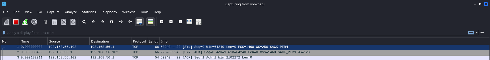

### Failed Handshake: Closed port

Changing assumption
- the port is closed, server doesn't wanna talk

The failed handshake:
- Client says hello marked as 'SYN' packet
- Server (port) says bye, 'RST'

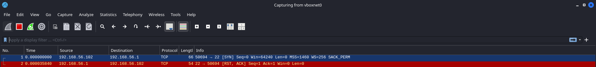

### Failed Handshake: Filtered port

Changing assumption
- the port is behind a firewall a.k.a **filtered**

The failed handshake:
- Client waits (yells in abyss) but no response from the server.

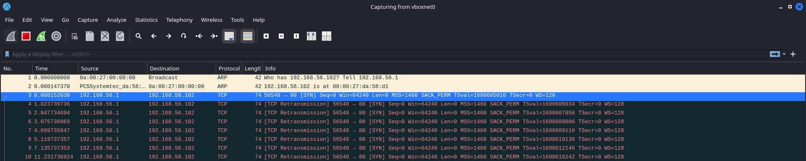

## Writing a TCP Scanner

Basis the concepts we discussed above, we can enumerate the state of a port by the kind of the packet returned.

V provides `net` standard library to work with networks. As per the [documentation](https://modules.vlang.io/net.html):

> *`net` provides networking functions. It is mostly a wrapper to BSD sockets, so you can listen on a port, connect to remote TCP/UDP services, and communicate with them.*

### Create a project

To setup a V project, create a directory with suitable name and run `v init` from within it.

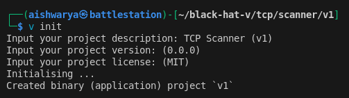

After answering the set of questions prompted on terminal, it creates a hello-world project.

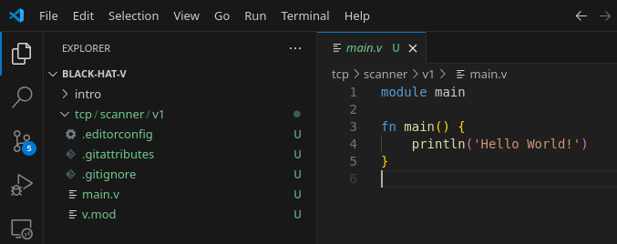

### Testing for port availablity.

Following the orginal source of reference ([Black Hat Go](https://nostarch.com/blackhatgo)) I utilize the host **scanme.nmap.org** for the following shenanigans.

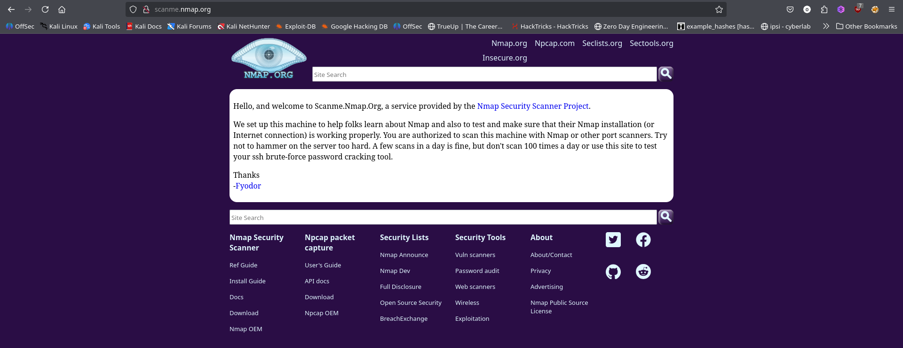

Basis the documentation of `net` library, there exists `dial_tcp` function which
- accepts a single parameter name `oaddress` of type `string` that consists of the host and the port separated by a colon `:`. 
- returns `!&net.TcpConn` i.e. either a reference to **TcpConn** structure or error in case of successful or failed connection respectively.

In the following code, I use `net.dial_tcp` to connect to **scanme.nmap.org** at port **80**. The [`if`-unwrapping](https://docs.vlang.io/statements-&-expressions.html#if-unwrapping) verfies for a successfully connection. If an error is returned by `net.dial_tcp`, the initialization of `conn` returns `false` and the condition is validated approriately.

```go
module main

import net

fn main() {
	host := 'scanme.nmap.org'
	port := 80

	if conn := net.dial_tcp('${host}:${port}') {                 // use `conn` initializatin to convert the net.dial_tcp function call to boolean condition
		println("Successfully connected to ${host}:${port}")
	} else {
		println("Failed to connect to ${host}:${port}")
	}

}
```

You can run the code mentioned above as follows (skipping the `-w` flag allows the v compilter to complain for unused variable `conn`).

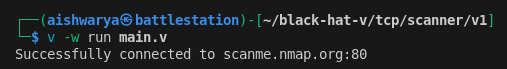

### Performing Non-concurrent Scanning

Utilizing a loop would help to rotate the `port` value in the connection string parameter to `net.dial_tcp`. Also, `.close()` can be used on a mutable instance of `net.TcpConn` to close the connection.

A sample code to scan the first hundred ports may appear as:

```go
module main

import net

fn main() {
	host := 'scanme.nmap.org'

	for port in 0..1024 {
		if mut conn := net.dial_tcp('${host}:${port}') {
			println("Successfully connected to ${host}:${port}")
			conn.close() or {
				println("Failed to close connection to ${host}:${port}")
			}
		} else {
			println("Failed to connect to ${host}:${port}")
		}
	}
}
```

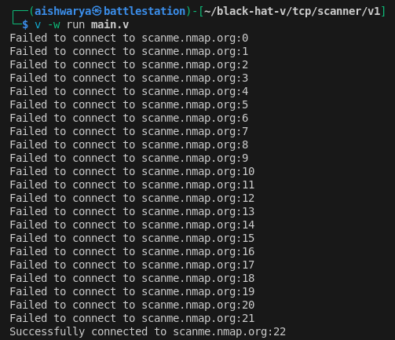

### Performing Concurrent Scanning

I will use goroutines provided by V runtime to execute concurrent lightweight threads.

Firstly, I create a [closure](https://docs.vlang.io/functions-2.html#closures) within `main()` to use the `host` variable and pass it a `port` parameter.

```go
fn [host] (port int) {
	if mut conn := net.dial_tcp('${host}:${port}') {
		println('Successfully connected to ${host}:${port}')
		conn.close() or { println('Failed to connect to ${host}:${port}') }
	} else {
		println('Failed to connect to ${host}:${port}')
	}
}
```

Next, I use this function with goroutines to scan first 100 ports

```go
module main

import net

fn main() {
	host := 'scanme.nmap.org'

	for p in 0..100 {
		go fn [host] (port int) {
			if mut conn := net.dial_tcp('${host}:${port}') {
				println('Successfully connected to ${host}:${port}')
				conn.close() or { println('Failed to connect to ${host}:${port}') }
			} else {
				println('Failed to connect to ${host}:${port}')
			}
		}(p)
	}
}
```

Owing to lack of wait for the goroutines to finish their work, the program exits before connections are established and the program fails to provide results.

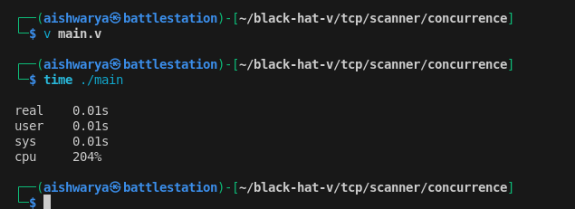

Adding a `wait()` for the goroutines does allow for the execution of the function to finish but the results may vary owing to limitation of network resources.

```go
module main

import net

fn main() {
	host := 'localhost'

	mut routines := []thread{}

	for p in 0..65536 {
		routines << go fn [host] (port int) {
			if mut conn := net.dial_tcp('${host}:${port}') {
				println('Successfully connected to ${host}:${port}')
				conn.close() or { println('Failed to connect to ${host}:${port}') }
			} else {
				println('Failed to connect to ${host}:${port}')
			}
		}(p)
	}

	routines.wait()
}
```

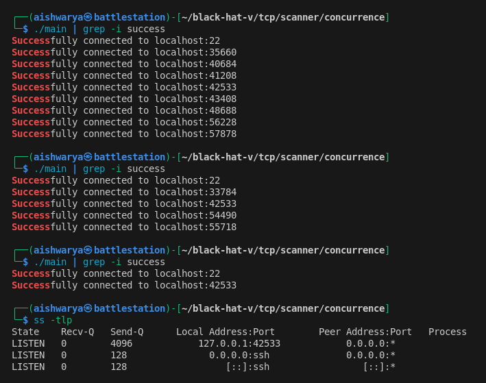

### Port Scanning using worker pools

To avoid inconsistencies, a pool of goroutines can be created to manage the task being performed. A `for` loop can be used to create a resource pool of worker goroutines. Next, in `main()` *thread*, use a **channel** to provide work.

To keep track of a worker, I will use [`sync`](https://modules.vlang.io/sync.html#readme_sync) module's [`WaitGroup`](https://modules.vlang.io/sync.html#WaitGroup) implementation.

The following code segment creates a resource pool of ten workers and uses them to output numbers within the 0 to 99 (inclusive) range using a buffered channel with a capacity of 100 elements.

```go
module main

import sync

fn worker(ch chan int) {	// worker function
    for {				
        val := <-ch or { continue } 		// monitor the channel for input
		println('${val}\n')
    }
}

fn main() {
    ch := chan int{cap: 10}			// instantiate a buffered channel to provide port number to the worker function
    mut wg := sync.new_waitgroup()

    for _ in 0..ch.cap {
        wg.go(fn [ch] () {			// WaitGroup.go() function manages the WaitGroup.add() and WaitGroup.done() function calls
            worker(ch)
        })
    }

    for i in 0..100 {				// Communicate port number through the channel
		ch <- i
    }

    wg.wait()

    ch.close()
}
```

When the previously built code for port scan is plugged into the worker function, I do get results but in no particular order. (I separated the WaitGroup call  `wg.go` into `wg.add()` and `wg.done()` for better control).

```go
module main

import net
import sync

fn worker(host string, ports chan int, mut wg &sync.WaitGroup) {		// worker function
    for {				
        port := <-ports or { continue } 								// monitor the channel for input
		if mut conn := net.dial_tcp('${host}:${port}') {
			println("Successfully connected to ${host}:${port}")
			conn.close() or {
				println("Failed to close connection to ${host}:${port}")
			}
		} else {
			println("Failed to connect to ${host}:${port}")
		}
		wg.done()														// signify work completion
    }
}

fn main() {
    ports := chan int{cap: 100}			// instantiate a buffered channel to provide port number to the worker function
    mut wg := sync.new_waitgroup()

    for _ in 0..ports.cap {
		go worker('localhost', ports, mut wg)
    }

    for port in 0..65536 {				
		wg.add(1)						// add the work
		ports <-port					// Communicate port number through the channel
    }

    wg.wait()

    ports.close()
}
```

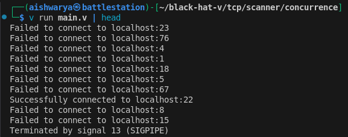

### Multichannel Communication

By using two threads
- One for sending port to worker for scanning
- Second for receivng the result

we can order the result of port scan. This also eliminates the need for `WaitGroup` as the number of inputs to and outputs from the worker pool remain constant for the batch of ports scanned. As explained better in the book [Black Hat Go](https://nostarch.com/blackhatgo):

> For example, if you scan 1024 ports, you’re sending on the worker channel 1024 times,and you’ll need to send the result of that work back to the main thread 1024 times. Because the number of work units sent and the number of results received are the same, your program can know when to close the channels and subsequently shut down the workers.

```go
module main

import net

fn worker(host string, ports chan int, results chan int) {				// worker function
    for {				
        port := <-ports or { continue } 								// monitor the channel for input
		
		if mut conn := net.dial_tcp('${host}:${port}') {
			conn.close() or {}
			results <- port												// record the port number
		} else {
			results <- -1												// -1 signifies a closed port
		}
    }
}

fn main() {
	host := 'scanme.nmap.org'
    ports := chan int{cap: 100}			// buffered channel to provide port number to the worker function
	results := chan int{cap: 100}		// buffered channel to retrieve result from worker function
	mut openports := []int{}

    for _ in 0..ports.cap {
		go worker(host, ports, results)
    }

	go fn [ports] () {					// thread to communicate ports
		for port in 0..1024 {				
			ports <-port
		}
	}()

	for _ in 0..1024 {					// fetch back the results (in this main thread)
		port := <- results
		if port != -1 {
			openports << port
		}
	}

    ports.close()
	results.close()

	openports.sort()

	for port in openports {
		println('Open: ${host}:${port}')
	}
}
```

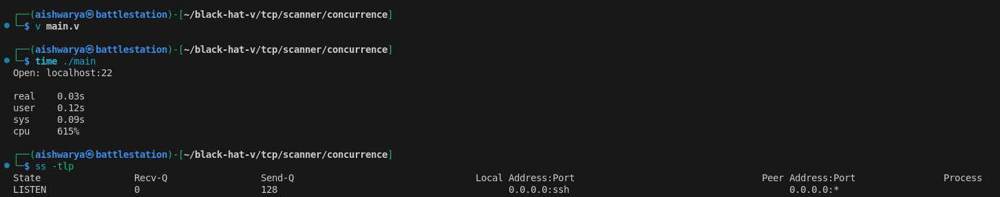

## Building a TCP Proxy

This section first walks through a TCP *echo server* that echoes a given response back to the client. Next, we build a port forwarder and implement netcat's code execution features.

### Using io.Reader and io.Writer

Similar to Go, V provides with [`io.Reader`](https://modules.vlang.io/io.html#Reader) and [`io.Writer`](https://modules.vlang.io/io.html#Writer) interfaces with a single requirement of `read` and `write` functions respectively.

```go
// Reader represents a stream of data that can be read.
interface Reader {
	// read reads up to buf.len bytes and places
	// them into buf.
	// A type that implements this should return
	// `io.Eof` on end of stream (EOF) instead of just returning 0
mut:
	read(mut buf []u8) !int
}

// Writer is the interface that wraps the write method, which writes buf.len bytes to the underlying data stream.
interface Writer {
mut:
	write(buf []u8) !int
}
```

An example implementation of the above described interfaces can be:

```go
module main

import os
import log

struct ExampleReader {}

fn (r ExampleReader) read(mut buf []u8) !int {
	eprint('in> ')
	return os.stdin().read(mut buf)					// os.stdin() returns an os.File struct which implements io.Reader.read() as read() for stdin
}

struct ExampleWriter {}

fn (w ExampleWriter) write(buf []u8) !int {
	eprint('out> ')
	mut stdout_handle := os.stdout()
	return stdout_handle.write(buf)					// os.stdout() returns an os.File struct which implements io.Writer.write() as write() for stdout
}

fn main() {
	reader := ExampleReader{}
	writer := ExampleWriter{}

	mut buf := []u8{len: 4096}		// io.Reader and io.Writer interfaces work on basis of buf.len

	if bufLen := reader.read(mut buf) {
		println("Read ${bufLen} bytes from stdin.")
	} else {
		log.fatal("Unable to read data.")
	}

	if bufLen := writer.write(buf) {
		println("Wrote ${bufLen} bytes to stdout.")
	} else {
		log.fatal("Unable to write data.")
	}
}
```

The following is output of the program for input `hello\n`

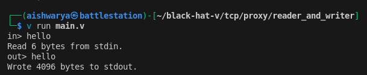

As copying data from Reader to Writer is a fairly common pattern, thus languages like Go and V provide a copy functionality - [`cp`](https://modules.vlang.io/io.html#cp) function can be used in V for this.

> `cp` copies from `src` to `dst` by allocating a maximum of 1024 bytes buffer for reading until either EOF is reached on `src` or an error occurs. An error is returned if an error is encountered during write.

```go
fn cp(mut src Reader, mut dst Writer, params CopySettings) !
```

The `main()` function can be re-written as:

```go
module main

import io
import os
import log

struct ExampleReader {}

fn (r ExampleReader) read(mut buf []u8) !int {
	eprint('in> ')
	return os.stdin().read(mut buf)
}

struct ExampleWriter {}

fn (w ExampleWriter) write(buf []u8) !int {
	eprint('out> ')
	mut stdout_handle := os.stdout()
	return stdout_handle.write(buf)
}

fn main() {
	mut reader := ExampleReader{}
	mut writer := ExampleWriter{}

	io.cp(mut reader, mut writer) or {
		log.fatal("Unable to read/write data.")
	}
}
```

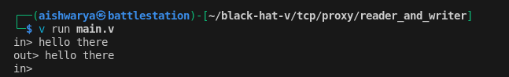

### Creating an Echo Server

V provides with [`TcpConn`](https://modules.vlang.io/net.html#TcpConn) struct which implements the `read()` and `write()` functions similar to those discussed above.

The function [`listen_tcp()`](https://modules.vlang.io/net.html#listen_tcp) allows to listen for connections and returns an [`TcpListener`](https://modules.vlang.io/net.html#TcpListener) object which exposes [`accept()`](https://modules.vlang.io/net.html#TcpListener.accept) function to accept connections represented as `TcpConn` object.

```go
module main

import net
import log

// process a connection from client
fn echo(mut conn net.TcpConn) {
	// at the end of it all, please close the connection
	defer {
		conn.close() or {
			log.fatal("Unable to close connection.")
		}
	}

	// buffer to store messages
	mut buf := []u8{len: 512}

	for {
		// read from client
		n := conn.read(mut buf) or {
			log.fatal("Unable to read from connection.")
			return
		}

		// validate client did not disconnect
		if n == 0 {
			log.info("Client disconnected.")
			break
		}

		// create a slice from buffer space upto the data transferred
		data := buf[..n].clone()

		log.info("Received ${n} bytes: ${data}")

		// return the data back to the client
		log.info("Writing back...")
		conn.write(data) or {
			log.fatal("Unable to write to connection.")
		}
	}

}

fn main() {
	// tell log.info() to print on `stdout` rather than `stderr`
	log.use_stdout()

	// port to listen on
	port := 20080
	
	// create a listener
	mut listener := net.listen_tcp(net.AddrFamily.ip, ":${port}") or {
		log.fatal("Failed to start a TCP listener on port: ${port}.")
	}
	log.info("Opened a TCP listener on port: ${port}.")

	// infinite loop to listen and accept connections
	for {
		mut conn := listener.accept() or {
			log.fatal("Unable to accept connections.")
		}

		// handle each connection in separate thread
		go echo(mut conn)
	}
}
```

Interacting with the echo server using `telnet` or `nc` demonstrates that the server stands up to its name.

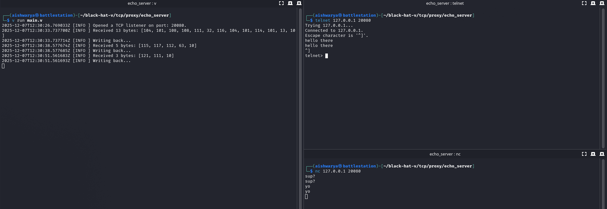

While `TcpConn.read()` and `TcpConn.write()` provide read/write capabilities on the socket, they require manual buffer tracking and low-level calls on the connection object. This can be futher improved using a buffered I/O mechanism by levaraging the [`BufferedReader`](https://modules.vlang.io/io.html#BufferedReader) and [`BufferedWriter`](https://modules.vlang.io/io.html#BufferedWriter) structs from `io` module.

```go
module main

import io
import net
import log

fn echo(mut conn net.TcpConn) {
	defer {
		conn.close() or {
			log.fatal("Unable to close connection.")
		}
	}

	// create a buffered reader
	mut reader := io.new_buffered_reader(io.BufferedReaderConfig{reader: conn})

	// create a buffered writer
	mut writer := io.new_buffered_writer(io.BufferedWriterConfig{writer: conn}) or {
		log.fatal("Failed to create buffered writer.")
	}

	// read line with delimiter at new-line.
	s := reader.read_line(io.BufferedReadLineConfig{delim: `\n`}) or {
		log.fatal("Unable to read data.")
	}

	log.info("Received ${s.len} bytes: ${s}")

	log.info("Writing data")

	// echo back the data using buffere writer (as per documentatio: write writes src in the buffer, flushing it to the underlying writer as needed, and returns the number of bytes written.)
	writer.write(s.bytes()) or {
		log.fatal("Unable to write data.")
	}
}
```

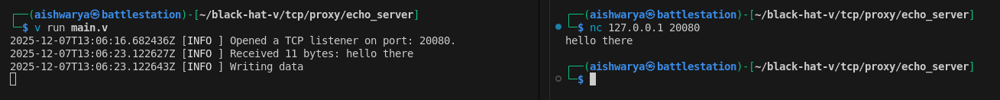

This can also be achived using `io.cp()` as it manages buffer and copies for reader to writer i.e. echoes.

```go
fn echo(mut conn net.TcpConn) {
	defer {
		conn.close() or {
			log.fatal("Unable to close connection.")
		}
	}

	io.cp(mut conn, mut conn) or {
		log.fatal("Unable to read/write data.")
	}
}
```

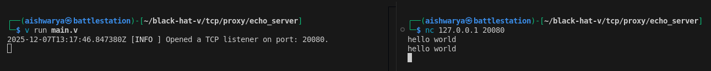

### Proxying a TCP Client

For this scenario, I configured a linux VM on a shared network interface. Such that the network is as follows:

- Host Machine: 192.168.1.5 on wlan0
- Virtual Machine: 192.168.1.7 on eth0

The host machine serves a website on 127.0.0.1:8000

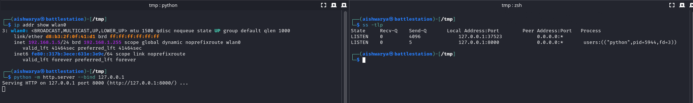

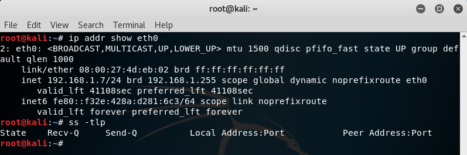

Being hosted on loopback interface of the host, this website is not directly accessible to the virtual machine. A port-forward proxy transfer packets from wlan0 host machine to loopback can be of aid in this situation.

```go
module main

import io
import net
import log

fn handle(mut src net.TcpConn) {
	mut dst := net.dial_tcp("127.0.0.1:8000") or {
		log.fatal("Unable to connect to 127.0.0.1:8000")
	}

	defer {
		dst.close() or {
			
		}
	}

	go fn [mut src, mut dst] () {
		io.cp(mut src, mut dst) or {
			log.fatal("Unable to write to 127.0.0.1:8000")
		}
	}()

	io.cp(mut dst, mut src) or {
		log.fatal("Unable to write to 192.168.1.5:8080")
	}

}

fn main() {
	mut listener := net.listen_tcp(net.AddrFamily.ip, "192.168.1.5:8080") or {
		log.fatal("Failed to start a TCP server on port 192.168.1.5:8080.")
	}
	
	for {
		mut conn := listener.accept() or {
			log.fatal("Unable to accept connections.")
		}

		go handle(mut conn)
	}
}
```

Running it opens up port 8080 (http-alt) on 192.168.1.5

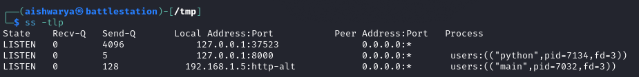

A `curl` from within the virtual machine demonstrates how the request is proxied to 127.0.0.1:8000.

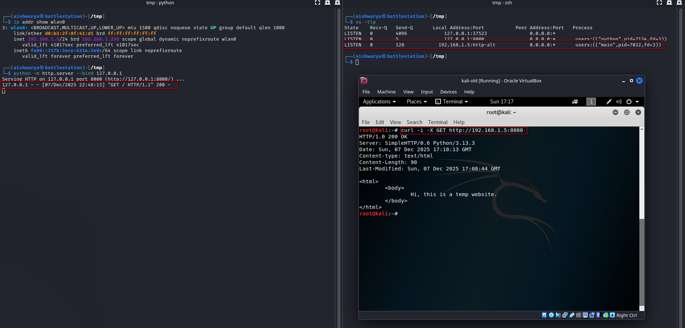

### Replicating Netcat for Command Execution

The [`os.Process`](https://modules.vlang.io/os.html#Process) struct can be used to execute processes. In following code, I launch an instance of `/bin/sh`. Through an infinite `for` loop, I process the input and return the output back to the client using buffered reader and writer (discussed above).

```go
module main

import os
import io
import net
import log

fn handle(mut conn net.TcpConn) {
	// Create buffered streams from the connection
	mut reader := io.new_buffered_reader(io.BufferedReaderConfig{reader: conn})
	mut writer := io.new_buffered_writer(io.BufferedWriterConfig{writer: conn}) or {
		log.fatal("Failed to create buffered writer.")
	}

	// Create a new '/bin/sh -i' process
	mut proc := os.Process{
		filename: "/bin/sh",
	}

	defer {
		proc.close()
		conn.close() or {
			log.error("Unable to close connection.")
		}
	}

	// Enable redirect for stdin/stdout/stderr
	proc.set_redirect_stdio()

	// Start the process
	proc.run()

	// read-exec-return loop
	for {
		// read input from client
		mut input := reader.read_line() or { 
			log.error("Unable to read command. Client possibly disconnected.")
			break
		}
		
		// provide input to the process
		proc.stdin_write(
			// handle edge-case where blank input breaks /bin/sh
			if input.len != 0 {input + '\n'} else { 'echo\n' }
		)

		// fetch back the result
		writer.write(proc.stdout_read().bytes()) or {
			log.error("Unable to fetch output")
			break
		}

		// flush the result to client
		writer.flush() or {
			log.error("Unable to send output")
			break
		}
	}
}


fn main() {
	log.use_stdout()

	host := "0.0.0.0"
	port := 20080

	mut listener := net.listen_tcp(net.AddrFamily.ip, "${host}:${port}") or {
		log.fatal("Failed to spawn a listener.")
	}

	log.info("Started listener on ${host}:${port}")

	for {
		mut conn := listener.accept() or {
			log.fatal("Failed to accept connections.")
		}

		go handle(mut conn)
	}
}
```

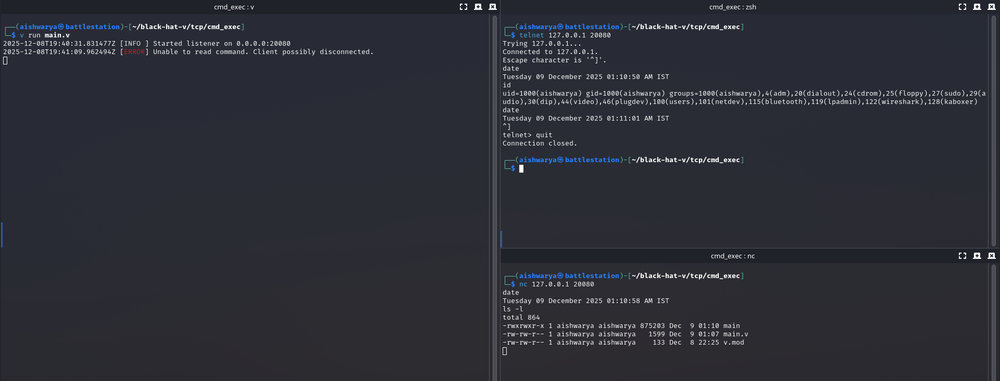

Swapping the process filename from `/bin/sh` to `c:\\windows\\system32\\cmd.exe` and cross-compiling for Microsoft Windows allowed the bind-shell to work on a different OS with minimal effor.

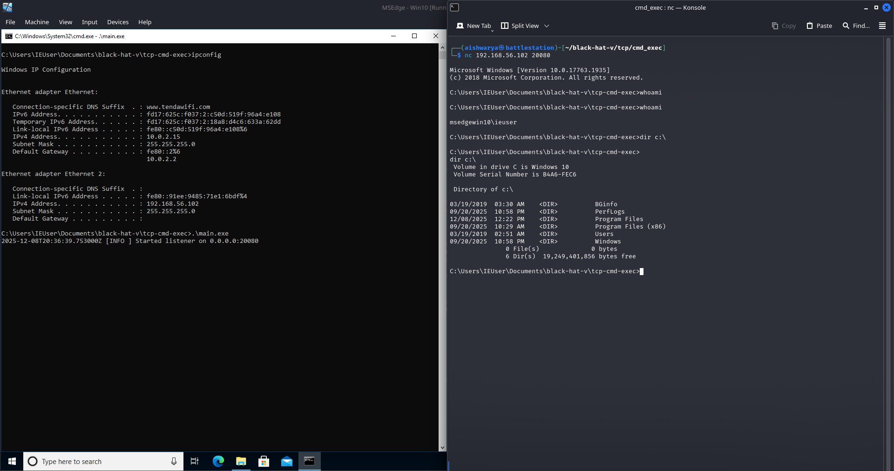

## Meme Time

