+++
title = 'SOC Homelab 101 - Learning Defensive Solutions'
date = 2026-03-16T02:33:55-04:00
tags = ["blue team", "homelab"]
+++

Unfortunately in the AD Homelab, I failed to focus on defensive capabilities of Wazuh as XDR so this time I planned to build a lab focused on detection solutions. Rather than Wazuh, in this iteration I tried to get my hands dirty with Elastic and Kibana from the renowned ELK stack. Furthermore, I leveraged this exercise to learn about Vagrant and automation VM provisioning so unlike the previous homelab blog, this focuses on automating steps in place of manual configurations.

I'd love to take people on a stroll on how to setup ELK but there are a plethora of blogs/videos/documentation and other references on the internet. The following aims to be an explanation of the [*Vagrant provisioning scripts I developed*](https://github.com/ashtrace/soc-homelab) for automating the setup to describe the what/why/how of the steps I undertook.

## The Environment

The configuration of my host machine were as follows:
- OS: Debian 13
- Hypervisor: Virtualbox

## Installing Dependencies

For Virtualbox, I downloaded the `.deb` file provided at [*Download VirtualBox for Linux Hosts*](https://www.virtualbox.org/wiki/Linux_Downloads) page for my particular host OS.

Whereas Vagrant, I followed the instructions at the [*Install Vagrant*](https://developer.hashicorp.com/vagrant/install) documentation for linux.

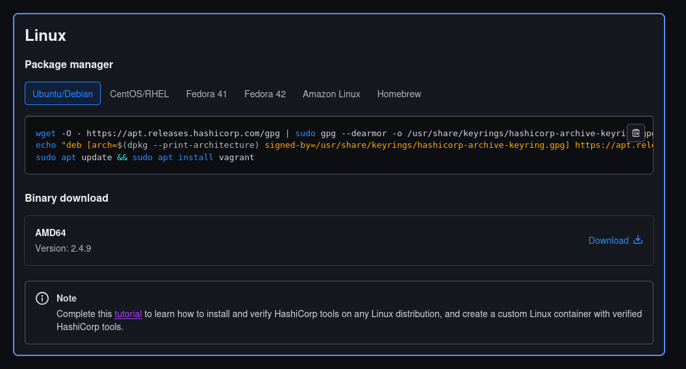

## Stage 0: The Plan

I aimed for a simple 2 machine architecture for the lab:

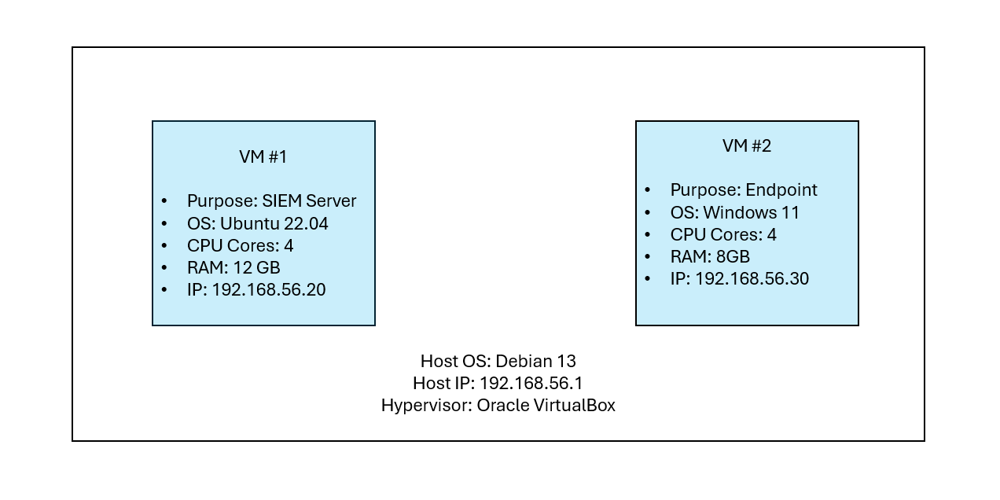

While configuring the elastic/kibana services in the SIEM lab VM, I needed to save the API tokens and secrets being generated to leverage them while creating the endpoint device. Thus, I used the current project directory as a shared mounted drive while provisioning the VMs.

```Vagrantfile
Vagrant.configure("2") do |config|

  # Shared folder for passing Enrollment Tokens and Configs between VMs
  config.vm.synced_folder ".", "/vagrant"
```

## Stage 1: The Elasticsearch and The Kibana

While originally I wanted to continue with Wazuh (the reason being my very teeny-tiny experience with it beforehand), I switched to elasticsearch + kibana as I felt that I had a larger set of public documentation to refer. Bear in mind that I had no prior experience of Elastic/Kibana or any other blue-team oriented technology for that matter.

For the first iteration I tried to configure things manually referring to [*digital ocean blogpost*](https://www.digitalocean.com/community/tutorials/how-to-install-elasticsearch-logstash-and-kibana-elastic-stack-on-ubuntu-22-04). Only once I felt confident in my setup, I moved to the second phase of automating it with Vagrant.

### Vagrantfile

I define a vm named `soc` with Ubuntu 22.04 as mentioned before. I configured a static IPv4 address `192.168.56.20` and mentioned the path of the bash script (i.e. `provision/soc.sh`) which would contain the configuration steps to be ran with the privileged user context.

Registering VirtualBox as my provider, I conifigured the display name visible on VirtualBox and provided with the machine with 12GB of RAM and 4 cores of CPU.

Finally, I enabled the `linked_clone` feature to create a lightweight copy of base image and enabled I/O APIC for OS features along with nested VM capabilities for elastic defend (more on this later in the following sections).

```Vagrantfile
  ########################################
  # SOC SIEM VM (Ubuntu 22.04 Jammy)
  ########################################
  config.vm.define "soc" do |soc|
    soc.vm.box = "ubuntu/jammy64"
    soc.vm.hostname = "soc-siem"

    soc.vm.network "private_network", ip: "192.168.56.20"

    soc.vm.provision "shell",
      path: "provision/soc.sh",
      privileged: true

    soc.vm.provider "virtualbox" do |vb|
      vb.name = "soc-siem-lab"
      vb.memory = 12288 # 12GB RAM
      vb.cpus = 4       # 4 cores for CPU
      
      vb.linked_clone = true
      vb.customize ["modifyvm", :id, "--ioapic", "on"]
      # Enable nested VT-x (Required for some Elastic Defend features)
      vb.customize ["modifyvm", :id, "--nested-hw-virt", "on"] 
    end
  end
```

### The Provisioning script

The `provision/soc.sh` is a bash script file with commands to configure the elastic/kibana services in automated fashion, only after I had validated them manually. It starts as follows:

```bash
#!/bin/bash

set -e

##################################################
# Configuration Variables 
##################################################
ELASTIC_PASSWORD="CHANGE_ME"
SHARED_DIR="/vagrant"
IP_ADDR="192.168.56.20"

apt update
apt install -y curl wget apt-transport-https gnupg jq unzip
```

The `set -e` command tells the script to stop running at the first error. Next, I configure the variables as mentioned in the preceeding sections. The `ELASTIC_PASSWORD` needs to be set to a secret phrase/password which shall be used to access the elasticsearch APIs and the dashboard. Following the variable declaration, dependecies are installed for later usage.

### Configuring Elasticsearch

Once the dependencies are installed, apt sources are configured for elasticsearch and kibana. Next, the script installs elasticsearch and configures it.

The YAML file sets up cluster and node name, followed by paths for data and logs. Next, it configures the network host for the server. It enables security options required by Elastic Agent during enrollment while disabling HTTPs (I did not want to `curl -k` too much, its a homelab so I can take this risk but do not follow this in production environments).

```yaml
cluster.name: soc-lab
node.name: soc-node1
path.data: /var/lib/elasticsearch
path.logs: /var/log/elasticsearch
network.host: 0.0.0.0
discovery.type: single-node

# --- SECURITY SECTION ---
xpack.security.enabled: true
xpack.security.enrollment.enabled: true

# Disable HTTP SSL (for easy Browser/Kibana access)
xpack.security.http.ssl.enabled: false

# Disable Transport SSL
xpack.security.transport.ssl.enabled: false
```

Next, the script starts the elasticsearch service and waits until it is reachable via `curl`. Following which, it resets the elasticsearch password to the one provided in `ELASTIC_PASSWORD` variable. Furthermore it resets kibana password and saves both of these secrets along with the version of elasticsearch installed in a text file with the shared folder (my current project directory) titled `elastic_config.txt`

```bash
##################################################
# Setup apt sources
##################################################

curl -fsSL https://artifacts.elastic.co/GPG-KEY-elasticsearch |sudo gpg --dearmor -o /usr/share/keyrings/elastic.gpg
echo "deb [signed-by=/usr/share/keyrings/elastic.gpg] https://artifacts.elastic.co/packages/8.x/apt stable main" > /etc/apt/sources.list.d/elastic-8.x.list
apt update

##################################################
# Install Elasticsearch
##################################################

apt install elasticsearch

##################################################
# Configure Elasticsearch (disabled HTTPS and TLS, reset password  )
##################################################

mkdir -p /var/lib/elasticsearch
mkdir -p /var/log/elasticsearch

chown -R elasticsearch:elasticsearch /var/lib/elasticsearch
chown -R elasticsearch:elasticsearch /var/log/elasticsearch

cat > /etc/elasticsearch/elasticsearch.yml <<EOF
cluster.name: soc-lab
node.name: soc-node1
path.data: /var/lib/elasticsearch
path.logs: /var/log/elasticsearch
network.host: 0.0.0.0
discovery.type: single-node

# --- SECURITY SECTION ---
xpack.security.enabled: true
xpack.security.enrollment.enabled: true

# Disable HTTP SSL (for easy Browser/Kibana access)
xpack.security.http.ssl.enabled: false

# Disable Transport SSL
xpack.security.transport.ssl.enabled: false
EOF

##################################################
# Start Elasticsearch 
##################################################

systemctl daemon-reload
systemctl enable --now elasticsearch

echo "Waiting for Elasticsearch..."

until curl http://localhost:9200 >/dev/null 2>&1
do
 sleep 5
done

##################################################
# Extract elastic password
##################################################

printf "y\n$ELASTIC_PASSWORD\n$ELASTIC_PASSWORD\n" | /usr/share/elasticsearch/bin/elasticsearch-reset-password -u elastic -i -f
echo "elastic password: $ELASTIC_PASSWORD" > ${SHARED_DIR}/elastic_config.txt

KIBANA_PASSWORD=$(/usr/share/elasticsearch/bin/elasticsearch-reset-password -u kibana_system -f -b | grep "New value:" | awk '{print $NF}')
echo "kibana_system password: $KIBANA_PASSWORD" >> ${SHARED_DIR}/elastic_config.txt

chmod 644 $SHARED_DIR/elastic_config.txt

echo "Validating new Elasticsearch password ..."

curl -u elastic:$ELASTIC_PASSWORD http://localhost:9200

ELASTIC_VERSION=$(curl -u elastic:$ELASTIC_PASSWORD http://localhost:9200 | jq -r '.version.number')

echo "[*] Installed Elasticsearch version: $ELASTIC_VERSION"
echo "Elasticsearch version: $ELASTIC_VERSION" >> ${SHARED_DIR}/elastic_config.txt
```

### Configuring Kibana

Within this segement, the script installs kibana, configures the server to listen on all interface, sets the elasticsearch host, username, and password generated from previous section.

```yaml
server.host: "0.0.0.0"
elasticsearch.hosts: ["http://localhost:9200"]
elasticsearch.username: "kibana_system"
elasticsearch.password: "$KIBANA_PASSWORD"
```

Then it generates the encryption keys required by elastic defend service during enrollment. Finally, it starts the service and validates the reachability.

```bash
##################################################
# Install Kibana
##################################################

sudo apt install kibana

cat > /etc/kibana/kibana.yml <<EOF
server.host: "0.0.0.0"
elasticsearch.hosts: ["http://localhost:9200"]
elasticsearch.username: "kibana_system"
elasticsearch.password: "$KIBANA_PASSWORD"
EOF

# For Elastic Defend
/usr/share/kibana/bin/kibana-encryption-keys generate | grep -E '^xpack\..*:' > /tmp/kibana.keys
cat /tmp/kibana.keys >> /etc/kibana/kibana.yml

systemctl daemon-reload
systemctl enable --now kibana

echo "[*] Waiting for Kibana ..."
until [ "$(curl -s -u elastic:$ELASTIC_PASSWORD http://localhost:5601/api/status | jq -r '.status.overall.level' 2>/dev/null)" == "available" ]; do
    echo "    - Still initializing plugins..."
    sleep 10
done
```

## Stage 2: Fleet

### Terminologies

As per the elastic [documentation](https://www.elastic.co/docs/reference/fleet):

> Elastic Agent is a single, unified way to add monitoring for logs, metrics, and other types of data to a host. It can also protect hosts from security threats, query data from operating systems, forward data from remote services or hardware, and more. A single agent makes it easier and faster to deploy monitoring across your infrastructure. Each agent has a single policy you can update to add integrations for new data sources, security protections, and more.

While [fleet allows to](https://www.elastic.co/docs/reference/fleet/manage-elastic-agents-in-fleet):

> Manage Elastic Agent binaries and specify settings installed on the host that determine whether the agent is enrolled in Fleet, what version of the agent is running, and which agent policy is used.
Manage agent policies that specify agent configuration settings, which integrations are running, whether agent monitoring is turned on, input settings, and more.

Using `fleet` one may configure `elastic agents`. These agents allow to monitor logs through [*`integrations`*](https://www.elastic.co/docs/reference/integrations).

> Integrations provide an easy way to connect Elastic to external services and systems, and quickly get insights or take action. They can collect new sources of data, and they often ship with out-of-the-box assets like dashboards, visualizations, and pipelines to extract structured fields out of logs and events.

Another important terminology is `Elastic Agent Policy`

> Agent policies specify which integrations you want to run and on which hosts. You can apply an Elastic Agent policy to multiple agents, making it even easier to manage configuration at scale.

Thus policies help to create sets of integrations for better management.

### Fleet Policies

The fleet server recieves the instruction from Kibana (Fleet UI) and pushes the policies to the enrolled elastic agents while keeping track of their health and status.

For simplicity, I went on to configure it on the same host which already runs the elasticsearch and the kibana services.

The script starts with initialzing the fleet setup with the fleet-server-policy which contains the integration for fleet-server functionalities.
The *fleet-server-policy* policy when applied to an elastic agent would allow it function as a fleet-server, as mentioned in the elastic [documentation](https://www.elastic.co/docs/reference/fleet/fleet-server):

> Fleet Server is a subprocess that runs inside a deployed Elastic Agent. This means the deployment steps are similar to any Elastic Agent, except that you enroll the agent in a special Fleet Server policy. Typically—especially in large-scale deployments—this agent is dedicated to running Fleet Server as an Elastic Agent communication host and is not configured for data collection.

```bash
############################################
# INITIALIZE FLEET
############################################
echo "[*] Initializing Fleet..."
curl -s -X POST http://localhost:5601/api/fleet/setup -H "kbn-xsrf: true" -u elastic:$ELASTIC_PASSWORD

echo ""

############################################
# CREATE FLEET-SERVER POLICY
############################################
echo "[*] Creating fleet-server-policy..."
curl -s -u elastic:$ELASTIC_PASSWORD \
  -X POST -H "kbn-xsrf: kibana" -H "Content-type: application/json" \
  "http://localhost:5601/api/fleet/agent_policies" \
  -d '{
    "id": "fleet-server-policy",
    "name": "Fleet-Server-Policy",
    "namespace": "default",
    "monitoring_enabled": []
  }'

echo ""

############################################
# ADD FLEET-SERVER INTEGRATION
############################################
echo "[*] Adding fleet-server integration..."
curl -s -u elastic:$ELASTIC_PASSWORD \
  -X POST -H "kbn-xsrf: kibana" -H "Content-type: application/json" \
  "http://localhost:5601/api/fleet/package_policies" \
  -d '{
    "name": "fleet_server-1",
    "namespace": "default",
    "policy_id": "fleet-server-policy",
    "package": {
      "name": "fleet_server",
      "version": "1.6.0"
    }
  }'
```

Once created, the policy (with the integration) is visible in the dashboard.

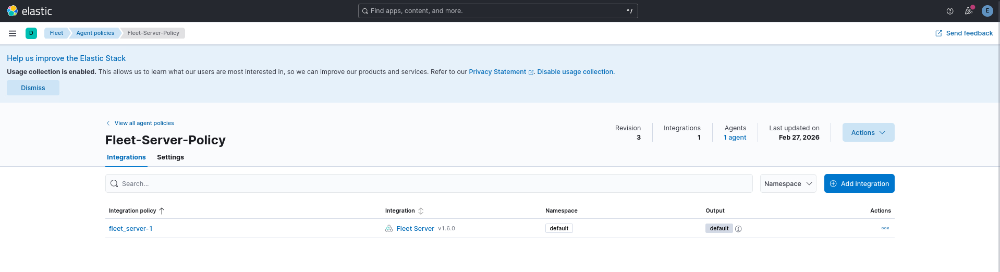

Next the script creates another policy with integrations for elastic defend and windows telemetry, titled 'SOC-Lab-Policy'. This is the policy that would later-on be applied onto the agent being enrolled on the Windows 11 endpoint VM.

```bash
############################################
# CREATE SOC POLICY
############################################
echo "[*] Creating SOC-Lab-Policy..."
SOC_POLICY_ID=$(curl -s -X POST http://localhost:5601/api/fleet/agent_policies \
    -H "kbn-xsrf: true" -H "Content-Type: application/json" -u elastic:$ELASTIC_PASSWORD \
    -d '{"name":"SOC-Lab-Policy","namespace":"default","monitoring_enabled":["logs","metrics"]}' | jq -r '.item.id')

echo "[*] SOC Policy ID: $SOC_POLICY_ID"
echo "SOC Policy ID: $SOC_POLICY_ID" >> ${SHARED_DIR}/elastic_config.txt

############################################
# INSTALL WINDOWS INTEGRATION TO SOC POLICY
############################################

echo "[*] Adding Windows telemetry integration..."

WIN_VERSION=$(curl -s -u elastic:$ELASTIC_PASSWORD "http://localhost:5601/api/fleet/epm/packages/windows" | jq -r '.item.version')

curl -s -X POST http://localhost:5601/api/fleet/package_policies \
  -H "kbn-xsrf: true" -H "Content-Type: application/json" -u elastic:$ELASTIC_PASSWORD \
  -d "{
    \"name\": \"windows-integration\",
    \"namespace\": \"default\",
    \"policy_id\": \"$SOC_POLICY_ID\",
    \"package\": {
      \"name\": \"windows\",
      \"version\": \"$WIN_VERSION\"
    }
  }"

echo ""

############################################
# INSTALL ELASTIC DEFEND INTEGRATION TO SOC POLICY
############################################

echo "[*] Adding Elastic Defend integration..."

ENDPOINT_VERSION=$(curl -s -u elastic:$ELASTIC_PASSWORD \
http://localhost:5601/api/fleet/epm/packages/endpoint \
| jq -r '.item.version')

curl -s -X POST http://localhost:5601/api/fleet/epm/packages/endpoint/$ENDPOINT_VERSION \
-H "kbn-xsrf: true" \
-u elastic:$ELASTIC_PASSWORD

curl -s -X POST http://localhost:5601/api/fleet/package_policies \
  -H "kbn-xsrf: true" \
  -H "Content-Type: application/json" \
  -u elastic:$ELASTIC_PASSWORD \
  -d "{
    \"name\": \"elastic-defend\",
    \"policy_id\": \"$SOC_POLICY_ID\",
    \"package\": {
      \"name\": \"endpoint\",
      \"version\": \"$ENDPOINT_VERSION\"
    },
    \"inputs\": [
      {
        \"type\": \"ENDPOINT_INTEGRATION_CONFIG\",
        \"enabled\": true,
        \"streams\": [],
        \"config\": {
          \"_config\": {
            \"value\": {
              \"type\": \"endpoint\",
              \"endpointConfig\": {
                \"preset\": \"EDRComplete\"
              }
            }
          }
        }
      }
    ]
  }"
```

The 'SOC-Lab-Policy' is created as follows:

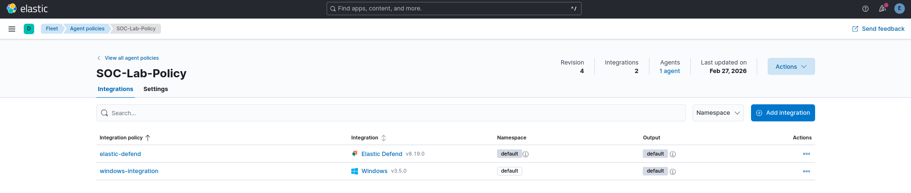

The windows integration allows to collect logs from different data streams as demonstrated below:

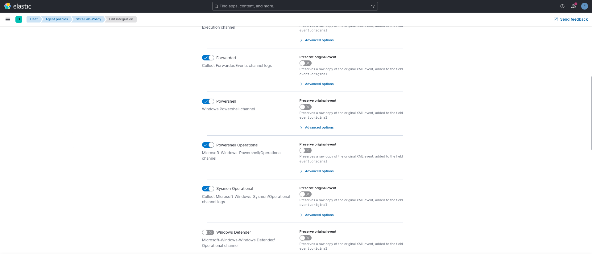

While, the elastic-defend integration allows the agent to act as an Endpoint Detection and Response (EDR) agent. The `EDRComplete` preset mentioned in the script above allows to enable the following options within the integration:

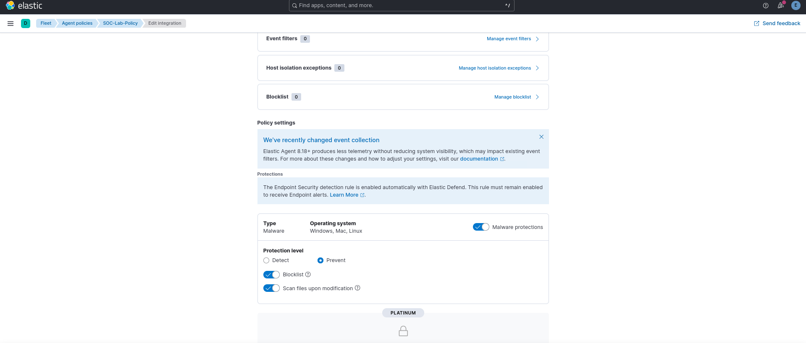

### Fleet Server

Once the policies are in place, the script fetches the service token from the elastic service and uses it to register an elastic agent as a fleet server. It ensures that the elastic agent is compatible with the version of elasticsearch installed previously.

Next, it configures the fleet server host in the Kibana fleet UI and updates the output to be elasticsearch. Finally, it validates that the fleet server is up and running.

```bash

############################################
# INSTALL FLEET SERVER
############################################
echo "[*] Installing Fleet Server..."
# Generate service token for the agent
SERVICE_TOKEN=$(curl -s -u elastic:$ELASTIC_PASSWORD -X POST \
    http://localhost:9200/_security/service/elastic/fleet-server/credential/token/fleet-token \
    | jq -r '.token.value')

echo "[*] Service Token: $SERVICE_TOKEN"
echo "Service Token: $SERVICE_TOKEN" >> ${SHARED_DIR}/elastic_config.txt

# Using the Elastic version installed
cd /tmp
wget -q "https://artifacts.elastic.co/downloads/beats/elastic-agent/elastic-agent-${ELASTIC_VERSION}-linux-x86_64.tar.gz" -O elastic-agent.tar.gz
tar -xzf elastic-agent.tar.gz
cd elastic-agent-${ELASTIC_VERSION}-linux-x86_64/

./elastic-agent install \
  --fleet-server-es=http://localhost:9200 \
  --fleet-server-service-token=$SERVICE_TOKEN \
  --fleet-server-policy=fleet-server-policy \
  --fleet-server-port=8220 \
  --insecure --non-interactive

############################################
# CONFIGURE FLEET HOST
############################################

echo "[*] Setting Fleet Server host..."

curl -s -u elastic:$ELASTIC_PASSWORD \
   -X PUT -H "kbn-xsrf: kibana" \
   -H "Content-Type: application/json" \
   "http://localhost:5601/api/fleet/settings" \
   -d "{\"fleet_server_hosts\": [\"https://$IP_ADDR:8220\"]}"

# Add elasticsearch to fleet's default output
curl -X PUT http://localhost:5601/api/fleet/outputs/fleet-default-output \
-u elastic:$ELASTIC_PASSWORD \
-H "kbn-xsrf: true" \
-H "Content-Type: application/json" \
-d "{
  \"name\": \"default\",
  \"type\": \"elasticsearch\",
  \"hosts\": [\"http://$IP_ADDR:9200\"],
  \"is_default\": true,
  \"is_default_monitoring\": true
}"


echo ""

############################################
# WAIT FOR FLEET SERVER
############################################

echo "[*] Waiting for Fleet Server..."

until curl -k https://${IP_ADDR}:8220/api/status >/dev/null 2>&1
do
    sleep 5
done
```

Once the server is validated to be running, the script procures the secret token to be used for enrolling subsequent agents from different endpoints into the fleet.

```bash
############################################
# GENERATE ENROLLMENT TOKEN
############################################

echo "[*] Generating enrollment token..."

ENROLL_TOKEN=$(curl -s \
-X POST \
http://localhost:5601/api/fleet/enrollment_api_keys \
-H "kbn-xsrf: true" \
-H "Content-Type: application/json" \
-u elastic:$ELASTIC_PASSWORD \
-d "{
\"policy_id\":\"$SOC_POLICY_ID\"
}" \
| jq -r '.item.api_key')

echo "[*] Enrollment token for windows: $ENROLL_TOKEN" 
echo "Enrollment token for windows: $ENROLL_TOKEN" >> ${SHARED_DIR}/elastic_config.txt
```

## Stage 3: Detection Rules

Having logs into the system is only a part of the equation, intelligence is dervied only once the logs are parsed against the detection rules to identify said indicators of compromise (IOCs) i.e. steps taken by a potentially malicious actor on the system being monitored.

The script installs the pre-packaged detection rules (~1500 at the time of writing this blog) and enables them in batches as the API allows to enable at-most 100 rules in one go.

```bash

############################################
# INSTALL & ENABLE DETECTION RULES
############################################

echo "[*] Validating detction engine index..."

curl -s -k -u "elastic:$ELASTIC_PASSWORD" -X POST "http://localhost:5601/api/detection_engine/index" -H "kbn-xsrf: true"

echo "[*] Installing pre-packaged detection rules..."

curl -s -u "elastic:$ELASTIC_PASSWORD"   -X PUT "http://localhost:5601/api/detection_engine/rules/prepackaged"   -H "kbn-xsrf: true"

echo "[*] Fetching rule IDs..."

curl -s -u "elastic:$ELASTIC_PASSWORD" "http://localhost:5601/api/detection_engine/rules/_find?per_page=10000" -H "kbn-xsrf: true" | jq -r '.data[].id' > /tmp/rule_ids.txt

echo "[*] Enabling rules in batches..."

split -l 100 /tmp/rule_ids.txt /tmp/rules_batch_

for file in /tmp/rules_batch_*; do

  IDS=$(jq -R . "$file" | jq -s .)

  curl -s -u "elastic:$ELASTIC_PASSWORD" \
    -X POST "http://localhost:5601/s/default/api/detection_engine/rules/_bulk_action" \
    -H "kbn-xsrf: true" \
    -H "Content-Type: application/json" \
    -d "{\"action\":\"enable\",\"ids\":$IDS}"

  echo "[+] Enabled batch: $file"

  sleep 1

done

echo "[+] Detection rules installed and enabled"

curl -s -u "elastic:$ELASTIC_PASSWORD" "http://localhost:5601/api/detection_engine/rules/_find?filter=alert.attributes.enabled:true&per_page=1" -H "kbn-xsrf: true" | jq '.total'
```

After configuration completes succesfully, the installed and enabled detection rules are visible in the dashboard as follows:

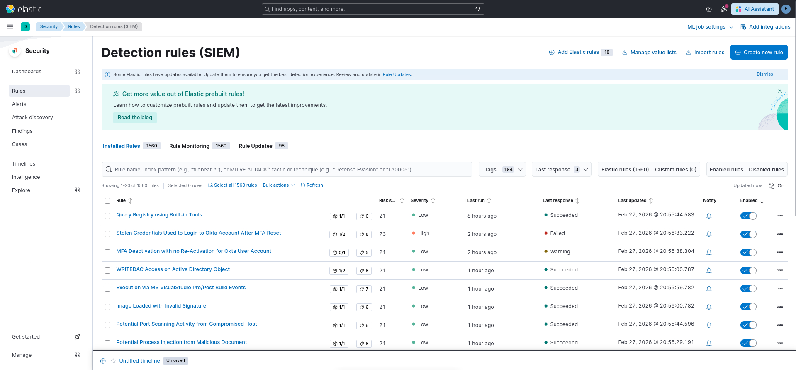

## Stage 4: Summary of the SOC-SIEM lab

Once the above mentioned steps successfully conclude, the script displays the dashboard URL along with the credentials to access it. Meanwhile, other secret tokens are written into the `elastic_config.txt` file as mentioned above.

```bash
############################################
# SUMMARIZE
############################################

echo ""
echo "[+] SOC LAB READY"
echo ""
echo "Kibana:"
echo "http://${IP_ADDR}:5601"
echo ""
echo "username: elastic"
echo "password: ${ELASTIC_PASSWORD}"
echo ""
```

## Stage 5: The Windows Endpoint

Once the SOC-SIEM VM is up and running, the next natural step is to setup the endpoint VM to be monitored. The Vagrantfile description for the same is:

```Vagrantfile
  ########################################
  # WINDOWS ENDPOINT VM (Windows 11)
  ########################################
  config.vm.define "win11" do |win|
    win.vm.box = "gusztavvargadr/windows-11"
    win.vm.hostname = "win11-endpoint"

    win.vm.network "private_network", ip: "192.168.56.30"

    # WinRM Configuration
    win.vm.communicator = "winrm"
    win.vm.boot_timeout = 1200
    win.winrm.transport = :plaintext
    win.winrm.basic_auth_only = true
    win.winrm.timeout = 1800

    # Provisioning
    win.vm.provision "shell" do |s|
      s.path = "provision/agent.ps1"
      s.privileged = true
      # Ensures the script runs in a session that can interact with the desktop if needed
      s.powershell_elevated_interactive = true 
    end

    win.vm.provider "virtualbox" do |vb|
      vb.name = "win11-endpoint-lab"
      vb.memory = 8192  # 8GB RAM
      vb.cpus = 4       # 4 CPU cores
      
      vb.linked_clone = true
      vb.customize ["modifyvm", :id, "--vram", "128"]                   # for Video Memory
      vb.customize ["modifyvm", :id, "--graphicscontroller", "vmsvga"]
      vb.customize ["modifyvm", :id, "--nested-hw-virt", "on"]
    end
  end
```

As observed from the definitions above, I used `gusztavvargadr/windows-11` as my base Windows 11 image and configured a static IPv4 address of `192.168.56.30` for the box. Configuring the communication medium to be `winrm`, I specified the provisioning script path (i.e. `provision/agent.ps1`). Next, I configured the VM settings for resources and customized the VRAM and graphics controller value (as I often need to do when I manually setup a Microsoft Windows VM). The `linked_clone` and nested virtualization features were enabled for requirements mentioned before.

## Stage 6: Endpoint Provisioning Script

Same as the bash script for SOC-SIEM VM, this script starts with configuring to terminate on encountering error. Next, it bypasses the execution policy for current process (i.e. the process running the provisioning powershell commands over winrm session). Next it, validates that the `elastic_config.txt` file exists in the shared folder (which is created when SOC lab is provisioned) as this file contains the secrets required for agent enrollment.

```ps1
$ErrorActionPreference = "Stop"
Set-ExecutionPolicy Bypass -Scope Process -Force

############################################################
# CONFIG FILE LOCATION (shared from SOC Vagrant VM)
############################################################

$CONFIG_FILE = "C:\vagrant\elastic_config.txt"

if (!(Test-Path $CONFIG_FILE)) {
    Write-Host "[-] elastic_config.txt not found"
    exit 1
}
```

Once validated, it parses the `elastic_config.txt` file for required values. Next, it ensures that the fleet server is reachable.

```ps1

############################################################
# PARSE CONFIG VALUES
############################################################

$content = Get-Content $CONFIG_FILE

$ELASTIC_PASSWORD = ($content | Select-String "elastic password").ToString().Split(":")[1].Trim()
$ELASTIC_VERSION  = ($content | Select-String "Elasticsearch version").ToString().Split(":")[1].Trim()
$ENROLL_TOKEN     = ($content | Select-String "Enrollment token for windows").ToString().Split(":")[1].Trim()

$SIEM_IP = "192.168.56.20"

Write-Host "[+] Detected Elastic version: $ELASTIC_VERSION"

############################################################
# WAIT FOR FLEET SERVER
############################################################

Write-Host "[*] Waiting for Fleet Server..."

while (!(Test-NetConnection -ComputerName $SIEM_IP -Port 8220 -InformationLevel Quiet)) {

    Write-Host "    Fleet not ready yet..."
    Start-Sleep 5

}

Write-Host "[+] Fleet reachable"
```

## Stage 7: Enabling Log sources

The windows telemetry integration attached in 'SOC-Lab-Policy' monitores for logs from inbuilt windows log sources. While the agent may activate the  data streams enabled in the integration, the script goes on to enable them nevertheless beforehand (This allowed me a learning opportunity into how these options appeared within the Windows OS).

Next, it installs [`Sysmon`](https://learn.microsoft.com/en-us/sysinternals/downloads/sysmon) with [*Olaf Hartong's configuration script*](https://github.com/olafhartong/sysmon-modular).

```ps1

############################################################
# ENABLE WINDOWS AUDITING
############################################################

Write-Host "[*] Enabling Windows audit logging..."

auditpol /set /category:* /success:enable /failure:enable

reg add HKLM\Software\Microsoft\Windows\CurrentVersion\Policies\System\Audit `
 /v ProcessCreationIncludeCmdLine_Enabled `
 /t REG_DWORD /d 1 /f

############################################################
# ENABLE POWERSHELL LOGGING
############################################################

Write-Host "[*] Enabling PowerShell logging..."

reg add HKLM\Software\Policies\Microsoft\Windows\PowerShell\ScriptBlockLogging `
 /v EnableScriptBlockLogging /t REG_DWORD /d 1 /f

reg add HKLM\Software\Policies\Microsoft\Windows\PowerShell\ModuleLogging `
 /v EnableModuleLogging /t REG_DWORD /d 1 /f

reg add HKLM\Software\Policies\Microsoft\Windows\PowerShell\ModuleLogging\ModuleNames `
 /v "*" /t REG_SZ /d "*" /f

############################################################
# INSTALL SYSMON
############################################################

Write-Host "[*] Installing Sysmon..."

Set-Location C:\Windows\Temp

Invoke-WebRequest `
 https://download.sysinternals.com/files/Sysmon.zip `
 -OutFile Sysmon.zip

Expand-Archive Sysmon.zip -Force

Set-Location C:\Windows\Temp\Sysmon\

Invoke-WebRequest `
 https://raw.githubusercontent.com/olafhartong/sysmon-modular/refs/heads/master/sysmonconfig.xml `
 -OutFile sysmonconfig.xml

.\Sysmon64.exe -accepteula -i sysmonconfig.xml

if (!(Get-Service Sysmon64 -ErrorAction SilentlyContinue)) {

    Write-Host "[-] Sysmon install failed"
    exit 1

}

Write-Host "[+] Sysmon installed"
```

## Stage 8: Installing the Agent

Finally, the provisioning script fetches the elastic agent compatible with the version of elasticserach installed onto the SOC-SIEM lab and enrolls it into the fleet configured as per steps mentioned before.

```ps1

############################################################
# DOWNLOAD ELASTIC AGENT MATCHING SIEM VERSION
############################################################

Write-Host "[*] Downloading Elastic Agent $ELASTIC_VERSION..."

Set-Location C:\Windows\Temp

$agentZip = "elastic-agent-$ELASTIC_VERSION-windows-x86_64.zip"

Invoke-WebRequest `
 https://artifacts.elastic.co/downloads/beats/elastic-agent/$agentZip `
 -OutFile $agentZip

Expand-Archive $agentZip -Force

Set-Location "elastic-agent-$ELASTIC_VERSION-windows-x86_64\elastic-agent-$ELASTIC_VERSION-windows-x86_64"

############################################################
# INSTALL AND ENROLL AGENT
############################################################

Write-Host "[*] Installing Elastic Agent..."

.\elastic-agent.exe install  --url=https://${SIEM_IP}:8220 --enrollment-token=$ENROLL_TOKEN --insecure --force

############################################################

Write-Host "[+] Endpoint successfully enrolled into SOC"
```

Once the configuration completes, one may observe that the Windows Security suggests that Virus and Threat Protection is now managed by Elastic Security.

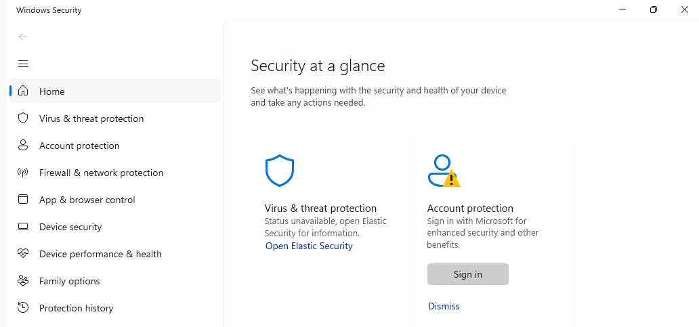

## Testing the Setup

To test the detection capabilities, I ran the following command from elevated PowerShell window in the monitored Windows 11 VM.

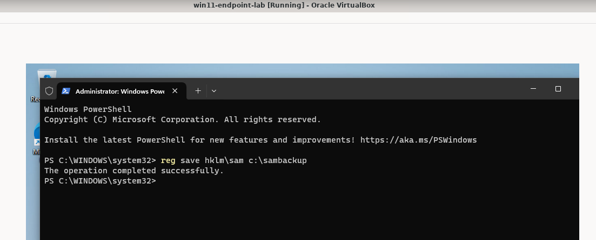

This created the following alert in the dashboard.

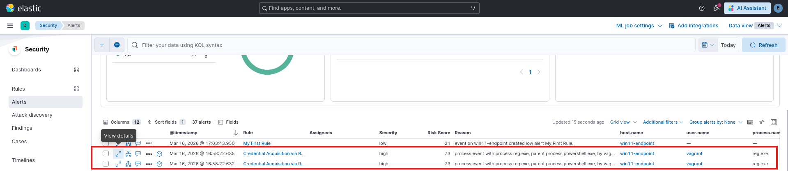

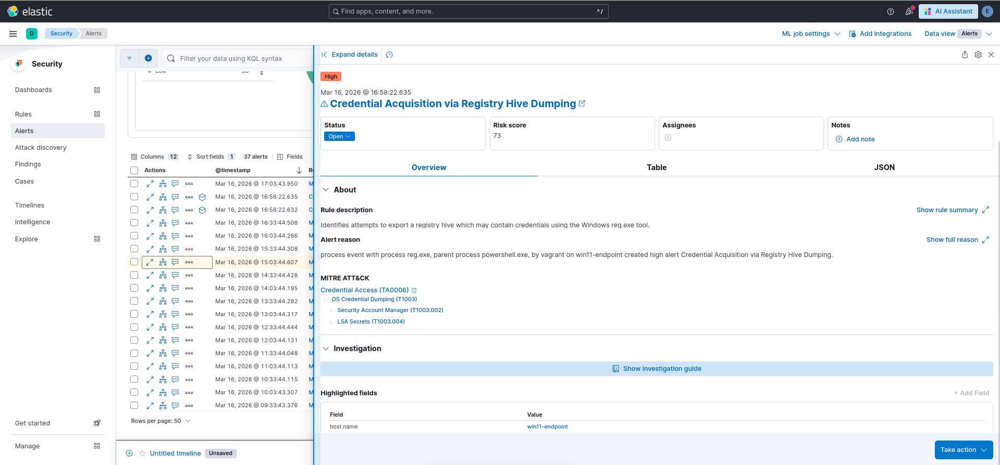